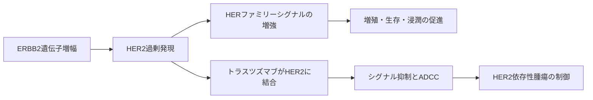

# トラスツズマブ（Herceptin）

## まず3行で

- HER2陽性乳がんを中心に、HER2過剰発現または遺伝子増幅を示す腫瘍に使われる抗体である。
- HER2の細胞外ドメインIVに結合し、増殖シグナルを抑えつつ、IgG1 Fcを介したADCCなどで腫瘍細胞を攻撃する。
- がん遺伝子増幅、診断法、標的抗体を一つの治療体系に結びつけ、乳がんを分子分類で治療する時代を開いた点が重要である。

## 1. どんな病気か

代表疾患としてHER2陽性乳がんを取り上げる。乳がんは乳腺上皮から発生する悪性腫瘍で、局所のしこりからリンパ節転移、遠隔転移まで多様な経過をとる。正常な乳腺上皮では、増殖、分化、生存はホルモン受容体や増殖因子受容体を含む複数の経路で制御されている。

HER2陽性乳がんでは、ERBB2遺伝子増幅によりHER2受容体が細胞表面に過剰発現する。HER2は明確なリガンドを持たず、過剰になるとHERファミリー受容体との二量体形成を通じてPI3K-AKTやMAPK経路を強く動かし、増殖と生存を促す。抗HER2治療以前、HER2増幅は予後不良と結びつく分子異常だった。[Slamonら](https://doi.org/10.1126/science.3798106)

ただし、HER2陽性乳がんも均一ではない。ホルモン受容体、PI3K経路変異、HER2発現不均一性などにより感受性は変わる。トラスツズマブはこの複雑さの中で、「増幅した受容体そのもの」を抗体で狙えることを示した。

## 2. なぜこの分子を標的にするのか

HER2はEGFR/HERファミリーの受容体型チロシンキナーゼである。正常組織にも発現するが、HER2陽性乳がんでは腫瘍細胞表面で高密度に発現するため、抗体が腫瘍を識別する足場になる。

長所は、単なるマーカーではなく腫瘍の増殖・生存に関与するドライバーである点である。HER2に結合すれば、受容体シグナル抑制と、抗体で標識された細胞を免疫細胞に処理させる作用を同時に期待できる。HER2検査で患者を選べるため、薬理作用と診断が対応する。

弱点は、心筋を含む正常組織でのHER2機能を無視できないことである。特にアントラサイクリン系薬剤との併用や既存の心機能低下では心毒性が問題になる。HER2発現低下、p95HER2、下流PI3K経路の変化などは抵抗性に関与すると考えられるが、患者ごとの支配的機序は一つに定まらない。

## 3. どんな抗体として設計されたか

### 開発企業

トラスツズマブの原型はGenentechで創製された抗HER2マウス抗体4D5である。Genentechは4D5をヒト化し、抗腫瘍活性とヒトでの使用可能性を両立するhumAb4D5-8を得た。[Carterら](https://doi.org/10.1073/pnas.89.10.4285) その後、Genentech/Rocheグループが国際開発を進め、日本では中外製薬が製造販売している。[PMDA](https://www.pmda.go.jp/PmdaSearch/rdDetail/iyaku/4291406D5024_1?user=1)

### 基本設計

トラスツズマブはヒト化IgG1κ抗体で、HER2細胞外ドメインIVに結合する。マウス抗体の相補性決定領域を残し、ヒト抗体フレームワークとIgG1定常領域へ置き換えることで、結合能、免疫原性低減、Fc機能の利用を同時に狙った。米国では1998年にHER2過剰発現転移性乳がんで初承認された。[FDA](https://www.accessdata.fda.gov/drugsatfda_docs/appletter/1998/trasgen092598L.htm)

投与は点滴静注で、乳がんでは週1回または3週ごとのレジメンが使われる。2026年7月21日時点の米国添付文書では、HER2過剰発現乳がんとHER2過剰発現転移性胃・胃食道接合部腺がんが適応に含まれる。[DailyMed](https://dailymed.nlm.nih.gov/dailymed/fda/fdaDrugXsl.cfm?setid=492dbdb2-077e-4064-bff3-372d6af0a7a2)

### 作用の仕組みと設計意図

作用は一つに限定されない。HER2シグナル抑制、細胞外ドメイン切断の抑制、受容体の内在化、細胞周期停止、ADCCなどが報告されている。患者体内でどの機序が最も効くかは状況依存で、完全には決着していない。したがって、「HER2をふさぐ抗体」だけでなく、「HER2過剰発現細胞をシグナル抑制と免疫動員の両面から攻める抗体」と理解するのが適切である。

## 4. 病態から作用まで

## 5. 何が画期的だったのか

第一に、HER2増幅という予後不良の分子異常を、治療可能な標的へ変えた。第二に、IHCやISHによるHER2検査を前提に患者を選び、分子診断と抗体治療を一体化した。第三に、受容体レベルの介入とFc依存性免疫動員を組み合わせた。

転移性乳がんでは、化学療法への追加により病勢進行までの期間、奏効率、生存が改善した。[Slamonら](https://doi.org/10.1056/NEJM200103153441101) 早期乳がんでも術後化学療法への追加が再発リスクを下げ、標準治療を変えた。[Romondら](https://doi.org/10.1056/NEJMoa052122)

> **一言で評価：** この抗体の革新性は、HER2増幅というがんの分子異常を、診断で選び抗体で制御する治療モデルとして実証したことにある。

## 6. 実際の医療での位置づけ

2026年7月21日時点で、トラスツズマブはHER2陽性乳がんの周術期治療、転移・再発治療、HER2陽性胃がん治療の基盤薬である。化学療法や他の抗HER2薬との併用で使われる場面が多く、治療前にHER2過剰発現または遺伝子増幅を確認する。

重要な副作用は心機能低下、infusion reaction、肺障害などである。HER2が正常組織にも関わり、IgG1抗体を静注することと結びつく。効果は大きいが、心機能評価と投与中の監視が治療の一部になる。

## 7. 類薬との違い

| 項目 | トラスツズマブ | ペルツズマブ | トラスツズマブ デルクステカン |
|---|---|---|---|
| 標的 | HER2ドメインIV | HER2ドメインII | HER2 |
| 抗体形式 | ヒト化IgG1 | ヒト化IgG1 | HER2抗体ADC |
| 作用の特徴 | シグナル抑制とADCC | HER2二量体化阻害を強化 | HER2発現細胞へペイロード送達 |
| 設計上の特徴 | 4D5ヒト化、IgG1 Fc | 別エピトープで相補的 | トポイソメラーゼI阻害薬、切断型リンカー |
| 強み | 標準治療の基盤、長い使用経験 | 併用でHER2遮断を深める | HER2低発現腫瘍にも広がる薬理 |
| 弱点 | 抵抗性、心毒性 | 併用前提になりやすい | 間質性肺疾患などADC特有の毒性 |

最も重要な違いは、トラスツズマブがHER2標的治療の土台を作り、後続薬が「別エピトープで遮断を深める」「抗体を送達装置にする」という方向へ発展したことである。

## 8. この抗体から学べること

- **疾患生物学：** 遺伝子増幅で増えた受容体は、腫瘍の悪性度と治療感受性を同時に規定し得る。
- **標的選択：** 標的分子が診断で測定できると、抗体治療は患者選択と一体で設計できる。
- **抗体設計：** ヒト化とIgG1 Fcの組み合わせにより、受容体制御と免疫動員を両立できる。
- **残る課題：** 抵抗性、HER2発現不均一性、心毒性を完全には避けられない。
- **次に読む抗体：** ペルツズマブ。HER2の別ドメインを狙うことで、同じ標的でも設計思想が変わる。

## 参考文献

1. [ハーセプチン注射用60／ハーセプチン注射用150 医療用医薬品情報](https://www.pmda.go.jp/PmdaSearch/rdDetail/iyaku/4291406D5024_1?user=1), 医薬品医療機器総合機構（PMDA）, 2025（アクセス日：2026-07-21）
2. [HERCEPTIN Prescribing Information](https://dailymed.nlm.nih.gov/dailymed/fda/fdaDrugXsl.cfm?setid=492dbdb2-077e-4064-bff3-372d6af0a7a2), DailyMed/U.S. National Library of Medicine, 2026（アクセス日：2026-07-21）
3. [Trastuzumab Product Approval Information - Licensing Action](https://www.accessdata.fda.gov/drugsatfda_docs/appletter/1998/trasgen092598L.htm), U.S. Food and Drug Administration, 1998（アクセス日：2026-07-21）
4. [Herceptin EPAR](https://www.ema.europa.eu/en/medicines/human/EPAR/herceptin), European Medicines Agency, 2026（アクセス日：2026-07-21）
5. [Human breast cancer: correlation of relapse and survival with amplification of the HER-2/neu oncogene](https://doi.org/10.1126/science.3798106), Slamon DJ et al., 1987
6. [Humanization of an anti-p185HER2 antibody for human cancer therapy](https://doi.org/10.1073/pnas.89.10.4285), Carter P et al., 1992
7. [Use of chemotherapy plus a monoclonal antibody against HER2 for metastatic breast cancer that overexpresses HER2](https://doi.org/10.1056/NEJM200103153441101), Slamon DJ et al., 2001
8. [Trastuzumab plus adjuvant chemotherapy for operable HER2-positive breast cancer](https://doi.org/10.1056/NEJMoa052122), Romond EH et al., 2005
9. [Molecular mechanisms of trastuzumab-based treatment in HER2-overexpressing breast cancer](https://pmc.ncbi.nlm.nih.gov/articles/PMC3512309/), Vu T and Claret FX, 2012（アクセス日：2026-07-21）
