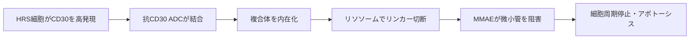

# ブレンツキシマブ ベドチン（アドセトリス）

## まず3行で

- 古典的ホジキンリンパ腫（cHL）を中心に、CD30を発現するリンパ腫に使われる抗体薬物複合体（ADC）である。
- 抗CD30抗体を「運搬体」として細胞内へ入り、切断型リンカーから微小管阻害薬MMAEを放出して腫瘍細胞を死滅させる。
- 抗体単独では不十分だった標的に、高活性ペイロードと安定性・切断性を両立したリンカーを組み合わせ、ADCを実用的な治療様式として確立した点が重要である。

## 1. どんな病気か

代表疾患はcHLである。頸部などの無痛性リンパ節腫脹、発熱、寝汗、体重減少を来し、若年成人と高齢者に発症の山がある。病変では、胚中心B細胞に由来するHodgkin/Reed–Sternberg（HRS）細胞は少数しか存在せず、周囲をT細胞、マクロファージ、好酸球など多数の非腫瘍細胞が取り囲む。この微小環境はHRS細胞が分泌するサイトカインやケモカインで形成され、腫瘍の生存と免疫回避を支える。[NCI](https://www.cancer.gov/types/lymphoma/hp/adult-hodgkin-treatment-pdq)

多剤化学療法と放射線で治癒可能な患者は多いが、再発・難治例には強力な救援化学療法と自家造血幹細胞移植が必要だった。正常細胞への傷害を抑えながら、少数のHRS細胞へ十分な細胞毒性薬を届けることが課題だった。病態はHRS細胞固有の遺伝子異常だけでは説明できず、微小環境との相互作用や治療抵抗性には未解明な部分が残る。

## 2. なぜこの分子を標的にするのか

CD30（TNFRSF8）はTNF受容体スーパーファミリーの膜タンパク質で、正常では主に抗原刺激後の一部のT細胞、B細胞、NK細胞に一過性に発現する。cHLのHRS細胞と全身性未分化大細胞リンパ腫では高発現する一方、健常組織での発現が限られるため、薬物送達の「住所」として適している。[FDA添付文書](https://www.accessdata.fda.gov/drugsatfda_docs/label/2025/125388Orig1s108lbl.pdf)

CD30シグナル自体の生存・増殖への作用は細胞状況で変わり、単純な遮断だけでは強い治療効果を得にくい。そこで重要なのが、CD30が抗体結合後に内在化する性質である。標的は腫瘍の必須ドライバーでなくても、腫瘍選択性と内在化能があればADCの入口になる。ただし可溶性CD30、発現量の差、抗原陰性細胞、薬剤排出や微小管系の変化は効果を弱め得る。

## 3. どんな抗体として設計されたか

### 開発企業

Seattle Genetics（後のSeagen、現在はPfizer傘下）が、抗CD30キメラ抗体cAC10と独自のリンカー・ペイロード技術を組み合わせてSGN-35を創製し、初期開発を進めた。[Franciscoら](https://doi.org/10.1182/blood-2003-01-0039) 2009年にMillennium Pharmaceuticals（Takeda Oncology）が提携し、その後は共同開発を担った。現在はPfizerが米国・カナダ、Takedaが日本を含むその他地域の商業化権を持つ。[Pfizer](https://www.pfizer.com/news/press-release/press-release-detail/pfizers-adcetrisr-regimen-produces-clinically-meaningful)

### 基本設計

本剤はCD30を認識するキメラIgG1κ抗体cAC10、バリン–シトルリンを含むプロテアーゼ切断型リンカー、微小管阻害薬monomethyl auristatin E（MMAE）の三要素からなるADCである。抗体1分子当たりMMAEは平均約4分子（DAR約4）。血中ではペイロードを保持し、標的細胞のリソソーム内で放出するという相反する要件をリンカー設計で両立した。[FDA添付文書](https://www.accessdata.fda.gov/drugsatfda_docs/label/2025/125388Orig1s108lbl.pdf)

日本では、未治療cHLで化学療法と併用して2週ごと、再発・難治cHLでは通常3週ごとに30分以上かけて点滴静注する。用量・回数は適応と併用療法で異なる。[PMDA](https://www.pmda.go.jp/PmdaSearch/rdDetail/iyaku/4291425D1021_1?user=1)

### 作用の仕組みと設計意図

CD30に結合したADCは内在化され、リソソームのプロテアーゼでリンカーが切断される。遊離MMAEがチューブリンに結合すると微小管網が崩れ、G2/M期で細胞周期が停止し、アポトーシスに至る。膜透過性のMMAEが近傍細胞へ作用するバイスタンダー効果も前臨床的に示唆されるが、患者での寄与の大きさは確定していない。IgG1によるADCPもin vitroで認められるものの、主作用はMMAE送達である。

## 4. 病態から作用まで

## 5. 何が画期的だったのか

抗CD30抗体だけの活性を、細胞内へ高活性薬を運ぶ能力へ転換した点に意義がある。腫瘍選択性、内在化、血中安定性、細胞内切断、適切な薬物搭載量を一つの分子に統合し、再発cHLで明確な臨床活性を示した。[Younesら](https://doi.org/10.1056/NEJMoa1002965) さらに「vedotin」と呼ばれるvc-MMAE設計は、異なる標的を狙う後続ADCにも展開された。

> **一言で評価：** この抗体の革新性は、CD30を単なる阻害標的ではなく細胞毒性薬の選択的な搬入口として使い、リンカー工学を臨床効果へ結びつけたことにある。

## 6. 実際の医療での位置づけ

2026年7月27日時点で、日本ではCD30陽性のcHL、末梢性T細胞リンパ腫、再発・難治性皮膚T細胞リンパ腫に承認され、未治療cHLでは化学療法との併用、再発・難治例では単剤などで使われる。[PMDA再審査報告書](https://www.pmda.go.jp/drugs_reexam/2025/P20250516001/400256000_22600AMX00031_A100_1.pdf) 米国では2025年に、レナリドミドおよびリツキシマブとの併用で再発・難治性大細胞型B細胞リンパ腫にも適応が拡大した。

重要な毒性は累積性の末梢神経障害で、MMAEの微小管阻害という作用そのものと結びつく。好中球減少、感染、肝障害、まれだが進行性多巣性白質脳症にも注意する。ブレオマイシンとの併用は肺毒性のため禁忌であり、ADCでも全身毒性を完全には避けられない。

## 7. 類薬との違い

| 項目 | ブレンツキシマブ ベドチン | ニボルマブ |
|---|---|---|
| 標的 | 腫瘍細胞上のCD30 | T細胞上のPD-1 |
| 抗体形式 | vc-MMAE型ADC | IgG4阻害抗体 |
| 作用の特徴 | 内在化後にMMAEを放出 | 抗腫瘍T細胞の抑制を解除 |
| 強み | CD30陽性細胞へ直接、強い殺細胞作用 | 抗原不均一性を免疫応答で補える可能性 |
| 弱点 | CD30発現・内在化に依存、神経障害 | 免疫関連有害事象、免疫学的に冷たい腫瘍 |

最も重要な違いは、前者が腫瘍抗原を「薬物の入口」として直接殺傷するのに対し、後者は患者の免疫を実行役にする点である。

## 8. この抗体から学べること

- **疾患生物学：** 少数のHRS細胞でも、安定した表面抗原があれば選択的に攻撃できる。
- **標的選択：** ADCではドライバー性だけでなく、発現分布と内在化能が重要である。
- **抗体設計：** 抗体、リンカー、ペイロード、DARは独立でなく一つの治療システムとして最適化する。
- **残る課題：** 神経毒性、抗原不均一性、薬剤耐性を抑えつつ治療域を広げる必要がある。
- **次に読む抗体：** PD-1阻害で同じcHLを別方向から治療する[ニボルマブ](20260724_nivolumab.md)。

## 参考文献

1. ADCETRIS Prescribing Information. U.S. Food and Drug Administration, 2025. [PDF](https://www.accessdata.fda.gov/drugsatfda_docs/label/2025/125388Orig1s108lbl.pdf)（2026年7月27日アクセス）
2. アドセトリス点滴静注用50mg 医療用医薬品情報. 医薬品医療機器総合機構. [PMDA](https://www.pmda.go.jp/PmdaSearch/rdDetail/iyaku/4291425D1021_1?user=1)（2026年7月27日アクセス）
3. アドセトリス再審査報告書. 医薬品医療機器総合機構, 2025. [PDF](https://www.pmda.go.jp/drugs_reexam/2025/P20250516001/400256000_22600AMX00031_A100_1.pdf)（2026年7月27日アクセス）
4. Hodgkin Lymphoma Treatment (PDQ®). National Cancer Institute, 2025. [NCI](https://www.cancer.gov/types/lymphoma/hp/adult-hodgkin-treatment-pdq)（2026年7月27日アクセス）
5. Francisco JA, et al. cAC10-vcMMAE, an anti-CD30-monomethyl auristatin E conjugate with potent and selective antitumor activity. *Blood*. 2003. [doi:10.1182/blood-2003-01-0039](https://doi.org/10.1182/blood-2003-01-0039)
6. Senter PD, Sievers EL. The discovery and development of brentuximab vedotin. *Nature Biotechnology*. 2012. [doi:10.1038/nbt.2289](https://doi.org/10.1038/nbt.2289)
7. Younes A, et al. Brentuximab Vedotin (SGN-35) for Relapsed CD30-Positive Lymphomas. *New England Journal of Medicine*. 2010. [doi:10.1056/NEJMoa1002965](https://doi.org/10.1056/NEJMoa1002965)
8. Adcetris: European Public Assessment Report. European Medicines Agency, 2025. [EMA](https://www.ema.europa.eu/en/medicines/human/EPAR/adcetris)（2026年7月27日アクセス）
