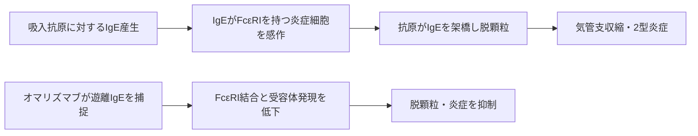

# オマリズマブ（ゾレア）

## まず3行で

- 通年性吸入抗原に感作され、吸入ステロイド薬などでも制御不十分なアレルギー性喘息を代表に、IgEが関与する疾患に使われる抗体である。
- 循環中の遊離IgEを捕捉してFcεRIへの結合を防ぎ、肥満細胞・好塩基球の活性化とアレルギー炎症を上流で抑える。
- 受容体に結合済みのIgEを架橋しない抗体をヒト化し、「抗IgE抗体自身が脱顆粒を起こす」という根本的な安全性課題を避けて抗IgE治療を実用化した。

## 1. どんな病気か

代表疾患はアレルギー性喘息である。患者は喘鳴、息切れ、咳、胸部圧迫感を反復し、増悪時には気道狭窄が急速に悪化する。正常な気道は刺激を受けても開存を保つが、喘息では慢性炎症、過敏性、粘液増加、平滑筋収縮が重なり、可逆性を伴う気流制限を起こす。長期には気道壁が肥厚するリモデリングも進み得る。[NHLBI](https://www.nhlbi.nih.gov/health/asthma/causes)

アレルギー型では、吸入抗原に対するIgEが肥満細胞や好塩基球の高親和性受容体FcεRIに結合する。再び抗原が入ると、細胞表面のIgEが架橋され、ヒスタミンやロイコトリエンなどが放出される。即時の気管支収縮に続き、2型サイトカインや好酸球が遅発性炎症を持続させる。吸入ステロイド薬、長時間作用性気管支拡張薬などを併用しても増悪を繰り返す患者では、全身性ステロイドへの依存とその毒性が課題だった。

ただし喘息は一つの分子で説明できる病気ではない。IgE優位、好酸球優位、非2型炎症などが重なり、IgE値だけでは治療反応を完全に予測できない。気道リモデリングがどこまで可逆的かも未解明である。

## 2. なぜこの分子を標的にするのか

IgEはB細胞から分泌され、寄生虫に対する宿主防御にも関与する一方、アレルギーでは抗原情報を肥満細胞・好塩基球へ伝える増幅器になる。遊離IgEを減らせば、新たなFcεRI感作を防ぐだけでなく、細胞表面のFcεRI発現自体も低下する。実際、抗IgE抗体投与後に好塩基球の遊離IgEとFcεRI密度が大きく低下したことが示されている。[MacGlashanら](https://pubmed.ncbi.nlm.nih.gov/9013989/)

可溶性分子なので抗体が細胞外で高選択的に捕捉でき、複数の抗原に共通する上流を一度に遮断できる点が長所である。一方、IgEを作るB細胞そのものは除去せず、投与中止後には遊離IgEと症状が戻り得る。正常な寄生虫防御への影響、投与前IgE値と体重に応じた用量、非IgE型喘息には効きにくいことが制約になる。

## 3. どんな抗体として設計されたか

### 開発企業

Genentechは、受容体結合前のIgEを認識するマウス抗体MaE11を創製し、結合能を保つために必要なヒトフレームワーク残基を選びながらヒト化した。[Prestaら](https://pubmed.ncbi.nlm.nih.gov/8360482/) Tanoxは抗IgE治療概念と先行候補の開発を進め、1996年以降、Genentech、Tanox、Novartisが共同で抗IgE抗体を開発・商業化した。現在の米国開発・販売もGenentechとNovartisが共同で担う。[Genentech](https://www.gene.com/stories/timeless-partnerships)

### 基本設計

本剤は約149 kDaのヒト化IgG1κ通常抗体で、IgE重鎖のCε3領域に結合する。重要なのは、遊離IgEには結合するが、既にFcεRIへ結合したIgEには結合しない点である。[PMDA添付文書](https://www.pmda.go.jp/PmdaSearch/iyakuDetail/300242_2290400G1021_1_09) 受容体上のIgEを二価抗体で架橋すれば脱顆粒を誘発しかねないため、標的状態を識別するエピトープ選択が安全性設計そのものになっている。

日本の喘息では、投与開始前の総IgE濃度と体重から1回75～600 mgを選び、2週または4週ごとに皮下注射する。IgE量に見合う抗体量を確保する薬力学的な個別投与であり、治療中は複合体形成で総IgE測定値が上昇するため、その値で用量を再設定しない。

### 作用の仕組みと設計意図

オマリズマブ–IgE複合体の形成で遊離IgEが低下し、IgEのFcεRI結合、抗原による架橋、炎症細胞の脱顆粒が順に減る。さらにFcεRIがダウンレギュレーションされ、細胞のアレルゲン感受性も下がる。これは単なる一時的中和に加え、反応装置の密度まで下げる二段階作用である。ただし慢性特発性蕁麻疹で症状が改善する詳細機序は、規制当局文書でも未確定とされる。

## 4. 病態から作用まで

オマリズマブは上図の「感作前」を遮断するため、既に起きた喘息発作を速やかに止める救急薬ではない。

## 5. 何が画期的だったのか

「病原体や細胞ではなく、患者自身の抗体アイソタイプを抗体で中和する」という設計を上市薬にした点が本質である。2002年に豪州で初めて登録され、その後、喘息から慢性特発性蕁麻疹、鼻茸、さらに米国では2024年に複数食物への偶発曝露時の反応低減へと応用が広がった。[FDA](https://www.fda.gov/news-events/press-announcements/fda-approves-first-medication-help-reduce-allergic-reactions-multiple-foods-after-accidental)

> **一言で評価：** この抗体の革新性は、IgEの「遊離状態」だけを安全に捕捉する分子認識を、複数のアレルギー疾患に展開できる上流介入へ変えたことにある。

## 6. 実際の医療での位置づけ

2026年7月30日時点で、日本では既存治療で制御できない難治性気管支喘息、重症季節性アレルギー性鼻炎、特発性慢性蕁麻疹に承認される。喘息では通年性吸入抗原への陽性と用量表のIgE・体重要件を満たす患者に、標準吸入治療へ追加する。増悪を減らし、ステロイド負担を軽くできることが主要な価値である。[Busseら](https://doi.org/10.1067/mai.2001.117880)

主な問題は注射部位反応と、頻度は低いが重篤になり得るショック・アナフィラキシーである。設計上は受容体結合IgEを架橋しないが、薬剤への過敏反応までなくなるわけではない。開始時は医療施設で投与し、適切な患者だけが訓練後に自己投与する。継続注射、用量条件、IgE非依存性病態を取りこぼす点も制約である。

## 7. 類薬との違い

| 項目 | オマリズマブ | メポリズマブ | デュピルマブ |
|---|---|---|---|
| 標的 | 遊離IgE | IL-5 | IL-4Rα |
| 抗体形式 | ヒト化IgG1κ | ヒト化IgG1κ | ヒトIgG4 |
| 作用の特徴 | 感作・脱顆粒を上流で抑制 | 好酸球の成熟・生存を抑制 | IL-4/IL-13シグナルを二重遮断 |
| 患者選択 | アレルゲン感作、IgE、体重 | 好酸球性炎症 | 2型炎症、併存疾患 |
| 強み | 抗原を問わずIgE経路を遮断 | 好酸球優位の増悪に直結 | 広い2型炎症を受容体で遮断 |
| 弱点 | 非IgE型には不向き、用量表 | 非好酸球型には不向き | 結膜炎、好酸球増多など |

最も重要な違いは、同じ2型炎症でも「感作の入口」「好酸球」「サイトカイン受容体」のどこを切るかで、適する患者が変わることである。

## 8. この抗体から学べること

- **疾患生物学：** アレルギー反応はIgE量だけでなく、FcεRI密度という細胞側の感度にも依存する。
- **標的選択：** 複数疾患に共通する上流因子は広い応用性を持つが、分子病型による患者選択が必要になる。
- **抗体設計：** 同じ分子でも「遊離」と「受容体結合済み」を見分けるエピトープが、有効性と安全性を同時に決める。
- **残る課題：** 反応予測、長期投与の終了基準、IgE非依存性炎症への対応が十分ではない。
- **次に読む抗体：** IL-5を中和し、好酸球側から喘息を制御するメポリズマブ。

## 参考文献

1. ゾレア皮下注 添付文書. 医薬品医療機器総合機構, 2025. [PMDA](https://www.pmda.go.jp/PmdaSearch/iyakuDetail/300242_2290400G1021_1_09)（2026年7月30日アクセス）
2. XOLAIR Prescribing Information. Genentech / U.S. National Library of Medicine, 2024. [DailyMed](https://dailymed.nlm.nih.gov/dailymed/fda/fdaDrugXsl.cfm?setid=7f6a2191-adfb-48b9-9bfa-0d9920479f0d)（2026年7月30日アクセス）
3. Xolair: European Public Assessment Report. European Medicines Agency, 2026. [EMA](https://www.ema.europa.eu/en/medicines/human/EPAR/xolair)（2026年7月30日アクセス）
4. Omalizumab Public Summary Document. Australian Government Pharmaceutical Benefits Scheme, 2009. [PBS](https://www.pbs.gov.au/info/industry/listing/elements/pbac-meetings/psd/2009-11/pbac-psd-Omalizumab-nov09)（2026年7月30日アクセス）
5. Asthma Causes and Triggers. National Heart, Lung, and Blood Institute. [NHLBI](https://www.nhlbi.nih.gov/health/asthma/causes)（2026年7月30日アクセス）
6. Presta LG, et al. Humanization of an antibody directed against IgE. *Journal of Immunology*. 1993;151:2623–2632. [PubMed](https://pubmed.ncbi.nlm.nih.gov/8360482/)
7. MacGlashan DW Jr, et al. Down-regulation of FcεRI expression on human basophils during in vivo treatment of atopic patients with anti-IgE antibody. *Journal of Immunology*. 1997;158:1438–1445. [PubMed](https://pubmed.ncbi.nlm.nih.gov/9013989/)
8. Busse W, et al. Omalizumab, anti-IgE recombinant humanized monoclonal antibody, for the treatment of severe allergic asthma. *Journal of Allergy and Clinical Immunology*. 2001;108:184–190. [doi:10.1067/mai.2001.117880](https://doi.org/10.1067/mai.2001.117880)
9. FDA Approves First Medication to Help Reduce Allergic Reactions to Multiple Foods After Accidental Exposure. U.S. Food and Drug Administration, 2024. [FDA](https://www.fda.gov/news-events/press-announcements/fda-approves-first-medication-help-reduce-allergic-reactions-multiple-foods-after-accidental)（2026年7月30日アクセス）
