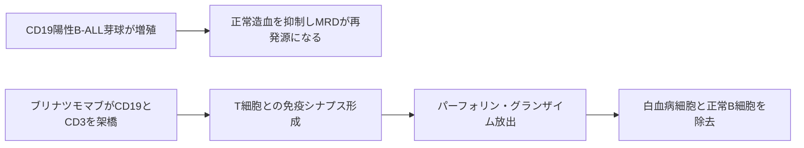

# ブリナツモマブ（ビーリンサイト／Blincyto）

## まず3行で

- CD19陽性B細胞性急性リンパ性白血病（B-ALL）、特に再発・難治例を治療する二重特異性抗体である。
- 白血病細胞のCD19とT細胞のCD3を同時につかみ、患者自身のT細胞に免疫シナプスを作らせて標的細胞を破壊する。
- Fcを持たない2つの一本鎖可変領域だけで「既存T細胞の向きを変える」BiTEを実用化し、二重特異性T細胞リダイレクトという創薬様式を臨床で成立させた。

## 1. どんな病気か

B-ALLは、未熟なB細胞系リンパ芽球が骨髄で急速に増える血液がんである。正常造血が押しのけられるため、貧血による倦怠感、血小板減少による出血、正常白血球減少による感染・発熱が起こり、芽球は中枢神経系などにも広がり得る。前駆B細胞型は典型的にCD19を発現するが、遺伝子異常や治療反応は患者間で多様である。[NCI](https://www.cancer.gov/types/leukemia/hp/adult-all-treatment-pdq)

多剤併用化学療法で形態学的寛解に達しても、測定可能残存病変（MRD）が残れば再発の種になる。再発・難治例では追加化学療法だけで深い寛解を得にくく、同種造血幹細胞移植へ進める状態に戻すこと自体が課題だった。病勢、T細胞の量と状態、白血病クローンの遺伝学が治療反応をどう決めるかは、なお完全には説明できない。

## 2. なぜこの分子を標的にするのか

CD19はB細胞受容体シグナルの閾値を調節する共受容体で、初期B細胞から多くの成熟B細胞、そしてB-ALL芽球まで広く表面に存在する。[Del Nagroら](https://pubmed.ncbi.nlm.nih.gov/15778510/) 造血幹細胞には発現しないため、CD19陽性細胞を一時的に除去してもB細胞系を再構築できる余地がある。一方、正常B細胞も巻き込むので、B細胞減少と免疫グロブリン低下は避けにくい。

CD3はT細胞受容体複合体の構成要素である。CD19とCD3を同時に結べば、白血病固有のペプチド抗原や患者ごとのHLAに依存せず、既存T細胞を標的の隣へ連れてこられる。長所は標的範囲の広さと即時性、弱点は機能するT細胞とCD19発現への依存である。治療後の再発はCD19陽性のまま起こる場合も多いが、CD19消失クローンや髄外病変による逃避も確認されており、単一抗原標的の限界は残る。[Aldossら](https://pubmed.ncbi.nlm.nih.gov/39820649/)

## 3. どんな抗体として設計されたか

### 開発企業

Micrometが独自のBiTE基盤でMT103（後のブリナツモマブ）を創製し、臨床開発を進めた。Amgenは2012年に、当時第2相段階だった本剤とBiTE基盤を含めMicrometを買収し、後期開発、承認取得、商業化を担った。[Amgen](https://www.amgen.com/newsroom/press-releases/2012/01/amgen-to-acquire-micromet)

### 基本設計と作用の仕組み

本剤は、マウス抗ヒトCD19抗体とマウス抗ヒトCD3抗体に由来する2つの一本鎖可変領域（scFv）を直列に連結した、504アミノ酸・約54 kDaの組換えタンパク質である。通常のIgGの定常領域とFcを持たず、IgGサブクラスはない。[PMDA審査報告書](https://www.pmda.go.jp/drugs/2018/P20181015001/112292000_23000AMX00811_A100_1.pdf)

一方のscFvがB細胞のCD19、もう一方がT細胞のCD3に結合すると、両細胞間に細胞傷害性シナプスが形成される。T細胞は活性化・増殖し、パーフォリンとグランザイムを放出してCD19陽性細胞をアポトーシスへ導く。同じT細胞が次の標的を攻撃する連続殺傷も可能で、患者内でT細胞を採取・遺伝子改変せずに利用できる。[NCI](https://dctd.cancer.gov/drug-discovery-development/reagents-materials/formulary/about/agents/blinatumomab)

### 設計上の工夫

Fcを省いた小型構造は、細胞同士を直接架橋する機能に絞った設計で、既製品として微量でT細胞を動員できる反面、FcRnによる半減期延長を得られない。平均消失半減期は約2.2時間で、血中濃度を保つため原則28日間の持続静注が必要になる。[FDA添付文書](https://www.accessdata.fda.gov/drugsatfda_docs/label/2025/125557s031lbl.pdf) 再発・難治例では初回を低用量から段階的に増量し、デキサメタゾン前投与と早期の入院監視で急激なT細胞活性化を制御する。短寿命は投与負担である一方、重い毒性時に中断して曝露を速やかに下げられる制御弁でもある。

## 4. 病態から作用まで

抗体は白血病シグナルを直接止めるのではなく、腫瘍を認識しなかったT細胞へ一時的な「標的指定」を与える。

## 5. 何が画期的だったのか

ブリナツモマブは2014年に米国で初承認され、FcなしタンデムscFv型BiTEを初めて上市薬として成立させた。[Mocquotら](https://pubmed.ncbi.nlm.nih.gov/35906791/) 細胞製造を要するCAR-T療法とは異なり、投与可能な既製タンパク質で患者自身のT細胞を再配線した点が重要である。その後、米国ではMRD陽性寛解期、さらに2024年には新規診断Ph陰性B-ALLの地固め療法へ適応が広がり、再発後だけでなく腫瘍量が少ない段階でT細胞を動員する価値も示された。[FDA](https://www.fda.gov/drugs/resources-information-approved-drugs/fda-approves-blinatumomab-consolidation-cd19-positive-philadelphia-chromosome-negative-b-cell)

> **一言で評価：** この抗体の革新性は、2つの小さな抗体断片で腫瘍細胞とT細胞を物理的につなぎ、既製薬によるT細胞リダイレクトを実用的な治療様式にしたことにある。

## 6. 実際の医療での位置づけ

2026年8月2日時点で、日本の承認適応は再発又は難治性B細胞性ALLであり、28日持続静注と休薬を1サイクルとして単剤投与する。[PMDA添付文書](https://www.pmda.go.jp/PmdaSearch/iyakuDetail/ResultDataSetPDF/112292_4291445D1029_2_03) 成人再発・難治例の比較試験では、標準化学療法より全生存期間中央値を延長した（7.7対4.0か月）が、全例で効果が持続するわけではなく、寛解後に移植など次の治療へつなぐ判断が重要になる。[Kantarjianら](https://pubmed.ncbi.nlm.nih.gov/28249141/)

重要な副作用はサイトカイン放出症候群（CRS）、神経学的事象・ICANS、感染症、腫瘍崩壊症候群である。これはT細胞を強制的に活性化する作用と表裏一体で、病勢が大きい患者ほど慎重な前処置と監視を要する。正常B細胞の枯渇は低免疫グロブリン血症につながる。持続輸液ポンプとカテーテル管理も、Fcを持たない設計が生む大きな実務上の制約である。神経毒性の詳細機序は未解明である。

## 7. 類薬との違い

| 項目 | ブリナツモマブ | イノツズマブ オゾガマイシン | チサゲンレクルユーセル |
|---|---|---|---|
| 標的 | CD19 × CD3 | CD22 | CD19 |
| 抗体形式 | FcなしタンデムscFv型BiTE | カリケアマイシン結合ADC | 自家4-1BB型CAR-T細胞 |
| 作用の特徴 | 内在性T細胞を一時的に架橋 | 内在化後にDNA傷害薬を放出 | 改変T細胞が体内で増殖・持続 |
| 投与・製造 | 既製品、28日持続静注 | 既製品、間欠静注 | 個別細胞製造後に単回投与 |
| 強み | 採取・遺伝子改変なしでT細胞を動員 | T細胞機能に直接依存しない | 一回の投与で長期持続し得る |
| 弱点 | 輸液負担、CRS・神経毒性 | 肝静脈閉塞性疾患、移植時の制約 | 製造待機、CRS・神経毒性、遷延性B細胞減少 |

最も重要な違いは、同じB-ALLでも「患者のT細胞をその場で借りる」「毒素を届ける」「T細胞自体を製品化する」のどれを選ぶかで、即時性、持続性、毒性、移植計画が変わる点である。[BESPONSA米国添付文書](https://www.accessdata.fda.gov/drugsatfda_docs/label/2024/761040s003lbl.pdf)、[Kymriah EPAR](https://www.ema.europa.eu/en/medicines/human/EPAR/kymriah)

## 8. この抗体から学べること

- **疾患生物学：** 形態学的寛解後の少数の芽球も再発源となり、MRDは治療標的になり得る。
- **標的選択：** 系統抗原CD19は広く狙えるが、正常B細胞毒性と抗原逃避を受け入れる必要がある。
- **抗体設計：** Fcなし小型化は細胞架橋と制御性を得る一方、短半減期と持続静注を招く。
- **残る課題：** 反応予測、CD19陰性・髄外再発、神経毒性、持続輸液の負担である。
- **次に読む抗体：** Fcを備えたCD20×CD3二重特異性抗体として半減期を延ばしたモスネツズマブ。

## 参考文献

1. BLINCYTO Prescribing Information. U.S. Food and Drug Administration, 2025. [FDA](https://www.accessdata.fda.gov/drugsatfda_docs/label/2025/125557s031lbl.pdf)（2026年8月2日アクセス）
2. ビーリンサイト点滴静注用35 μg 添付文書. 医薬品医療機器総合機構, 2026. [PMDA](https://www.pmda.go.jp/PmdaSearch/iyakuDetail/ResultDataSetPDF/112292_4291445D1029_2_03)（2026年8月2日アクセス）
3. ビーリンサイト点滴静注用35 μg 審査報告書. 医薬品医療機器総合機構, 2018. [PMDA](https://www.pmda.go.jp/drugs/2018/P20181015001/112292000_23000AMX00811_A100_1.pdf)（2026年8月2日アクセス）
4. Blincyto: European Public Assessment Report. European Medicines Agency, 2026. [EMA](https://www.ema.europa.eu/en/medicines/human/EPAR/blincyto)（2026年8月2日アクセス）
5. Acute Lymphoblastic Leukemia Treatment (PDQ®). National Cancer Institute. [NCI](https://www.cancer.gov/types/leukemia/hp/adult-all-treatment-pdq)（2026年8月2日アクセス）
6. Klinger M, et al. Immunopharmacologic response of patients with B-lineage acute lymphoblastic leukemia to continuous infusion of blinatumomab. *Blood*. 2012;119:6226–6233. [PubMed](https://pubmed.ncbi.nlm.nih.gov/22592608/)
7. Kantarjian H, et al. Blinatumomab versus chemotherapy for advanced acute lymphoblastic leukemia. *New England Journal of Medicine*. 2017;376:836–847. [PubMed](https://pubmed.ncbi.nlm.nih.gov/28249141/)
8. Aldoss I, et al. TP53 mutations are associated with CD19-negative relapse and inferior outcomes after blinatumomab in adults with ALL. *Blood Advances*. 2025;9:2159–2172. [PubMed](https://pubmed.ncbi.nlm.nih.gov/39820649/)
9. Amgen to Acquire Micromet. Amgen, 2012. [Amgen](https://www.amgen.com/newsroom/press-releases/2012/01/amgen-to-acquire-micromet)（2026年8月2日アクセス）
10. BESPONSA Prescribing Information. U.S. Food and Drug Administration, 2024. [FDA](https://www.accessdata.fda.gov/drugsatfda_docs/label/2024/761040s003lbl.pdf)（2026年8月2日アクセス）
