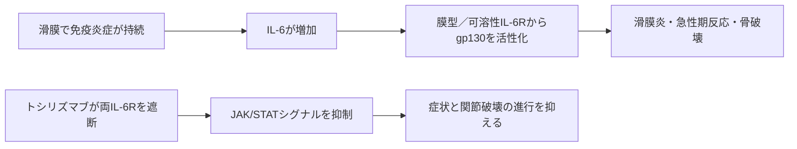

# トシリズマブ（アクテムラ）

## まず3行で

- 関節リウマチを代表に、IL-6が過剰に働く自己免疫・全身炎症性疾患へ用いる抗体である。
- 可溶性と膜結合性の両IL-6受容体に結合し、gp130を介する炎症シグナルを受容体の入口で遮断する。
- 日本発のヒト化抗体としてIL-6受容体を治療標的にできることを臨床で実証し、希少疾患から関節炎、サイトカイン放出症候群へ応用範囲を広げた。

## 1. どんな病気か

代表疾患は関節リウマチ（RA）である。手足など複数の関節に左右対称の腫れ、痛み、朝のこわばりが続き、疲労や微熱、貧血、肺病変など全身症状も起こり得る。正常な滑膜は関節を滑らかに動かす薄い組織だが、RAでは免疫細胞が滑膜へ集まり、線維芽細胞様滑膜細胞と相互作用して炎症を慢性化させる。肥厚した滑膜は軟骨と骨へ侵入し、不可逆的な関節破壊と機能低下を招く。[NIAMS](https://www.niams.nih.gov/health-topics/rheumatoid-arthritis)

IL-6はこの炎症ネットワークの一員で、滑膜細胞などから産生され、免疫細胞の活性化、肝臓でのCRPなど急性期蛋白の産生、造血や骨代謝に影響する。したがって局所の腫脹だけでなく、発熱、倦怠感、貧血、高CRPといった全身像も一つの経路で結び付く。ただしRAの起点は単一ではなく、遺伝、喫煙などの環境因子、自己抗体、TNFやIL-6を含む複数経路が関与する。どの患者がIL-6依存性かを治療前に確実に見分ける予測指標は、なお不十分である。

## 2. なぜこの分子を標的にするのか

IL-6は感染・組織損傷時の宿主防御と修復に必要なサイトカインである。膜型IL-6受容体（IL-6R）に結合する古典経路に加え、IL-6と可溶性IL-6Rの複合体が、多くの細胞に発現するgp130を刺激するトランスシグナルがある。この仕組みが、限られた細胞の受容体から広い組織へ炎症を波及させる。

可溶性・膜型に共通するIL-6Rを抗体で塞げば、両経路を一つの分子で抑えられる。実際、承認資料は両受容体への結合とIL-6活性の抑制を主作用とする。[PMDA添付文書](https://www.pmda.go.jp/PmdaSearch/iyakuDetail/450045_6399421A1020_1_24) 一方、標的は腫瘍特異抗原ではなく正常な炎症反応にも必要である。感染リスクに加え、発熱やCRP上昇まで抑えて感染の発見を遅らせ得ることは、薬効と安全性が同じ生物学から生じる弱点である。

## 3. どんな抗体として設計されたか

### 開発企業

大阪大学でのIL-6・IL-6R研究と中外製薬の免疫疾患創薬が結び付き、両者の共同研究から候補が創製された。中外製薬は抗体のヒト化、製造法と臨床開発を進め、2005年に日本で上市した。その後はRocheと世界開発・販売を共同で展開した。[中外製薬](https://www.chugai-pharm.co.jp/english/news/detail/20190213100000_596.html) [Roche](https://www.roche.com/stories/partnering-roche-hitachi-chugai)

### 基本設計

本剤は約148 kDaのヒト化IgG1κ通常抗体である。マウス抗ヒトIL-6R抗体PM-1の相補性決定領域（CDR）をヒト抗体へ移植し、結合・阻害活性を保ちながら反復投与時の免疫原性低減を狙った。[Satoら](https://pubmed.ncbi.nlm.nih.gov/8428365/) Fc増強、糖鎖改変、薬物結合はなく、承認資料で定義される中心機能は標的細胞の除去ではなく受容体遮断である。

日本のRAでは、点滴静注は8 mg/kgを4週ごと、皮下注は162 mgを2週ごとに投与し、効果不十分なら週1回まで短縮できる。静注と自己投与可能な皮下注を選べる製剤設計は、継続治療の運用幅を広げた。[PMDA皮下注添付文書](https://www.pmda.go.jp/PmdaSearch/iyakuDetail/ResultDataSetPDF/450045_6399421G1022_1_18)

### 作用の仕組みと設計意図

抗体がIL-6Rのリガンド結合を競合的に妨げ、IL-6/IL-6R複合体によるgp130二量体化と下流のJAK/STATシグナルを止める。その結果、滑膜炎、急性期反応、貧血や骨破壊へ連なる増幅が弱まる。抗体がIL-6を直接捕捉するのではなく、可溶性受容体を介して受容体非発現細胞へ広がる経路まで同じ入口で遮断する点が設計の要である。

## 4. 病態から作用まで

## 5. 何が画期的だったのか

本剤は2005年4月、キャッスルマン病に対して日本で初承認され、2008年にRAへ拡大した。[PMDA審査報告書](https://www.pmda.go.jp/drugs/2025/P20251028001/381103000_30700AMX00212_A100_1.pdf) RAでは、IL-6経路の遮断が症状だけでなくX線上の関節破壊進行も抑え得ることが無作為化試験で示された。[Nishimotoら](https://pubmed.ncbi.nlm.nih.gov/17485422/) さらに同じ受容体遮断が、慢性自己免疫疾患だけでなく、CAR-T細胞療法などに伴う急性のサイトカイン放出症候群にも展開されたことは、疾患名ではなく病態駆動分子を狙う価値を示した。

> **一言で評価：** この抗体の革新性は、可溶性・膜型IL-6受容体を一括して遮断し、IL-6依存性炎症を独立した治療軸として確立したことにある。

## 6. 実際の医療での位置づけ

2026年8月5日時点で、日本のRAでは少なくとも1剤の抗リウマチ薬で効果不十分な患者に用いる生物学的DMARDであり、関節の構造的損傷防止も適応に含む。国内ではキャッスルマン病、若年性特発性関節炎、成人発症スチル病、血管炎、悪性腫瘍治療に伴うサイトカイン放出症候群、酸素投与を要するSARS-CoV-2肺炎にも製剤ごとの適応がある。海外では単剤またはメトトレキサートなどの非生物学的DMARDとの併用が可能で、静注・皮下注の双方がある。[FDA添付文書](https://www.accessdata.fda.gov/drugsatfda_docs/label/2025/125472s059lbl.pdf)

最重要の副作用は重篤な感染症である。結核などの事前評価に加え、IL-6遮断で発熱・CRPが目立たなくても感染を疑う必要がある。好中球・血小板減少、肝酵素・脂質上昇を定期的に検査し、憩室炎からの腸管穿孔にも注意する。すべての患者が反応するわけではなく、継続注射とモニタリングが必要な点も制約である。

## 7. 類薬との違い

| 項目 | トシリズマブ | サリルマブ | アダリムマブ |
|---|---|---|---|
| 標的 | 可溶性・膜型IL-6R | IL-6R | TNF |
| 抗体形式 | ヒト化IgG1κ | ヒトIgG1 | ヒトIgG1 |
| 投与 | 静注または皮下注 | 皮下注 | 皮下注 |
| 作用の特徴 | IL-6シグナルを受容体で遮断 | 同じIL-6R経路を遮断 | TNFを中和 |
| 強み | 2経路・2剤形、全身炎症にも直結 | 2週ごとの皮下注 | 適応・使用経験が広い |
| 弱点 | CRPを指標にしにくい、感染・検査値異常 | 同系統の感染・検査値異常 | TNF非依存性病態は残る |

サリルマブは同じ標的を完全ヒト抗体と皮下注で実装し、アダリムマブはRAで別の上流サイトカインTNFを切る。重要なのは抗体の「ヒト化度」だけでなく、患者の炎症を主に駆動する経路と投与法を合わせることである。[EMA: Kevzara](https://www.ema.europa.eu/en/documents/overview/kevzara-epar-medicine-overview_en.pdf) [EMA: Humira](https://www.ema.europa.eu/en/medicines/human/EPAR/humira)

## 8. この抗体から学べること

- **疾患生物学：** 一つのサイトカインが関節局所と全身の急性期反応をつなぐ。
- **標的選択：** 可溶性・膜型受容体を共通に塞ぐと、古典経路とトランスシグナルを同時に抑えられる。
- **抗体設計：** CDR移植によるヒト化は、マウス抗体の機能を長期反復投与へ移す基盤技術である。
- **残る課題：** 反応患者の事前選別と、炎症指標を隠す状況での安全な感染監視が必要である。
- **次に読む抗体：** pH依存的なIL-6R結合で抗体を再利用するサトラリズマブ。

## 参考文献

1. アクテムラ点滴静注用 添付文書. 医薬品医療機器総合機構, 2026. [PMDA](https://www.pmda.go.jp/PmdaSearch/iyakuDetail/450045_6399421A1020_1_24)（2026年8月5日アクセス）
2. アクテムラ皮下注162mg 添付文書. 医薬品医療機器総合機構, 2026. [PMDA](https://www.pmda.go.jp/PmdaSearch/iyakuDetail/ResultDataSetPDF/450045_6399421G1022_1_18)（2026年8月5日アクセス）
3. ACTEMRA Prescribing Information. U.S. Food and Drug Administration, 2025. [FDA](https://www.accessdata.fda.gov/drugsatfda_docs/label/2025/125472s059lbl.pdf)（2026年8月5日アクセス）
4. トシリズマブBS点滴静注用「CT」審査報告書. 医薬品医療機器総合機構, 2025. [PMDA](https://www.pmda.go.jp/drugs/2025/P20251028001/381103000_30700AMX00212_A100_1.pdf)（2026年8月5日アクセス）
5. Rheumatoid Arthritis: Symptoms, Causes, & Risk Factors. National Institute of Arthritis and Musculoskeletal and Skin Diseases. [NIAMS](https://www.niams.nih.gov/health-topics/rheumatoid-arthritis)（2026年8月5日アクセス）
6. Sato K, et al. Reshaping a human antibody to inhibit the interleukin 6-dependent tumor cell growth. *Cancer Research*. 1993;53:851–856. [PubMed](https://pubmed.ncbi.nlm.nih.gov/8428365/)
7. Nishimoto N, et al. Study of active controlled monotherapy used for rheumatoid arthritis, an IL-6 inhibitor (SAMURAI). *Annals of the Rheumatic Diseases*. 2007;66:1162–1167. [PubMed](https://pubmed.ncbi.nlm.nih.gov/17485422/)
8. Chugai's Actemra Wins Chairman's Award of Japan Techno-Economics Society. Chugai Pharmaceutical, 2019. [Chugai](https://www.chugai-pharm.co.jp/english/news/detail/20190213100000_596.html)（2026年8月5日アクセス）
9. Kevzara: EPAR Medicine Overview. European Medicines Agency, 2024. [EMA](https://www.ema.europa.eu/en/documents/overview/kevzara-epar-medicine-overview_en.pdf)（2026年8月5日アクセス）
10. Humira: European Public Assessment Report. European Medicines Agency, 2026. [EMA](https://www.ema.europa.eu/en/medicines/human/EPAR/humira)（2026年8月5日アクセス）
