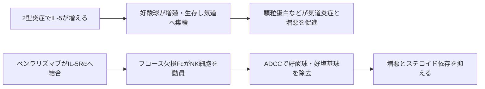

# ベンラリズマブ（ファセンラ）

## まず3行で

- 高用量吸入ステロイド薬などでも増悪を繰り返す、好酸球性の重症喘息に追加する抗体である。
- 好酸球・好塩基球のIL-5受容体αに結合し、フコースを欠くFcでNK細胞を強く呼び込み、標的細胞をADCCで除去する。
- サイトカインを中和するだけでなく、その受容体を持つ炎症細胞そのものを糖鎖工学で枯渇させた点が革新的だった。

## 1. どんな病気か

代表疾患は重症好酸球性喘息である。喘息では気道に慢性炎症が続き、粘膜の腫れ、粘液、平滑筋収縮によって咳、喘鳴、息苦しさが変動する。増悪は急速に呼吸を悪化させ、ときに生命を脅かす。[NHLBI](https://www.nhlbi.nih.gov/health/asthma/causes)

喘息は一つの病気ではない。好酸球性の型では、2型ヘルパーT細胞や2型自然リンパ球などがIL-5を産生し、骨髄での好酸球の分化、血中への動員、組織での生存・活性化を支える。気道へ集まった好酸球は顆粒蛋白、脂質メディエーター、サイトカインを放ち、上皮障害、粘液産生、気道過敏性と増悪を増幅する。高用量吸入ステロイド薬と長時間作用性気管支拡張薬を使っても増悪する患者には、全身性ステロイド薬の副作用を抑えつつ病態駆動細胞を選択的に制御する課題が残っていた。

ただし、好酸球はすべての喘息を駆動するわけではない。血中数は治療や時期で変動し、気道組織の状態を完全には表さない。好酸球除去と臨床改善を結ぶ機序も、規制当局は「確定していない」としており、病型選択が治療成否を左右する。[FDA添付文書](https://www.accessdata.fda.gov/drugsatfda_docs/label/2024/761070s021lbl.pdf)

## 2. なぜこの分子を標的にするのか

IL-5受容体は、IL-5を特異的に認識するα鎖（IL-5Rα、CD125）と、細胞内シグナルを担う共通β鎖からなる。IL-5Rαは主に好酸球、好塩基球とその前駆細胞に発現するため、広範な免疫細胞を狙うより標的範囲を絞りやすい。FabでIL-5結合を妨げれば生存シグナルを遮断でき、さらに細胞表面の受容体を目印にFcを使えば、組織や骨髄を含む好酸球を直接除去できる。実際、初期臨床研究では血液だけでなく、気道粘膜、喀痰、骨髄の好酸球も減少した。[Lavioletteら](https://pubmed.ncbi.nlm.nih.gov/23866823/)

弱点は、好酸球が寄生虫への免疫応答など正常機能にも関与することである。またIL-4/IL-13、肥満、感染など別経路が優位な喘息では、好酸球を減らしても十分な効果を期待できない。

## 3. どんな抗体として設計されたか

### 開発企業

協和発酵キリン（現・協和キリン）が抗体を創製し、米国子会社BioWa、MedImmune、AstraZenecaが開発を進めた。日本ではAstraZenecaが承認申請と販売を担った。[PMDA審査報告書](https://www.pmda.go.jp/files/000236124.pdf) [協和キリン](https://www.kyowakirin.com/media_center/news_releases/2017/e20170324_01.html)

### 基本設計と作用の仕組み

約148 kDaのヒト化IgG1κ通常抗体で、マウス抗IL-5Rα抗体の相補性決定部をヒトIgG1へ移植している。最大の工夫は、糖タンパク質6-α-L-フコース転移酵素（FUT8）欠損CHO細胞で生産し、Fc糖鎖からコアフコースを除いたことにある。これによりFcがNK細胞などのFcγRIIIaへ高親和性で結合し、免疫シナプス形成、ADCC、好酸球・好塩基球のアポトーシスを強める。[PMDA添付文書](https://www.pmda.go.jp/PmdaSearch/iyakuDetail/ResultDataSetPDF/670227_2290402G1020_1_09) つまりFabは「標的の選択とIL-5シグナル遮断」、Fc糖鎖は「標的細胞の除去」を分担する。[Kolbeckら](https://pubmed.ncbi.nlm.nih.gov/20513525/)

喘息では30 mgを皮下注し、初回から3回は4週ごと、その後は8週ごとである。オートインジェクターは条件を満たせば自己投与でき、長期維持治療の負担を軽くする。

## 4. 病態から作用まで

## 5. 何が画期的だったのか

従来の抗IL-5抗体が可溶性サイトカインを捕捉するのに対し、本剤は受容体を細胞表面の「除去タグ」として利用した。フコース欠損化によって通常のIgG1よりFcγRIIIa結合とADCCを高め、少量の残存IL-5に依存しない迅速で深い好酸球枯渇を狙える。重症喘息の原著試験では、血中好酸球300/µL以上の患者で8週ごと投与が増悪率をプラセボより51%低下させた。[Bleeckerら](https://pubmed.ncbi.nlm.nih.gov/27609408/)

> **一言で評価：** この抗体の革新性は、標的結合だけでなくFc糖鎖を設計し、好酸球性炎症を「シグナル阻害」から「細胞除去」へ進めたことにある。

## 6. 実際の医療での位置づけ

2026年8月8日時点の日本では、6歳以上の難治性喘息のうち、特に血中好酸球が多く増悪を繰り返す患者に既存治療へ追加する。急性発作を止める薬ではなく、開始後も吸入・全身ステロイド薬を自己判断で急に中止しない。日本では成人の再燃・難治性好酸球性多発血管炎性肉芽腫症にも用い、2026年5月には12歳以上の好酸球増多症候群へ適応が拡大した。[PMDA添付文書](https://www.pmda.go.jp/PmdaSearch/iyakuDetail/670227_2290402G1020_1_09)

重要な副作用は遅発例を含むアナフィラキシーなどの重篤な過敏症である。頭痛、咽頭炎、発熱、注射部位反応にも注意する。好酸球が寄生虫防御に関わる可能性があるため、既存の蠕虫感染は投与前に治療する。臨床上の制約は、血中好酸球などで病型を選ぶ必要、注射継続、非好酸球性の炎症には効きにくいことである。

## 7. 類薬との違い

| 項目 | ベンラリズマブ | メポリズマブ | デュピルマブ |
|---|---|---|---|
| 標的 | IL-5Rα | IL-5 | IL-4Rα |
| 抗体形式 | フコース欠損ヒト化IgG1κ | ヒト化IgG1κ | ヒトIgG4 |
| 作用 | ADCCで好酸球を直接除去 | IL-5中和で産生・生存を抑制 | IL-4/IL-13シグナルを遮断 |
| 維持投与 | 喘息では8週ごと | 4週ごと | 通常2週ごと |
| 強み | 深い細胞枯渇、投与間隔 | 適応と使用経験が広い | 広い2型炎症を抑える |
| 弱点 | 好酸球非依存病態は残る | 細胞を直接除去しない | 好酸球増加に注意 |

最重要の違いは、同じIL-5軸でもリガンドを中和するか、受容体陽性細胞を除去するかである。デュピルマブはより上流の2型炎症を広く抑えるため、合併症やバイオマーカーも含めて選択する。[EMA: Nucala](https://www.ema.europa.eu/en/medicines/human/EPAR/nucala) [EMA: Dupixent](https://www.ema.europa.eu/en/medicines/human/EPAR/dupixent)

## 8. この抗体から学べること

- **疾患生物学：** 喘息は異質であり、好酸球優位という病型の同定が標的治療を成立させる。
- **標的選択：** 受容体はシグナルの入口であると同時に、病的細胞を選ぶ表面マーカーにもなる。
- **抗体設計：** Fc糖鎖のフコース一つが、IgG1を受容体阻害薬から強力な細胞除去薬へ変え得る。
- **残る課題：** 血中好酸球だけでは反応を完全に予測できず、深い長期枯渇の生理的影響も監視が必要である。
- **次に読む抗体：** IL-5そのものを中和するメポリズマブ。

## 参考文献

1. ファセンラ皮下注 添付文書. 医薬品医療機器総合機構, 2026. [PMDA](https://www.pmda.go.jp/PmdaSearch/iyakuDetail/ResultDataSetPDF/670227_2290402G1020_1_09)（2026年8月8日アクセス）
2. ファセンラ皮下注30mgシリンジ 審査報告書. 医薬品医療機器総合機構, 2018. [PMDA](https://www.pmda.go.jp/files/000236124.pdf)（2026年8月8日アクセス）
3. FASENRA Prescribing Information. U.S. Food and Drug Administration, 2024. [FDA](https://www.accessdata.fda.gov/drugsatfda_docs/label/2024/761070s021lbl.pdf)（2026年8月8日アクセス）
4. Asthma: Causes and Triggers. National Heart, Lung, and Blood Institute, 2024. [NHLBI](https://www.nhlbi.nih.gov/health/asthma/causes)（2026年8月8日アクセス）
5. Kolbeck R, et al. MEDI-563, a humanized anti-IL-5 receptor alpha mAb with enhanced antibody-dependent cell-mediated cytotoxicity function. *J Allergy Clin Immunol*. 2010;125:1344–1353.e2. [PubMed](https://pubmed.ncbi.nlm.nih.gov/20513525/)
6. Laviolette M, et al. Effects of benralizumab on airway eosinophils in asthmatic patients with sputum eosinophilia. *J Allergy Clin Immunol*. 2013;132:1086–1096.e5. [PubMed](https://pubmed.ncbi.nlm.nih.gov/23866823/)
7. Bleecker ER, et al. Efficacy and safety of benralizumab for patients with severe asthma uncontrolled with high-dosage inhaled corticosteroids and long-acting β2-agonists. *Lancet*. 2016;388:2115–2127. [PubMed](https://pubmed.ncbi.nlm.nih.gov/27609408/)
8. Kyowa Hakko Kirin Enters Agreement with AstraZeneca for Development and Commercialisation of Benralizumab in Asia. Kyowa Hakko Kirin, 2017. [Kyowa Kirin](https://www.kyowakirin.com/media_center/news_releases/2017/e20170324_01.html)（2026年8月8日アクセス）
9. Nucala: European Public Assessment Report. European Medicines Agency, 2026. [EMA](https://www.ema.europa.eu/en/medicines/human/EPAR/nucala)（2026年8月8日アクセス）
10. Dupixent: European Public Assessment Report. European Medicines Agency, 2026. [EMA](https://www.ema.europa.eu/en/medicines/human/EPAR/dupixent)（2026年8月8日アクセス）
