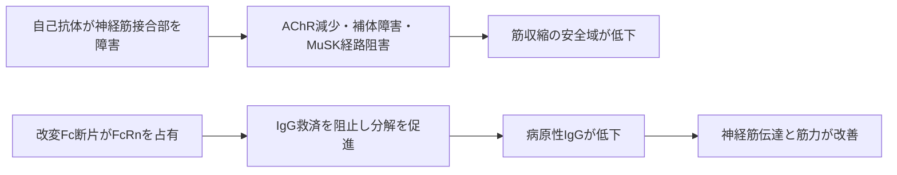

# エフガルチギモド アルファ（ウィフガート／Vyvgart）

## まず3行で

- 全身型重症筋無力症（gMG）など、病原性IgG自己抗体が病態を動かす自己免疫疾患に用いる抗体由来薬である。
- IgGを分解から救う胎児性Fc受容体（FcRn）を改変IgG1 Fc断片で占有し、自己抗体を含む血中IgGの分解を促す。
- 一つの自己抗原ではなく「IgGの再利用機構」を狙い、抗体工学で一時的な血漿交換に似た効果を薬物治療として実現したことが革新的だった。

## 1. どんな病気か

代表疾患のgMGは、神経筋接合部に対する自己抗体で骨格筋の力が入りにくくなる疾患である。眼瞼下垂や複視に加え、嚥下、発声、四肢、呼吸の筋力が活動後に低下し、休息で改善する。呼吸筋や嚥下筋の急激な悪化は生命を脅かす。[NINDS](https://www.ninds.nih.gov/sites/default/files/migrate-documents/myasthenia_gravis_e_march_2020_508c.pdf)

正常では、運動神経末端から放出されたアセチルコリンが筋側のAChRに結合し、十分な余裕をもって収縮を起こす。gMGでは主に抗AChR IgGが受容体を架橋・内在化させ、補体による終板膜障害も起こす。抗MuSK IgGなどはAChRを終板へ集積させる経路を乱す。その結果、神経から筋への信号の安全域が失われる。従来のステロイド薬や免疫抑制薬は広く免疫を抑え、効果発現の遅さや長期毒性が課題だった。血漿交換は自己抗体を速く減らせるが、侵襲性と効果の一過性が制約となる。

ただし、血中自己抗体量と症状は常に比例せず、抗体陰性例には未同定抗体や抗体以外の要因もあり得る。IgG低下から症状改善までの個人差はなお完全には説明できない。

## 2. なぜこの分子を標的にするのか

FcRnは内皮細胞などの酸性エンドソーム内でIgGのFcを捕捉し、リソソーム分解を免れさせて細胞表面へ戻す「救済受容体」である。中性の細胞外でIgGを放すことで、IgGの長い半減期を支える。ここを競合的に塞げば、新たな抗体産生を全面的に止めなくても、既存IgGの分解を速められる。

長所は、AChR、MuSKなど自己抗原が異なってもIgG介在疾患を共通原理で狙える点である。一方、病原性自己抗体だけでなく感染防御に必要なIgGも減らすため感染リスクがあり、IgG型治療用抗体や免疫グロブリン製剤の血中濃度も下げ得る。IgA、IgMなどとアルブミンは減らさないことが、標的選択性の重要な境界である。[PMDA添付文書](https://www.pmda.go.jp/PmdaSearch/iyakuDetail/ResultDataSetPDF/113014_6399430A1029_1_08)

## 3. どんな抗体として設計されたか

### 開発企業

University of Texas Southwestern Medical CenterのE. Sally Wardらが、FcRn結合を高めて内因性IgGの分解を促す「Abdeg」の原理を示した。argenxは同大学との共同研究・技術権を基盤にエフガルチギモドを創製し、臨床開発と承認取得を担った。[Vaccaroら](https://pubmed.ncbi.nlm.nih.gov/16186811/) [argenx](https://reports.argenx.com/2025/argenx-group/intellectual-property.html)

### 基本設計と作用の仕組み

可変領域もFabも持たない、約54 kDaのヒトIgG1 Fcホモ二量体である。完全長IgGより小さく、抗原特異的結合、ADCC、CDCを目的としない。FcRn結合面にM252Y、S254T、T256E、H433K、N434Fの5置換（ABDEG変異）を導入し、酸性だけでなく中性付近でも野生型Fcより高い親和性を持たせた。[PMDA審査報告書](https://www.pmda.go.jp/drugs/2021/P20211223002/113014000_30400AMX00013_A100_1.pdf)

改変FcがFcRnを占有すると、同じ受容体を使う内因性IgGが救済されず、リソソームへ送られる。薬そのものも永続的に受容体を塞がず、投与終了後にIgGが回復するため、症状に応じた周期投与が可能になる。日本のgMGでは10 mg/kgを週1回、計4回1時間かけて点滴静注し、次サイクルは臨床症状から判断する。皮下投与には、組織内拡散を助けるヒアルロニダーゼとの別配合製剤もある。

## 4. 病態から作用まで

## 5. 何が画期的だったのか

FcRn阻害薬として初めて承認され、抗体のFcを「半減期を延ばす部品」ではなく「他のIgGを分解へ向ける薬」に反転させた。抗AChR抗体陽性gMGの初回サイクルでは、日常生活機能が臨床的に改善した患者が67.7%で、プラセボの29.7%を上回った。[Howardら](https://pubmed.ncbi.nlm.nih.gov/34146511/) 2026年5月には米国の成人gMG適応から抗AChR抗体陽性要件が外れ、標的が自己抗原ではなくIgG経路である広がりも示された。[FDA添付文書](https://www.accessdata.fda.gov/drugsatfda_docs/label/2026/761195s016lbl761304s018lbl.pdf)

> **一言で評価：** この薬の革新性は、FcRnへの結合を5変異で再設計し、自己抗体を一つずつ中和せずIgGの寿命そのものを短くしたことにある。

## 6. 実際の医療での位置づけ

2026年8月11日時点の日本では、ステロイド薬または他の免疫抑制薬で十分な効果が得られない成人gMGに、既存治療へ追加して用いる。持続性・慢性免疫性血小板減少症にも承認されている。効果は比較的速い一方、反応と持続期間には個人差があり、固定した維持投与ではなく症状に応じてサイクルを繰り返す。

重要な副作用は感染症、ショック・アナフィラキシー、infusion reactionである。投与中の生ワクチンは避け、活動性感染症やIgG低値を監視する。IgG型生物学的製剤、免疫グロブリン、血液浄化療法との相互作用、反復点滴の負担も制約となる。

## 7. 類薬との違い

| 項目 | エフガルチギモド アルファ | ロザノリキシズマブ | エクリズマブ |
|---|---|---|---|
| 標的 | FcRn | FcRn | 補体C5 |
| 抗体形式 | 改変ヒトIgG1 Fc断片 | ヒト化IgG4モノクローナル抗体 | ヒト化IgG2/4抗体 |
| 作用 | IgG再循環を阻害 | IgG再循環を阻害 | 終末補体活性化を阻害 |
| 主な投与 | 4回の周期的点滴静注 | 週1回、6週の皮下注 | 導入後2週ごとの点滴静注 |
| 強み | 小型Fc断片、周期投与 | 皮下投与、抗AChR・抗MuSK陽性に対応 | IgG全体を減らさず補体障害を抑える |
| 弱点 | 正常IgGも低下、点滴 | 正常IgGも低下、頭痛など | 補体非依存機序には効きにくく髄膜炎菌感染に注意 |

同じFcRn阻害でも、Fc断片を競合リガンドにするか、完全長抗体で受容体を塞ぐかが設計上の違いである。C5阻害はAChR抗体による補体障害を選択的に止めるが、MuSK抗体など補体非依存の病態には原理上届きにくい。[PMDA: リスティーゴ](https://www.pmda.go.jp/PmdaSearch/rdDetail/iyaku/6399432A1028_1?user=1) [PMDA: ソリリス](https://www.pmda.go.jp/PmdaSearch/rdDetail/iyaku/6399424A1023_1?user=1)

## 8. この抗体から学べること

- **疾患生物学：** gMGは自己抗原が複数でも、病原性IgGという共通層で治療できる。
- **標的選択：** 病因分子そのものだけでなく、その寿命を支える恒常性機構も創薬標的になる。
- **抗体設計：** Fcはエフェクター部位に限らず、親和性とpH依存性の改変で単独の薬になり得る。
- **残る課題：** 正常IgGを保ちながら病原性自己抗体だけを除く選択性と、反応・再投与時期を予測する指標が必要である。
- **次に読む抗体：** 同じFcRnを完全長IgG4で阻害するロザノリキシズマブ。

## 参考文献

1. ウィフガート点滴静注400mg 添付文書. 医薬品医療機器総合機構, 2025. [PMDA](https://www.pmda.go.jp/PmdaSearch/iyakuDetail/ResultDataSetPDF/113014_6399430A1029_1_08)（2026年8月11日アクセス）
2. ウィフガート点滴静注400mg 審査報告書. 医薬品医療機器総合機構, 2022. [PMDA](https://www.pmda.go.jp/drugs/2021/P20211223002/113014000_30400AMX00013_A100_1.pdf)（2026年8月11日アクセス）
3. VYVGART Prescribing Information. U.S. Food and Drug Administration, 2026. [FDA](https://www.accessdata.fda.gov/drugsatfda_docs/label/2026/761195s016lbl761304s018lbl.pdf)（2026年8月11日アクセス）
4. FDA Approves New Treatment for Myasthenia Gravis. U.S. Food and Drug Administration, 2021. [FDA](https://www.fda.gov/news-events/press-announcements/fda-approves-new-treatment-myasthenia-gravis)（2026年8月11日アクセス）
5. Myasthenia Gravis. National Institute of Neurological Disorders and Stroke, 2020. [NINDS](https://www.ninds.nih.gov/sites/default/files/migrate-documents/myasthenia_gravis_e_march_2020_508c.pdf)（2026年8月11日アクセス）
6. Vaccaro C, et al. Engineering the Fc region of immunoglobulin G to modulate in vivo antibody levels. *Nat Biotechnol*. 2005;23:1283–1288. [PubMed](https://pubmed.ncbi.nlm.nih.gov/16186811/)
7. Howard JF Jr, et al. Safety, efficacy, and tolerability of efgartigimod in patients with generalised myasthenia gravis (ADAPT). *Lancet Neurol*. 2021;20:526–536. [PubMed](https://pubmed.ncbi.nlm.nih.gov/34146511/)
8. Intellectual Property: ABDEG platform and efgartigimod. argenx Annual Report 2025. [argenx](https://reports.argenx.com/2025/argenx-group/intellectual-property.html)（2026年8月11日アクセス）
9. リスティーゴ皮下注 添付文書情報. 医薬品医療機器総合機構, 2025. [PMDA](https://www.pmda.go.jp/PmdaSearch/rdDetail/iyaku/6399432A1028_1?user=1)（2026年8月11日アクセス）
10. ソリリス点滴静注300mg 添付文書情報. 医薬品医療機器総合機構, 2025. [PMDA](https://www.pmda.go.jp/PmdaSearch/rdDetail/iyaku/6399424A1023_1?user=1)（2026年8月11日アクセス）
