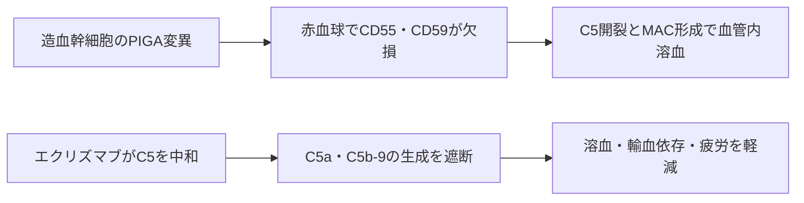

# エクリズマブ（ソリリス／Soliris）

## まず3行で

- 発作性夜間ヘモグロビン尿症（PNH）など、補体が自分の細胞を傷つける希少疾患に用いる抗体である。
- 補体C5に結合してC5aとC5bへの開裂を止め、炎症と膜侵襲複合体（MAC）による血管内溶血を抑える。
- 感染防御をすべて消さずに終末補体だけを選択的に遮断し、補体を治療標的として初めて臨床的に確立したことが革新的だった。

## 1. どんな病気か

代表疾患のPNHは、造血幹細胞に後天的な**PIGA**変異が生じ、その子孫である血球がクローン性に増える疾患である。PIGAは膜蛋白を細胞表面につなぐGPIアンカーの合成に必要で、欠損すると補体制御蛋白CD55とCD59も表面から失われる。[Takedaら](https://pubmed.ncbi.nlm.nih.gov/8500164/)

補体は本来、病原体を標識し、炎症を起こし、MACで膜に孔を開ける自然免疫である。正常赤血球はCD55がC3/C5変換酵素を抑え、CD59がMAC形成を止める。PNH赤血球にはこの盾がなく、常時弱く作動する補体第二経路や感染時の増幅で血管内溶血を起こす。貧血、暗色尿、強い疲労に加え、遊離ヘモグロビンによる一酸化窒素消費や補体・血小板活性化などが血栓症、腹痛、嚥下障害、腎障害につながる。骨髄不全を伴う患者もいる。

従来は輸血、抗凝固、造血幹細胞移植などが中心で、溶血の原因を長期に抑える治療がなかった。ただしPIGA変異だけではクローン拡大を十分説明できず、骨髄の免疫選択などがどう関わるかは未解明である。エクリズマブも変異クローンや骨髄不全そのものは除去しない。

## 2. なぜこの分子を標的にするのか

C5は補体カスケードの収束点で、開裂すると強い炎症・白血球遊走を起こすC5aと、C5b-9（MAC）の起点となるC5bを生じる。C5を止めれば、PNHの中心である血管内溶血を遮断できる。一方、より上流のC3による病原体のオプソニン化は残るため、補体全体を抑えるより感染防御を温存しやすい。

弱点も同じ生理作用から予測できる。終末補体は髄膜炎菌などの莢膜形成菌防御に重要で、C5阻害は致命的感染のリスクを上げる。また上流のC3活性化は続くため、C3断片で標識されたPNH赤血球が脾臓・肝臓で除かれる血管外溶血が残り得る。[Risitanoら](https://pubmed.ncbi.nlm.nih.gov/20145265/)

## 3. どんな抗体として設計されたか

### 開発企業

Alexion Pharmaceuticalsが1990年代に抗C5抗体の基礎・前臨床研究、ヒト化、臨床開発を一貫して進め、PNHで承認を取得した。[Rotherら](https://www.nature.com/articles/nbt1344) 米国では2007年3月に初承認された。[FDA](https://www.accessdata.fda.gov/scripts/opdlisting/oopd/detailedIndex.cfm?cfgridkey=173203)

### 基本設計と作用の仕組み

約148 kDaのヒト化IgG2/IgG4κ通常抗体である。マウス抗ヒトC5抗体5G1.1の相補性決定部をヒト可変領域骨格へ移植し、高親和性と補体溶血阻害を保った。[Thomasら](https://pubmed.ncbi.nlm.nih.gov/9171898/) 定常領域はIgG2由来のCH1・ヒンジとIgG4由来のCH2・CH3を組み合わせ、Fcγ受容体結合やC1q結合を抑えた。狙いはC5を中和することであり、標的の除去、ADCC、CDCを起こすことではない。補体阻害薬自身が補体を活性化する矛盾を避ける「静かな遮断抗体」である。

FabがC5に結合するとC5変換酵素による開裂が妨げられ、C5aとMACが生じない。PNH成人では600 mgを週1回で4回導入後、900 mgを2週ごとに点滴静注する。抗体の持続濃度を保つ必要があり、投与遅延や中止は突破性・反跳性溶血につながり得る。[PMDA添付文書](https://www.pmda.go.jp/PmdaSearch/iyakuDetail/ResultDataSetPDF/870056_6399424A1023_1_22)

## 4. 病態から作用まで

## 5. 何が画期的だったのか

補体は感染防御に必要な連鎖反応であり、長期阻害の実用性は不確かだった。エクリズマブは終末段階だけを抗体で選択し、PNHを「支持療法中心の溶血性疾患」から「分子機序を直接抑える疾患」へ変えた。承認根拠試験では、輸血なしでヘモグロビンが安定した患者は49%で、プラセボは0%だった。[Hillmenら](https://pubmed.ncbi.nlm.nih.gov/16990386/)

さらにaHUS、全身型重症筋無力症、視神経脊髄炎スペクトラム障害へ適応が広がり、異なる疾患を「終末補体による組織障害」という共通層で治療できることを示した。

> **一言で評価：** この抗体の革新性は、エフェクター機能を抑えたIgG2/4でC5だけを静かに遮断し、補体病という創薬領域を臨床に開いたことにある。

## 6. 実際の医療での位置づけ

2026年8月14日時点の日本では、PNHの溶血抑制、補体制御異常によるaHUS、治療抵抗性の抗AChR抗体陽性gMG、抗AQP4抗体陽性NMOSDの再発予防に承認されている。PNHではフローサイトメトリーで確定診断し、輸血を要する溶血性患者に長期投与する。溶血は速やかに低下するが、骨髄不全や既存血栓を治す薬ではない。

最重要の安全対策は投与開始原則2週前までの髄膜炎菌ワクチン接種と、発熱・頭痛・項部硬直などの早期認識である。接種後も感染を完全には防げない。投与負担は2週ごとの点滴で、C3依存の血管外溶血、補体増幅時の突破性溶血も残る。日本人の約3.5%にみられるC5 p.Arg885His多型では抗体がC5へ結合できず、不応となり得る。[Nishimuraら](https://pubmed.ncbi.nlm.nih.gov/24521109/)

## 7. 類薬との違い

| 項目 | エクリズマブ | ラブリズマブ | ペグセタコプラン |
|---|---|---|---|
| 標的 | C5 | C5 | C3/C3b |
| 形式 | ヒト化IgG2/4 | エクリズマブ由来の長時間作用型抗体 | PEG化環状ペプチド二量体 |
| 主作用 | 血管内溶血を抑制 | 同じC5遮断を長く維持 | 血管内・血管外溶血を上流で抑制 |
| 主な投与 | 2週ごと静注 | 成人は8週ごと静注 | 週2回皮下注 |
| 強み | 長い使用経験、複数疾患で実証 | 通院頻度を低減 | C3標識による残存貧血も狙う |
| 弱点 | 点滴頻度、血管外溶血 | C5阻害共通の感染・残存溶血 | 広い補体阻害、頻回皮下注 |

ラブリズマブは標的を変えず抗体の再利用と半減期を改善した後継薬である。[PMDA](https://www.pmda.go.jp/PmdaSearch/iyakuDetail/ResultDataSetPDF/870056_6399427A2023_1_02) ペグセタコプランはC3へ上流化してエクリズマブ後の残存貧血を改善し得るが、感染防御をより広く抑える設計上の交換条件がある。[PMDA](https://www.pmda.go.jp/drugs/2023/P20230329001/371336000_30500AMX00117_B100_2.pdf)

## 8. この抗体から学べること

- **疾患生物学：** PNHは遺伝子変異から補体制御欠損、溶血まで因果鎖が明確な標的治療の好例である。
- **標的選択：** カスケードの収束点を選ぶと、病的な終末効果を止めつつ上流機能を一部残せる。
- **抗体設計：** 中和抗体ではFabだけでなく、Fcが余計な免疫反応を起こさない設計が重要である。
- **残る課題：** 感染防御、C3依存性貧血、C5多型、頻回点滴を同時に解決する必要がある。
- **次に読む抗体：** pH依存的C5結合で抗体を再利用するクロバリマブ。

## 参考文献

1. ソリリス点滴静注300mg 添付文書. 医薬品医療機器総合機構, 2025. [PMDA](https://www.pmda.go.jp/PmdaSearch/iyakuDetail/ResultDataSetPDF/870056_6399424A1023_1_22)（2026年8月14日アクセス）
2. Search Orphan Drug Designations and Approvals: eculizumab. U.S. Food and Drug Administration, 2007. [FDA](https://www.accessdata.fda.gov/scripts/opdlisting/oopd/detailedIndex.cfm?cfgridkey=173203)（2026年8月14日アクセス）
3. Takeda J, et al. Deficiency of the GPI anchor caused by a somatic mutation of the PIG-A gene in paroxysmal nocturnal hemoglobinuria. *Cell*. 1993;73:703–711. [PubMed](https://pubmed.ncbi.nlm.nih.gov/8500164/)
4. Thomas TC, et al. Inhibition of complement activity by humanized anti-C5 antibody and single-chain Fv. *Mol Immunol*. 1996;33:1389–1401. [PubMed](https://pubmed.ncbi.nlm.nih.gov/9171898/)
5. Rother RP, et al. Discovery and development of the complement inhibitor eculizumab for the treatment of paroxysmal nocturnal hemoglobinuria. *Nat Biotechnol*. 2007;25:1256–1264. [Nature](https://www.nature.com/articles/nbt1344)
6. Hillmen P, et al. The complement inhibitor eculizumab in paroxysmal nocturnal hemoglobinuria. *N Engl J Med*. 2006;355:1233–1243. [PubMed](https://pubmed.ncbi.nlm.nih.gov/16990386/)
7. Risitano AM, et al. Eculizumab prevents intravascular hemolysis and unmasks low-level extravascular hemolysis through C3 opsonization. *Haematologica*. 2010;95:567–573. [PubMed](https://pubmed.ncbi.nlm.nih.gov/20145265/)
8. Nishimura JI, et al. Genetic variants in C5 and poor response to eculizumab. *N Engl J Med*. 2014;370:632–639. [PubMed](https://pubmed.ncbi.nlm.nih.gov/24521109/)
9. ユルトミリスHI点滴静注 添付文書. 医薬品医療機器総合機構, 2025. [PMDA](https://www.pmda.go.jp/PmdaSearch/iyakuDetail/ResultDataSetPDF/870056_6399427A2023_1_02)（2026年8月14日アクセス）
10. エムパベリ皮下注1080mg 申請資料概要. 医薬品医療機器総合機構, 2023. [PMDA](https://www.pmda.go.jp/drugs/2023/P20230329001/371336000_30500AMX00117_B100_2.pdf)（2026年8月14日アクセス）
