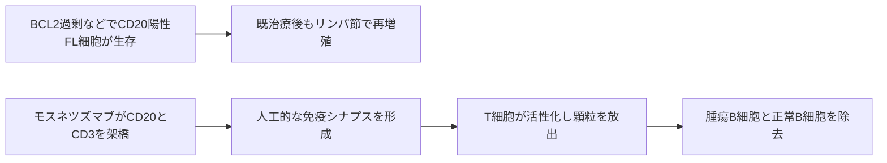

# モスネツズマブ（ルンスミオ／Lunsumio）

## まず3行で

- 再発・難治性の濾胞性リンパ腫を中心に用いる、CD20陽性B細胞リンパ腫の治療薬である。
- 腫瘍B細胞のCD20とT細胞のCD3を同時につかみ、抗原提示に依存せずT細胞へ標的細胞の殺傷を指示する。
- 2種類のFabをフルサイズIgG1へ正しく組み立て、Fc機能、半減期、サイトカイン放出を工学的に制御した初の承認CD20×CD3二重特異性抗体である。

## 1. どんな病気か

代表疾患の濾胞性リンパ腫（FL）は、リンパ節の胚中心B細胞に由来する低悪性度リンパ腫である。無痛性リンパ節腫脹で見つかることが多く、進行は緩やかでも寛解と再発を繰り返し、一部はびまん性大細胞型B細胞リンパ腫へ形質転換する。

多くのFLではt(14;18)転座により**BCL2**が免疫グロブリン重鎖遺伝子の制御下に入り、胚中心で本来除かれるB細胞がアポトーシスを免れる。ただし転座だけで発症するわけではなく、後続する遺伝子・エピゲノム異常と、濾胞ヘルパーT細胞や間質細胞を含む微小環境がクローンを支える。[Tsujimotoら](https://pubmed.ncbi.nlm.nih.gov/3547408/)

抗CD20抗体を含む免疫化学療法で長く制御できても、再発ごとに治療選択肢は狭まり得る。既治療に耐性化したB細胞を、同じCD20を目印に別の殺傷原理で攻撃できることが開発課題だった。形質転換や治療抵抗性を決めるクローン進化と免疫微小環境の寄与は患者ごとに異なり、完全には予測できない。

## 2. なぜこの分子を標的にするのか

CD20はpre-B細胞から成熟B細胞に発現する膜蛋白で、多くのFL細胞にも保たれる。造血幹細胞と形質細胞には乏しいため、CD20陽性細胞を除去してもB細胞再生と既存抗体産生を一定程度残せる。臨床で確立した標的であり、腫瘍細胞の選別マーカーとして使いやすい一方、正常B細胞減少、低ガンマグロブリン血症、感染はオンターゲット作用である。

CD3はT細胞受容体複合体の信号部である。CD20とCD3を架橋すると、腫瘍抗原ペプチド、HLA、既存の腫瘍特異的T細胞を必要とせず、局所で免疫シナプスを作れる。ただし効果はCD20発現と機能するT細胞に依存する。治療後の**CD20蛋白消失**は確立した耐性機序だが、CD20が残っても効かない例の原因はT細胞状態などを含め未解明である。[Schusterら](https://pmc.ncbi.nlm.nih.gov/articles/PMC10934296/)

## 3. どんな抗体として設計されたか

### 開発企業

Genentechが創製と前臨床開発を担い、Rocheグループが国際臨床開発・承認を進めた。日本では中外製薬が承認申請と製造販売を担う。世界初承認は2022年6月の欧州で、日本では2024年12月に静注製剤が初承認された。[EMA](https://www.ema.europa.eu/en/medicines/human/EPAR/lunsumio)

### 基本設計と作用の仕組み

約146 kDaのヒト化IgG1κ型1+1二重特異性抗体で、一方のFabがCD20、他方がCD3εに結合する。両細胞がそろった時にT細胞を活性化し、パーフォリン・グランザイムによるB細胞溶解と連続殺傷を誘導する。抗原提示や共刺激は必須ではない。[Sunら](https://pubmed.ncbi.nlm.nih.gov/25972002/)

### 設計上の工夫

異なる重鎖のCH3に相補的な「突起」と「穴」を作る**knobs-into-holes**で、CD20腕とCD3腕のヘテロ二量体化を促す。両重鎖のFc糖鎖付加部位をAsnからGlyへ置換し、Fcγ受容体結合とADCCを低減した。T細胞をFcで非選択的に架橋せず、殺傷をFabによるCD20×CD3架橋へ限定するためである。[厚生労働省](https://www.mhlw.go.jp/web/t_doc?dataId=00tc7494&dataType=1&pageNo=1)

Fcを残すことで定常状態の半減期は約16日となり、Fcを持たず半減期約2時間のブリナツモマブと違って間欠投与できる。一方、急なT細胞活性化はCRSを生むため、初回サイクルを低用量から段階増量する。皮下注は吸収を緩やかにし、投与時間と急峻なサイトカイン曝露を抑える製剤上の発展である。

## 4. 病態から作用まで

## 5. 何が画期的だったのか

モスネツズマブは、リツキシマブと同じCD20を「Fc依存性除去」ではなく「T細胞への標的指定」に再利用した。CD20抗体を含む複数治療後のFLでも、単剤・期間固定で完全奏効を得られる患者がいることを示し、個別細胞製造を要するCAR-Tと持続静注を要する初期BiTEの間に、既製IgG型T細胞リダイレクトという選択肢を確立した。承認根拠試験の完全奏効割合は60%だったが、単群試験であり長期比較効果には不確実性が残る。[Buddeら](https://pubmed.ncbi.nlm.nih.gov/35803286/)

> **一言で評価：** この抗体の革新性は、CD20×CD3架橋を半減期の長いFcサイレントIgGへ実装し、段階増量と皮下注で強力なT細胞活性化を実用的に制御したことにある。

## 6. 実際の医療での位置づけ

2026年8月17日時点の日本では、抗CD20抗体を含む少なくとも2治療後の再発・難治性FL Grade 1～3Aに単剤で用いる。静注は1/2/60/60/30 mg、皮下注は5/45/45 mgと段階増量し、完全奏効なら8サイクルで終了、部分奏効または安定なら最大17サイクルまで続ける。さらに皮下注＋ポラツズマブ ベドチンは、再発・難治性の大細胞型B細胞リンパ腫とFL Grade 3Bにも承認されている。[PMDA](https://www.pmda.go.jp/PmdaSearch/iyakuDetail/ResultDataSetPDF/450045_4291476A3020_1_02)

最重要毒性はCRSで、発熱、低血圧、低酸素などを投与初期に起こし得る。副腎皮質ステロイド等の前投与、初回の入院監視、トシリズマブを含む対応体制が必要である。ICANSなどの神経学的事象、感染、血球減少、腫瘍崩壊症候群にも注意する。正常B細胞も除去するため免疫低下は避けにくく、CD20消失による再発も残る。

## 7. 類薬との違い

| 項目 | モスネツズマブ | ブリナツモマブ | グロフィタマブ |
|---|---|---|---|
| 標的 | CD20 × CD3 | CD19 × CD3 | CD20 × CD3 |
| 形式 | 1+1ヒト化IgG1、Fcサイレント | FcなしタンデムscFv | 2+1ヒト化IgG1、Fcサイレント |
| 主な疾患 | FL | B-ALL | 大細胞型B細胞リンパ腫 |
| 投与設計 | 3週ごと静注または皮下注、期間固定 | 28日持続静注 | オビヌツズマブ前投与後、3週ごと静注、期間固定 |
| 強み | 間欠・皮下投与、外来化の余地 | 短寿命で中断後の制御が速い | CD20を二価で高アビディティ結合 |
| 弱点 | CRS、B細胞減少、抗原消失 | 輸液ポンプ、神経毒性 | 前処置・入院、CRS |

最も重要な違いは、T細胞リダイレクトの原理が同じでも、Fcの有無、腫瘍側の結合価、投与経路が曝露持続性と安全管理を変える点である。[FDA COLUMVI添付文書](https://www.accessdata.fda.gov/drugsatfda_docs/label/2025/761309s004lbl.pdf)

## 8. この抗体から学べること

- **疾患生物学：** 緩徐なFLも、BCL2による細胞生存と免疫微小環境が再発を支える。
- **標的選択：** 既知の系統抗原でも、殺傷原理をFc依存からT細胞依存へ変えると耐性後に再利用できる。
- **抗体設計：** ヘテロ二量体化、Fcサイレンシング、半減期、投与速度は一体で設計する必要がある。
- **残る課題：** CRS、感染、CD20消失、T細胞機能低下を予測・回避するバイオマーカーが必要である。
- **次に読む抗体：** CD20を二価、CD3を一価で結ぶ2+1型のグロフィタマブ。

## 参考文献

1. ルンスミオ皮下注5 mg／45 mg 添付文書. 医薬品医療機器総合機構, 2026. [PMDA](https://www.pmda.go.jp/PmdaSearch/iyakuDetail/ResultDataSetPDF/450045_4291476A3020_1_02)（2026年8月17日アクセス）
2. ルンスミオ点滴静注1 mg／30 mg 添付文書. 医薬品医療機器総合機構, 2026. [PMDA](https://www.pmda.go.jp/PmdaSearch/iyakuDetail/ResultDataSetPDF/450045_4291476A1028_1_02)（2026年8月17日アクセス）
3. ルンスミオ点滴静注 審査報告書. 医薬品医療機器総合機構, 2024. [PMDA](https://www.pmda.go.jp/drugs/2025/P20250115001/450045000_30600AMX00306_A100_1.pdf)（2026年8月17日アクセス）
4. Lunsumio: European Public Assessment Report. European Medicines Agency, 2026. [EMA](https://www.ema.europa.eu/en/medicines/human/EPAR/lunsumio)（2026年8月17日アクセス）
5. 医薬品の一般的名称について（モスネツズマブ）. 厚生労働省, 2023. [厚生労働省](https://www.mhlw.go.jp/web/t_doc?dataId=00tc7494&dataType=1&pageNo=1)（2026年8月17日アクセス）
6. Tsujimoto Y, et al. DNA rearrangements in human follicular lymphoma can involve the 5′ or the 3′ region of the bcl-2 gene. *Proceedings of the National Academy of Sciences USA*. 1987;84:1329–1331. [PubMed](https://pubmed.ncbi.nlm.nih.gov/3547408/)
7. Sun LL, et al. Anti-CD20/CD3 T cell-dependent bispecific antibody for the treatment of B cell malignancies. *Science Translational Medicine*. 2015;7:287ra70. [PubMed](https://pubmed.ncbi.nlm.nih.gov/25972002/)
8. Hosseini I, et al. Mitigating the risk of cytokine release syndrome in a phase I trial of CD20/CD3 bispecific antibody mosunetuzumab. *npj Systems Biology and Applications*. 2020;6:28. [Nature](https://www.nature.com/articles/s41540-020-00145-7)
9. Budde LE, et al. Safety and efficacy of mosunetuzumab in relapsed or refractory follicular lymphoma. *Lancet Oncology*. 2022;23:1055–1065. [PubMed](https://pubmed.ncbi.nlm.nih.gov/35803286/)
10. Schuster SJ, et al. Loss of CD20 expression as a mechanism of resistance to mosunetuzumab in relapsed/refractory B-cell lymphomas. *Blood*. 2024;143:822–832. [PMC](https://pmc.ncbi.nlm.nih.gov/articles/PMC10934296/)
