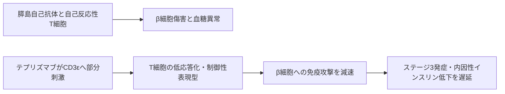

# テプリズマブ（Tzield／Teizeild）

## まず3行で

- 1型糖尿病の自己免疫が始まり、血糖異常はあるが症状のない段階を中心に用いる疾患修飾抗体である。
- T細胞のCD3εに弱い刺激を短期間与え、膵β細胞を攻撃するT細胞の反応性を下げ、インスリン産生の喪失を遅らせる。
- Fc受容体結合を抑えた抗CD3設計により、強いT細胞活性化を避けつつ、発症前の自己免疫へ介入できることを初めて承認薬として示した。

## 1. どんな病気か

1型糖尿病（T1D）は、膵島のβ細胞が自己免疫で傷害され、インスリンが不足する疾患である。インスリンは血中ブドウ糖を細胞へ取り込ませるため、欠乏すると口渇、多尿、体重減少、疲労が現れ、重症ではケトアシドーシスに至る。発症後は原則として生涯のインスリン補充が必要になる。[NIDDK](https://www.niddk.nih.gov/health-information/diabetes/overview/what-is-diabetes/type-1-diabetes)

病気は症状より前から進む。膵島抗原に対する自己抗体が複数ある正常血糖期がステージ1、さらに血糖異常を伴う無症候期がステージ2、症候性高血糖がステージ3である。自己抗体は病勢の標識で、β細胞を直接壊す主役は自己反応性CD8陽性T細胞などと考えられる。遺伝素因、環境因子、β細胞ストレスがどう発火・持続させるか、患者ごとの進行速度はなお完全には説明できない。

従来治療は失われたホルモンを補うもので、自己免疫そのものを変えなかった。課題は、β細胞が残る無症候期を検査で見つけ、感染防御を長期に損なわず自己免疫だけを減速することだった。

## 2. なぜこの分子を標的にするのか

CD3はT細胞受容体（TCR）と複合体を作り、抗原認識を細胞内へ伝える。CD3εは成熟T細胞に広く存在するため、抗CD3抗体はβ細胞特異的T細胞だけでなくT細胞応答全体を一時的に再設定できる。細胞外エピトープへ結合し、短い投与期間で受容体シグナルの強さと時間を制御できる点は抗体に適する。

反面、CD3は病的細胞だけの標的ではない。強く架橋すれば大量のサイトカイン放出を、持続的に抑えれば感染防御低下を招く。したがって設計課題は「T細胞を除去する」ことではなく、「必要十分な部分刺激を安全に与える」ことにある。

## 3. どんな抗体として設計されたか

### 開発企業

大学・Immune Tolerance Network・NIH TrialNetによる初期研究後、MacroGenicsが2005年から、Eli Lillyとの提携を含め臨床開発を進めた。Provention Bioが2018年に権利を取得し、発症前ステージ2で承認へつなげた。2023年にProventionを買収したSanofiが現在の開発・販売主体である。[FDA審査資料](https://www.accessdata.fda.gov/drugsatfda_docs/nda/2023/761183Orig1s000ClinPharmR.pdf)

### 基本設計と作用の仕組み

約150 kDaのヒト化IgG1κ通常抗体で、マウス抗CD3抗体OKT3由来の結合部位がCD3εを認識する。FcのLeu234とLeu235をAlaへ置換した**LALA変異**によりFcγ受容体結合を100分の1以下へ低減し、C1q依存性補体活性化も抑えた。[Xuら](https://pubmed.ncbi.nlm.nih.gov/10716879/) Fc受容体陽性細胞が抗体を架橋してT細胞を一斉活性化する旧来型OKT3の弱点を避けるためである。

FabによるCD3結合は残るため、完全な遮断ではなく部分アゴニストとして働く。CD3複合体の内在化、末梢血からの一過性リンパ球減少、制御性T細胞と機能低下したKLRG1陽性TIGIT陽性CD8陽性T細胞の増加が観察される。これらが自己反応性T細胞を低応答化すると考えられるが、どの変化が長期効果の原因かは未確定である。[Longら](https://pubmed.ncbi.nlm.nih.gov/28664195/)

## 4. 病態から作用まで

## 5. 何が画期的だったのか

テプリズマブ以前、T1D治療の中心は血糖を管理するインスリンだった。本薬は、複数自己抗体と血糖異常で高リスク期を定義し、14日間の免疫介入で症候性発症までの時間を中央値約2年延ばした。小規模試験で効果の個人差も大きく、発症を永久に防ぐ薬ではないが、「診断後に代謝を補う」から「発症前に病因を減速する」へ治療時点を移した。[Heroldら](https://doi.org/10.1056/NEJMoa1902226)

> **一言で評価：** この抗体の革新性は、Fcを静かにした抗CD3部分アゴニストで自己免疫を短期再調整し、1型糖尿病の発症前治療を実用化したことにある。

## 6. 実際の医療での位置づけ

2026年8月20日時点の米国では、ステージ2 T1Dの1歳以上に14日間連続で点滴静注する。さらに診断直後のステージ3 T1Dでは、8～17歳に12日間投与を6か月間隔で2コース行い、内因性インスリン低下を遅らせる適応が迅速承認された。EUでは8歳以上のステージ2に承認済み、日本では未承認として第III相試験中である。[FDA添付文書](https://www.accessdata.fda.gov/drugsatfda_docs/label/2026/761183s010lbls014lbl.pdf) [EMA](https://www.ema.europa.eu/en/medicines/human/EPAR/teizeild) [jRCT](https://jrct.mhlw.go.jp/latest-detail/jRCT2051250224)

発症遅延はインスリン治療を不要にする治癒ではなく、ステージ3ではインスリンと併用する。重要な副作用はサイトカイン放出症候群、リンパ球減少、重篤感染、肝障害、発疹である。2026年の米国添付文書にはEBV・CMV再活性化の枠囲み警告が加わり、投与前検査と投与中・終了後の監視が必要になった。対象者を自己抗体スクリーニングで見つける体制、14日連続点滴、反応予測、抗薬物抗体も普及上の制約である。

## 7. 類薬との違い

| 項目 | テプリズマブ | インスリン | ムロモナブ-CD3（OKT3） |
|---|---|---|---|
| 標的 | T細胞CD3ε | インスリン受容体 | T細胞CD3ε |
| 形式 | ヒト化IgG1、LALA Fc | ペプチドホルモン | マウスIgG2a |
| 目的 | 自己免疫を短期再調整 | 代謝を生涯補充 | 移植拒絶でT細胞を強く抑制 |
| 投与 | 連日点滴の限定コース | 毎日の皮下投与等 | 歴史的には連日点滴 |
| 強み | 発症前から疾患経過を遅らせる | 発症後の生命維持に不可欠 | 強い免疫抑制 |
| 弱点 | CRS、感染、選別・点滴負担 | 自己免疫は止めない | CRS、抗マウス抗体 |

最も重要な違いは、テプリズマブがインスリンの代替ではなく、その必要時期やβ細胞機能低下を遅らせること、同じCD3標的でもFc架橋を弱めると「除去」から「調節」へ作用を変えられることである。

## 8. この抗体から学べること

- **疾患生物学：** T1Dは症状出現前から段階的に進む、介入可能な自己免疫疾患である。
- **標的選択：** 病原クローン固有抗原がなくても、共通のTCR信号装置を短期調節する選択肢がある。
- **抗体設計：** Fc機能の低減は安全性だけでなく、CD3抗体の作用様式そのものを変える。
- **残る課題：** 誰が長く応答するか、再投与で抗薬物抗体をどう扱うか、広域スクリーニングをどう実装するか。
- **次に読む抗体：** T細胞を除去せず共刺激を抑えるCTLA-4-Igのアバタセプト。

## 参考文献

1. TZIELD (teplizumab-mzwv) Prescribing Information. U.S. Food and Drug Administration, 2026. [FDA](https://www.accessdata.fda.gov/drugsatfda_docs/label/2026/761183s010lbls014lbl.pdf)（2026年8月20日アクセス）
2. FDA approves first drug that can delay onset of type 1 diabetes. U.S. Food and Drug Administration, 2022. [FDA](https://www.fda.gov/news-events/press-announcements/fda-approves-first-drug-can-delay-onset-type-1-diabetes)（2026年8月20日アクセス）
3. Teizeild: European Public Assessment Report. European Medicines Agency, 2026. [EMA](https://www.ema.europa.eu/en/medicines/human/EPAR/teizeild)（2026年8月20日アクセス）
4. Clinical Pharmacology Review: BLA 761183. U.S. Food and Drug Administration, 2022. [FDA](https://www.accessdata.fda.gov/drugsatfda_docs/nda/2023/761183Orig1s000ClinPharmR.pdf)（2026年8月20日アクセス）
5. Type 1 Diabetes. National Institute of Diabetes and Digestive and Kidney Diseases. [NIDDK](https://www.niddk.nih.gov/health-information/diabetes/overview/what-is-diabetes/type-1-diabetes)（2026年8月20日アクセス）
6. Xu D, et al. In vitro characterization of five humanized OKT3 effector function variant antibodies. *Cellular Immunology*. 2000;200:16–26. [PubMed](https://pubmed.ncbi.nlm.nih.gov/10716879/)
7. Herold KC, et al. An Anti-CD3 Antibody, Teplizumab, in Relatives at Risk for Type 1 Diabetes. *New England Journal of Medicine*. 2019;381:603–613. [DOI](https://doi.org/10.1056/NEJMoa1902226)
8. Long SA, et al. Partial exhaustion of CD8 T cells and clinical response to teplizumab in new-onset type 1 diabetes. *Science Immunology*. 2016;1:eaai7793. [PubMed](https://pubmed.ncbi.nlm.nih.gov/28664195/)
9. Ramos EL, et al. Teplizumab and β-Cell Function in Newly Diagnosed Type 1 Diabetes. *New England Journal of Medicine*. 2023;389:2151–2161. [DOI](https://doi.org/10.1056/NEJMoa2308743)
10. ステージ3の1型糖尿病患者を対象としたteplizumab第III相試験（jRCT2051250224）. 厚生労働省, 2026. [jRCT](https://jrct.mhlw.go.jp/latest-detail/jRCT2051250224)（2026年8月20日アクセス）
