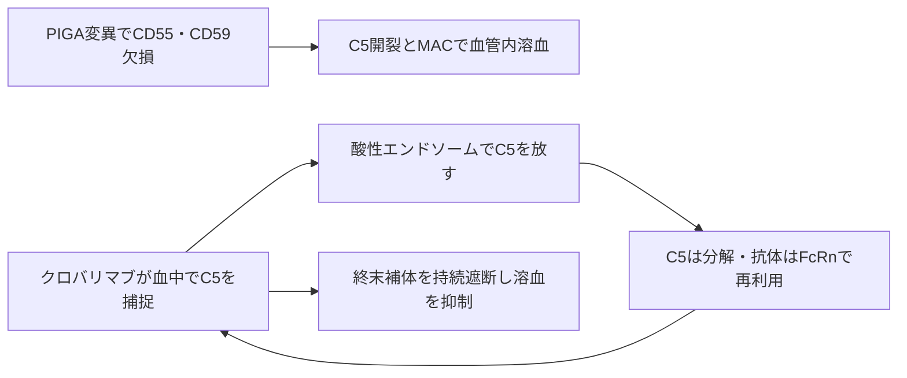

# クロバリマブ（ピアスカイ／PiaSky）

## まず3行で

- 発作性夜間ヘモグロビン尿症（PNH）で、補体による赤血球破壊を抑える抗体である。
- 補体C5に結合してC5aとC5bへの開裂を止め、酸性の細胞内ではC5を放して血中へ戻り、繰り返し働く。
- pH依存的結合、FcRn・表面電荷改変、高濃度製剤を統合し、4週ごとの少量皮下注を実現したことが革新的だった。

## 1. どんな病気か

PNHは、造血幹細胞に後天的な**PIGA**変異が生じたクローン性疾患である。PIGAは蛋白質を細胞膜につなぐGPIアンカーの合成に必要で、変異クローン由来の赤血球では補体制御蛋白CD55とCD59が欠ける。[Takedaら](https://pubmed.ncbi.nlm.nih.gov/8500164/)

補体は本来、病原体を標識し、炎症を呼び、膜侵襲複合体（MAC）で標的膜に孔を開ける自然免疫である。防御蛋白を失ったPNH赤血球ではこの反応が自分に向かい、血管内溶血、貧血、暗色尿、疲労を生じる。遊離ヘモグロビンによる一酸化窒素消費や血小板・補体活性化などは、腹痛、嚥下障害、腎障害、致死的な血栓症にもつながる。

C5阻害薬は血管内溶血を大きく変えた一方、長期の定期点滴が必要だった。治療しても変異クローンや骨髄不全は消えず、上流のC3標識による血管外溶血も残り得る。PIGA変異クローンがなぜ選択的に拡大するかも完全には解明されていない。

## 2. なぜこの分子を標的にするのか

C5は古典、レクチン、第二の3経路が合流する終末補体の要所である。C5変換酵素がC5を切ると、炎症を促すC5aとMACの起点C5bが生じる。C5を止めれば溶血の実行段階を遮断しつつ、上流のC3による病原体標識は一部残せる。

ただしC5は血漿中に豊富で絶えず産生される可溶性蛋白であり、通常抗体は抗原との複合体ごとFcRnに救済され、かえってC5を蓄積させ得る。薬効維持には大量投与が必要になる。また終末補体は髄膜炎菌など莢膜形成菌の排除に重要なため、C5阻害に伴う重症感染は避けられないオンターゲットリスクである。

## 3. どんな抗体として設計されたか

### 開発企業

中外製薬とシンガポールのChugai Pharmabody Researchがウサギ抗体から創製・ヒト化し、独自のリサイクリング抗体技術でSKY59（クロバリマブ）へ最適化した。[Fukuzawaら](https://pubmed.ncbi.nlm.nih.gov/28439081/) Rocheと中外が国際第III相試験を共同で進め、Genentechが米国申請主体となった。[FDA審査資料](https://www.accessdata.fda.gov/drugsatfda_docs/nda/2024/761388Orig1s000IntegratedR.pdf) 中国に続き日本で2024年3月に承認され、同年5月に日本で世界初の発売となった。[中外製薬](https://www.chugai-pharm.co.jp/news/detail/20240522113000_1395.html)

### 基本設計と作用の仕組み

ヒト化IgG1κ通常抗体で、C5のβ鎖側エピトープへ高親和性で結合し、C5の開裂を妨げる。改変FcはFcγ受容体とC1qへの結合が弱く、ADCCやCDCで細胞を攻撃するのではなく、可溶性C5を「静かに」中和する。[PMDA審査報告書](https://www.pmda.go.jp/drugs/2024/P20240423001/450045000_30600AMX00131_A100_1.pdf)

### 設計上の工夫

血中の中性pHではC5を強く捕らえるが、複合体が細胞へ取り込まれた後の酸性エンドソームでは結合が弱まり、C5を放す。C5はリソソームへ送られ、抗体はFcRnに救済されて血中へ戻る。FcのM428L/N434Aは酸性pHでのFcRn結合を高める。さらに抗体表面の電荷を調整して複合体の細胞取り込みを促し、C5蓄積を抑えた。[Sampeiら](https://pubmed.ncbi.nlm.nih.gov/30592762/)

この反復利用と高い溶解性により、初回点滴後は導入皮下注を経て、体重別に680または1,020 mgを4週ごとに皮下注できる。十分な訓練後は在宅自己注射も可能である。[PMDA添付文書](https://www.pmda.go.jp/PmdaSearch/iyakuDetail/ResultDataSetPDF/450045_6399433A1022_1_03)

## 4. 病態から作用まで

## 5. 何が画期的だったのか

クロバリマブは新しい標的を開拓した薬ではない。革新は、抗体が可溶性抗原を抱え込むという薬物動態上の問題を、抗原の受け渡しまで設計して解いた点にある。C5阻害未治療患者では、4週ごとの皮下注で2週ごとのエクリズマブ点滴に対し、溶血制御と輸血回避で非劣性を示した。[Röthら](https://doi.org/10.1002/ajh.27412)

またエクリズマブとは異なる部位に結合し、同薬が効きにくいC5 p.Arg885His変異にも前臨床で中和活性を示した。[Fukuzawaら](https://pubmed.ncbi.nlm.nih.gov/28439081/) ただし、この少数集団での臨床効果の確実性は限定的である。

> **一言で評価：** この抗体の革新性は、C5を一度捕らえて終わる抗体を、抗原を捨てて何度も働く分子へ変え、持続性と皮下投与を両立したことにある。

## 6. 実際の医療での位置づけ

2026年8月23日時点の日本では、体重40 kg以上のPNH患者に、未治療からも他のC5阻害薬からの切替えでも使用できる。疾患を治癒させる薬ではなく、継続的なC5遮断で溶血を管理する。第III相比較試験ではエクリズマブと同程度の疾患制御を保ちながら、維持投与を月1回の皮下注へ変えた点が実用上の価値である。

最重要の安全対策は、原則として開始2週前までの髄膜炎菌ワクチン接種と、接種後も続く髄膜炎・敗血症の警戒である。抗薬物抗体による曝露・薬効低下、注射反応にも注意する。特に別エピトープの抗C5抗体から切り替えると、同じC5に新旧抗体が同時結合して大きな免疫複合体を作り、発疹や関節痛などIII型過敏症反応を起こし得る。切替え試験では多くが軽度～中等度で解消したが、設計差が生む固有の制約である。[Scheinbergら](https://doi.org/10.1002/ajh.27413)

## 7. 類薬との違い

| 項目 | クロバリマブ | エクリズマブ | ラブリズマブ |
|---|---|---|---|
| 標的 | C5の別エピトープ | C5 | C5（エクリズマブ由来） |
| 形式 | pH依存・電荷改変IgG1 | ヒト化IgG2/4 | pH依存・長時間作用型IgG2/4 |
| 維持投与 | 4週ごと皮下注 | 2週ごと点滴静注 | 成人は8週ごと点滴静注 |
| 設計の核 | C5分解と抗体再利用 | 終末補体の選択的遮断 | 抗体再利用と半減期延長 |
| 強み | 少量皮下、在宅投与、C5変異への可能性 | 長い実績、複数疾患の適応 | 長い投与間隔、複数疾患の適応 |
| 弱点 | 切替え時免疫複合体、ADA | 頻回点滴、特定C5変異 | 点滴、特定C5変異 |

最重要の違いは、クロバリマブが長寿命化だけでなく、複合体を取り込ませてC5を捨てる「抗原クリアランス」まで積極的に設計した点である。三剤ともC5阻害共通の感染リスクと、C3依存性血管外溶血は残す。

## 8. この抗体から学べること

- **疾患生物学：** PNHは終末補体を止めれば血管内溶血を抑えられるが、変異クローンと上流補体の問題は残る。
- **標的選択：** 高濃度の可溶性標的では、親和性だけでなく抗原の産生・消失速度が投与量を決める。
- **抗体設計：** pH依存性、FcRn、表面電荷、溶解性を組み合わせると、抗体と抗原の体内動態を別々に制御できる。
- **残る課題：** 重症感染、ADA、切替え時免疫複合体、残存する血管外溶血を減らす必要がある。
- **次に読む抗体：** 同じリサイクリング技術をIL-6受容体に用いたサトラリズマブ。

## 参考文献

1. ピアスカイ注340mg 添付文書（第4版）. 医薬品医療機器総合機構, 2026. [PMDA](https://www.pmda.go.jp/PmdaSearch/iyakuDetail/ResultDataSetPDF/450045_6399433A1022_1_03)（2026年8月23日アクセス）
2. ピアスカイ注340mg 審査報告書. 医薬品医療機器総合機構, 2024. [PMDA](https://www.pmda.go.jp/drugs/2024/P20240423001/450045000_30600AMX00131_A100_1.pdf)（2026年8月23日アクセス）
3. Takeda J, et al. Deficiency of the GPI anchor caused by a somatic mutation of the PIG-A gene in paroxysmal nocturnal hemoglobinuria. *Cell*. 1993;73:703–711. [PubMed](https://pubmed.ncbi.nlm.nih.gov/8500164/)
4. Fukuzawa T, et al. Long lasting neutralization of C5 by SKY59, a novel recycling antibody, is a potential therapy for complement-mediated diseases. *Scientific Reports*. 2017;7:1080. [PubMed](https://pubmed.ncbi.nlm.nih.gov/28439081/)
5. Sampei Z, et al. Antibody engineering to generate SKY59, a long-acting anti-C5 recycling antibody. *PLOS ONE*. 2018;13:e0209509. [PubMed](https://pubmed.ncbi.nlm.nih.gov/30592762/)
6. Röth A, et al. The complement C5 inhibitor crovalimab in paroxysmal nocturnal hemoglobinuria. *Blood*. 2020;135:912–920. [PubMed](https://pubmed.ncbi.nlm.nih.gov/31978221/)
7. Röth A, et al. Phase 3 randomized COMMODORE 2 trial: Crovalimab versus eculizumab in patients with paroxysmal nocturnal hemoglobinuria naive to complement inhibition. *American Journal of Hematology*. 2024;99:1768–1777. [DOI](https://doi.org/10.1002/ajh.27412)
8. Scheinberg P, et al. Phase 3 randomized COMMODORE 1 trial: Crovalimab versus eculizumab in complement-inhibitor experienced patients with PNH. *American Journal of Hematology*. 2024;99:1757–1767. [DOI](https://doi.org/10.1002/ajh.27413)
9. 「ピアスカイ注340mg」国内発売のお知らせ. 中外製薬, 2024. [中外製薬](https://www.chugai-pharm.co.jp/news/detail/20240522113000_1395.html)（2026年8月23日アクセス）
10. Integrated Review: BLA 761388, PIASKY (crovalimab-akkz). U.S. Food and Drug Administration, 2024. [FDA](https://www.accessdata.fda.gov/drugsatfda_docs/nda/2024/761388Orig1s000IntegratedR.pdf)（2026年8月23日アクセス）
