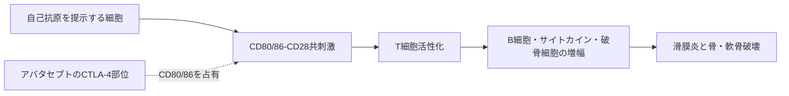

# アバタセプト（オレンシア／Orencia）

## まず3行で

- 関節リウマチを中心に、自己反応性免疫が関節を慢性的に傷つける病気に用いる抗体由来融合タンパク質である。
- 抗原提示細胞のCD80・CD86を覆い、T細胞のCD28へ入る「第2シグナル」を遮断して、炎症の起動と増幅を抑える。
- 生体の免疫ブレーキCTLA-4を可溶性の二量体へ作り替え、細胞を殺さず共刺激だけを調節する治療を実用化した点が重要である。

## 1. どんな病気か

関節リウマチ（RA）は、免疫系が自分の組織を攻撃する慢性疾患である。手指や手首などの関節に左右対称の腫れ、痛み、朝のこわばりを生じ、疲労や肺・血管などの関節外病変も起こり得る。女性に多く、未治療では滑膜の炎症が軟骨と骨を不可逆的に傷つけ、機能障害につながる。[NIAMS](https://www.niams.nih.gov/health-topics/rheumatoid-arthritis)

遺伝素因、喫煙などの環境因子、粘膜免疫が重なり、症状より前から自己免疫が進む。抗原提示細胞が自己由来抗原をT細胞へ示すと、T細胞はB細胞の自己抗体産生を助け、マクロファージや滑膜線維芽細胞を刺激する。TNF、IL-6などの炎症性サイトカインと破骨細胞活性化が連鎖し、肥厚した滑膜が関節を侵食する。ただし、発症の引き金や患者ごとに優勢な経路は完全には解明されていない。

メトトレキサート（MTX）などの疾患修飾性抗リウマチ薬やTNF阻害薬があっても、効果不十分、不耐容、感染リスクが残る。そこで一つのサイトカインより上流で、獲得免疫の始動条件を調節する発想が生まれた。

## 2. なぜこの分子を標的にするのか

休止T細胞の十分な活性化には、T細胞受容体が抗原・MHCを読む第1シグナルに加え、T細胞上のCD28と抗原提示細胞上のCD80（B7-1）・CD86（B7-2）が結合する第2シグナルが必要である。CD80・CD86は樹状細胞、単球・マクロファージ、活性化B細胞などに発現する。

CTLA-4は活性化T細胞や制御性T細胞が用いる生理的なブレーキで、CD28より強くCD80・CD86へ結合する。アバタセプトはCTLA-4の細胞外部分を「おとり受容体」として使い、CD28との接触を競合的に防ぐ。これにより抗原特異性を一つずつ知る必要なく、T細胞増殖とIL-2、TNF、IFN-γ産生、その先のB細胞・マクロファージ・破骨細胞の反応を弱められる。

一方、CD28共刺激はワクチン応答や感染防御にも必要である。病的T細胞だけを選別する標的ではなく、共刺激への依存が低い既存のエフェクター／メモリーT細胞もあるため、効果には個人差がある。

## 3. どんな抗体として設計されたか

### 開発企業

Bristol-Myers Squibb（BMS）の研究者は、CTLA-4細胞外ドメインとIgG定常領域を融合したCTLA4-IgがB7へ結合し、免疫応答を抑えることを1991～1992年に示した。[Linsleyら（1991）](https://pubmed.ncbi.nlm.nih.gov/1714933/) [Linsleyら（1992）](https://pubmed.ncbi.nlm.nih.gov/1496399/) BMSがBMS-188667として臨床開発し、2005年に米国でRA治療薬として初承認を得た。日本ではBMSが開発・製造販売を担い、小野薬品工業が販売・プロモーションに関与する。[PMDAインタビューフォーム](https://www.info.pmda.go.jp/go/interview/1/670605_3999429D1021_1_013_1F.pdf)

### 基本設計と作用の仕組み

Fabや抗体可変領域を持たない、見かけの分子量約92 kDaの糖タンパク質である。1鎖はヒトCTLA-4細胞外ドメイン（1～125番残基）と、ヒンジ・CH2・CH3からなる改変ヒトIgG1 Fc（126～358番残基）で構成され、同一2鎖が共有結合した二量体としてCHO細胞で作られる。二つのCTLA-4部位がCD80・CD86へ結合し、CD28共刺激を遮断する。

### 設計上の工夫

Fcは二量体化と抗体様の長い体内滞留を与える足場であり、標的細胞を攻撃する武器ではない。IgG1ヒンジの4残基をSerへ置換した改変により、Fcγ受容体には結合してもADCCとCDCを誘導しない。[PMDAインタビューフォーム](https://www.info.pmda.go.jp/go/interview/1/670605_3999429D1021_1_013_1F.pdf) これは抗原提示細胞を枯渇させず、細胞間の情報伝達だけを可逆的に抑えるという設計意図に合う。

日本では、点滴静注は初回、2週、4週後、以後4週ごとに体重別投与する。成人RAでは125 mgを週1回皮下注でき、訓練後の自己投与も可能である。[PMDA点滴静注用添付文書](https://www.pmda.go.jp/PmdaSearch/iyakuDetail/ResultDataSetPDF/670605_3999429D1021_1_14) [PMDA皮下注用添付文書](https://www.pmda.go.jp/PmdaSearch/iyakuDetail/ResultDataSetPDF/670605_3999429G1028_2_13)

## 4. 病態から作用まで

## 5. 何が画期的だったのか

アバタセプトは、炎症産物を一つ中和するのではなく、抗原提示細胞とT細胞の対話に必要な許可信号を遮断した。天然受容体の結合部位と抗体Fcを組み合わせることで、膜受容体を投与可能な長時間作用型デコイへ変えたことが抗体工学上の要点である。

MTXで効果不十分なRA患者では、症状と身体機能を改善し、1年の関節構造損傷の進行をプラセボより抑えた。[Kremerら](https://pubmed.ncbi.nlm.nih.gov/16785475/) TNF阻害薬アダリムマブとの直接比較では、2年間の臨床・機能・画像評価は概ね同等だった。[Schiffら](https://pubmed.ncbi.nlm.nih.gov/23962455/) ただし2026年の遺伝・自己抗体で選別した試験でも優越性は示されず、機序に合う患者選択はなお未解決である。[Emeryら](https://pubmed.ncbi.nlm.nih.gov/42425800/)

> **一言で評価：** この抗体由来薬の革新性は、生体のCTLA-4ブレーキをFc融合デコイとして再構成し、細胞を除去せずT細胞共刺激を治療標的にしたことにある。

## 6. 実際の医療での位置づけ

2026年8月26日時点の日本では、少なくとも1剤の抗リウマチ薬で効果不十分なRAに、単剤またはMTXなどの従来型薬と組み合わせて用いる。点滴静注製剤は多関節型若年性特発性関節炎にも承認されている。RAでは月1回の点滴と週1回の皮下注を患者背景・希望に応じて選べる。病気を治癒させる薬ではないが、症状だけでなく関節破壊を抑える疾患修飾薬である。

最重要リスクは、T細胞応答を弱めることに伴う重篤感染症である。開始前に結核・肝炎ウイルスを確認し、治療中から終了後3か月は生ワクチンを避ける。抗TNF製剤との併用は効果を上乗せせず感染を増やすため行わない。重篤な過敏症と間質性肺炎にも注意する。[PMDA点滴静注用添付文書](https://www.pmda.go.jp/PmdaSearch/iyakuDetail/ResultDataSetPDF/670605_3999429D1021_1_14)

## 7. 類薬との違い

| 項目 | アバタセプト | アダリムマブ | ベラタセプト |
|---|---|---|---|
| 標的 | CD80・CD86 | TNF | CD80・CD86 |
| 形式 | 天然型CTLA-4＋改変IgG1 Fc | 完全ヒトIgG1抗体 | 高親和性変異CTLA-4＋IgG1 Fc |
| 主用途 | RA、pJIA | RAなどの炎症性疾患 | 腎移植拒絶予防 |
| 作用の核 | 上流のT細胞共刺激を調節 | 炎症性サイトカインを直接中和 | 共刺激をより強く遮断 |
| 強み | 細胞を除去せず、点滴・皮下注を選択 | 炎症実行因子を直接抑える | A29Y/L104EでCD80/86結合を増強 |
| 主な弱点 | 感染、反応予測が不十分 | 感染、TNF依存性の限界 | 強い免疫抑制、PTLD、EBV陽性者に限定 |

最も重要な違いは、アバタセプトが完全抗体ではなく、天然の抑制受容体を借りたデコイであることだ。ベラタセプトは同じ骨格を高親和性化して移植免疫へ展開した後継例であり、作用強度を上げれば適応と安全域も変わることを示す。[NULOJIX米国添付文書](https://packageinserts.bms.com/pi/pi_nulojix.pdf)

## 8. この抗体から学べること

- **疾患生物学：** RAはサイトカインだけでなく、抗原提示、T細胞、B細胞、滑膜・骨の連鎖で維持される。
- **標的選択：** 免疫応答の第2シグナルは、抗原特異性を知らなくても上流から病的反応を弱められる標的になる。
- **抗体設計：** 受容体細胞外ドメインをFcで二量体化・長寿命化し、ヒンジを静かにすれば、結合遮断に特化した薬にできる。
- **残る課題：** 感染防御を保ちながら、共刺激依存性が高く応答しやすい患者を事前に選ぶ指標が必要である。
- **次に読む抗体：** CTLA4-Igを高親和性化し、腎移植へ転用したベラタセプト。

## 参考文献

1. オレンシア点滴静注用250mg 添付文書（第4版）. 医薬品医療機器総合機構, 2026. [PMDA](https://www.pmda.go.jp/PmdaSearch/iyakuDetail/ResultDataSetPDF/670605_3999429D1021_1_14)（2026年8月26日アクセス）
2. オレンシア皮下注125mg 添付文書（第4版）. 医薬品医療機器総合機構, 2026. [PMDA](https://www.pmda.go.jp/PmdaSearch/iyakuDetail/ResultDataSetPDF/670605_3999429G1028_2_13)（2026年8月26日アクセス）
3. オレンシア点滴静注用250mg 医薬品インタビューフォーム（第13版）. ブリストル・マイヤーズ スクイブ／PMDA, 2026. [PMDA](https://www.info.pmda.go.jp/go/interview/1/670605_3999429D1021_1_013_1F.pdf)（2026年8月26日アクセス）
4. Rheumatoid Arthritis. National Institute of Arthritis and Musculoskeletal and Skin Diseases, 2022. [NIAMS](https://www.niams.nih.gov/health-topics/rheumatoid-arthritis)（2026年8月26日アクセス）
5. Linsley PS, et al. CTLA-4 is a second receptor for the B cell activation antigen B7. *Journal of Experimental Medicine*. 1991;174:561–569. [PubMed](https://pubmed.ncbi.nlm.nih.gov/1714933/)
6. Linsley PS, et al. Immunosuppression in vivo by a soluble form of the CTLA-4 T cell activation molecule. *Science*. 1992;257:792–795. [PubMed](https://pubmed.ncbi.nlm.nih.gov/1496399/)
7. Kremer JM, et al. Effects of abatacept in patients with methotrexate-resistant active rheumatoid arthritis: a randomized trial. *Annals of Internal Medicine*. 2006;144:865–876. [PubMed](https://pubmed.ncbi.nlm.nih.gov/16785475/)
8. Schiff M, et al. Head-to-head comparison of subcutaneous abatacept versus adalimumab for rheumatoid arthritis: two-year efficacy and safety findings from AMPLE trial. *Annals of the Rheumatic Diseases*. 2014;73:86–94. [PubMed](https://pubmed.ncbi.nlm.nih.gov/23962455/)
9. Emery P, et al. A head-to-head comparison of abatacept and adalimumab in adults with early and dual seropositive rheumatoid arthritis plus HLA-DRB1 shared epitope: results from the randomised phase 3 AMPLIFIED trial. *Annals of the Rheumatic Diseases*. 2026. [PubMed](https://pubmed.ncbi.nlm.nih.gov/42425800/)
10. NULOJIX (belatacept) U.S. Prescribing Information. Bristol Myers Squibb, 2021. [BMS](https://packageinserts.bms.com/pi/pi_nulojix.pdf)（2026年8月26日アクセス）
