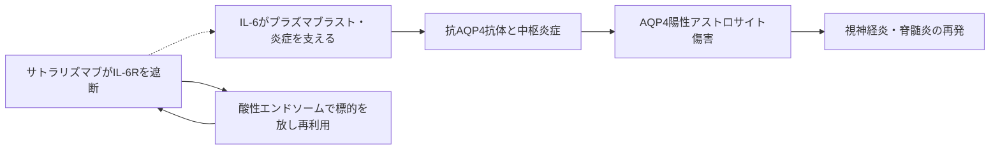

# サトラリズマブ（エンスプリング／Enspryng）

## まず3行で

- 視神経脊髄炎スペクトラム障害（NMOSD）で、視力や運動機能を奪い得る再発を予防する抗体である。
- 可溶性・膜結合型IL-6受容体を塞ぎ、自己抗体産生細胞の生存や中枢神経炎症を支えるIL-6シグナルを抑える。
- 酸性の細胞内で標的を放して血中へ戻る「リサイクリング抗体」を初めて承認品にし、4週ごとの皮下注を実現した点が重要である。

## 1. どんな病気か

NMOSDは、視神経、脊髄、脳幹などを発作性に傷つける自己免疫性中枢神経疾患である。視神経炎による視力低下、長い範囲の脊髄炎による麻痺・感覚障害、難治性の吃逆や嘔吐を生じ、再発のたびに障害が蓄積し得る。[NINDS](https://www.ninds.nih.gov/health-information/disorders/neuromyelitis-optica-spectrum-disorder)

抗AQP4抗体陽性例では、自己抗体がアストロサイト終足の水チャネルAQP4へ結合し、補体や炎症細胞を呼び込んでアストロサイトを傷害する。その後に脱髄と軸索障害が起こるため、単なる多発性硬化症の一型ではなく「抗体介在性アストロサイト病」と理解される。

患者血中では、抗AQP4抗体を作るプラズマブラストが増え、IL-6はその生存と抗体分泌を促す。抗IL-6R抗体でこの反応が抑えられた原著は、標的選択の直接的な根拠になった。[Chiharaら](https://pubmed.ncbi.nlm.nih.gov/21321193/) 一方、血液脳関門、Th17細胞、好中球などを介するIL-6の寄与は複数あり、どの経路が臨床効果をどれだけ担うかは未解明である。急性発作を治すだけでなく、長期に再発を防ぐ選択肢が必要だった。

## 2. なぜこの分子を標的にするのか

IL-6は感染時の急性期反応、B細胞の分化・抗体産生、T細胞分化、造血などを調節する。IL-6が膜結合型または可溶性IL-6Rへ結合すると、共通シグナル分子gp130が作動する。サトラリズマブは両型のIL-6Rを占有し、古典経路とトランスシグナルをまとめて遮断する。

標的の長所は、病原性抗体そのもの、B細胞、終末補体の一つだけでなく、自己抗体産生細胞の維持と炎症増幅の結節点を抑えられることにある。反面、IL-6は正常な感染防御と発熱・CRP上昇にも必要である。阻害すると感染が重症化するだけでなく、その徴候を見えにくくするというオンターゲットの弱点がある。

## 3. どんな抗体として設計されたか

### 開発企業

中外製薬が、マウス抗ヒトIL-6R抗体の相補性決定部をヒト化し、独自のリサイクリング抗体技術を用いてSA237（サトラリズマブ）を創製した。2016年に日本・韓国・台湾を除く開発販売権をRocheへ許諾し、中外は製造供給を継続、Genentechが米国申請を担った。[中外製薬](https://www.chugai-pharm.co.jp/english/news/detail/20160601150001_133.html)

### 基本設計と作用の仕組み

約146 kDaの改変ヒト化IgG2κ通常抗体で、可溶性・膜結合型IL-6RへのIL-6結合を競合的に妨げる。Fcγ受容体への結合増強はなく、IL-6R陽性細胞に対するADCCとCDCも検出されていない。細胞を除去するのではなく、シグナル遮断に特化した設計である。[PMDA審査報告書](https://www.pmda.go.jp/drugs/2020/20200710002/450045000_30200AMX00488_A100_1.pdf)

### 設計上の工夫

血中のpH 7.4ではIL-6Rへ強く結合するが、複合体が取り込まれた酸性エンドソームでは速やかに標的を放す。IL-6Rは分解側へ送られ、抗体はFcRnに救済されて血中へ戻り、別の受容体に再結合できる。さらに改変Fcは酸性条件で天然型IgG2よりFcRnへ強く結合する。[Igawaら](https://doi.org/10.1038/nbt.1691) つまり親和性を一律に上げるのではなく、場所に応じて結合を切り替え、標的結合による抗体消失を減らした。

## 4. 病態から作用まで

## 5. 何が画期的だったのか

中和する分子はIL-6Rであり、作用点自体はトシリズマブで実証済みだった。革新は、膜標的へ結合した抗体が内在化・消失する問題を、pH依存的な結合とFcRn利用で解いたことにある。サトラリズマブは中外のリサイクリング抗体技術を用いた最初の承認品となった。

第III相試験では、既存免疫抑制薬への追加でも単剤でも再発リスクをプラセボより低下させ、効果は抗AQP4抗体陽性群で明瞭だった。[Yamamuraら](https://pubmed.ncbi.nlm.nih.gov/31774956/) [Traboulseeら](https://pubmed.ncbi.nlm.nih.gov/32333898/) 抗体工学が単なる半減期の数字ではなく、希少な慢性疾患の在宅維持治療へ結びついた例である。

> **一言で評価：** この抗体の革新性は、結合を強め続けるのではなく細胞内で標的を放すよう設計し、一分子を繰り返し働かせたことにある。

## 6. 実際の医療での位置づけ

2026年8月29日時点の日本では、抗AQP4抗体陽性NMOSDの再発予防に成人・小児へ用いる。120 mgを初回、2週後、4週後、その後4週ごとに皮下注し、単剤または背景免疫抑制薬と併用できる。12歳未満の臨床試験はなく、体重を考慮して適否を判断する。訓練後は患者・介護者による自己投与が可能で、2026年にはオートインジェクターも承認された。[PMDA添付文書](https://www.pmda.go.jp/PmdaSearch/iyakuDetail/ResultDataSetPDF/450045_6399428G1024_1_06)

重要なリスクは重篤感染症、結核・B型肝炎の再活性化、アナフィラキシー、好中球・血小板減少、肝機能・脂質異常である。IL-6遮断により発熱やCRP上昇が弱くても感染を除外できない。抗薬物抗体が高頻度に検出され、曝露へ影響し得る点も制約だが、有効性への影響はなお一様には定まっていない。

## 7. 類薬との違い

| 項目 | サトラリズマブ | トシリズマブ | イネビリズマブ |
|---|---|---|---|
| 標的 | IL-6R | IL-6R | CD19 |
| 形式 | pH依存・FcRn強化IgG2 | ヒト化IgG1 | B細胞除去型IgG1 |
| NMOSDでの位置づけ | 国内承認、4週ごと皮下注 | 国内未承認 | 国内承認、6か月ごと点滴 |
| 作用の核 | IL-6シグナルを持続遮断 | 同じ経路を通常抗体で遮断 | B細胞～一部形質芽細胞を除去 |
| 主な弱点 | 感染徴候のマスキング、ADA | NMOSDの承認なし | 広いB細胞減少、感染・低IgG |

最重要の違いは、トシリズマブとの間では標的でなく体内動態の設計、イネビリズマブとの間では細胞を残してサイトカイン回路を抑えるか、抗体産生系を細胞ごと減らすかである。[ユプリズナ添付文書](https://www.pmda.go.jp/PmdaSearch/iyakuDetail/ResultDataSetPDF/400315_6399429A1026_1_07)

## 8. この抗体から学べること

- **疾患生物学：** NMOSDはAQP4抗体だけで完結せず、抗体産生細胞と中枢炎症を支えるIL-6回路を伴う。
- **標的選択：** 病原性分子の上流にある生存・増幅因子も、再発予防の有効な標的になる。
- **抗体設計：** 親和性は高いほどよいとは限らず、血中で結合し細胞内で解離する時間・場所の設計が持続性を生む。
- **残る課題：** 抗AQP4抗体陰性例の有効性、個々のIL-6依存性、ADAの臨床的意味を明らかにする必要がある。
- **次に読む抗体：** 同じリサイクリング原理を高濃度可溶性C5へ展開したクロバリマブ。

## 参考文献

1. エンスプリング皮下注120mgシリンジ／オートインジェクター 添付文書（第7版）. 医薬品医療機器総合機構, 2026. [PMDA](https://www.pmda.go.jp/PmdaSearch/iyakuDetail/ResultDataSetPDF/450045_6399428G1024_1_06)（2026年8月29日アクセス）
2. エンスプリング皮下注120mgシリンジ 審査報告書. 医薬品医療機器総合機構, 2020. [PMDA](https://www.pmda.go.jp/drugs/2020/20200710002/450045000_30200AMX00488_A100_1.pdf)（2026年8月29日アクセス）
3. Neuromyelitis Optica Spectrum Disorder. National Institute of Neurological Disorders and Stroke, n.d. [NINDS](https://www.ninds.nih.gov/health-information/disorders/neuromyelitis-optica-spectrum-disorder)（2026年8月29日アクセス）
4. Chihara N, et al. Interleukin 6 signaling promotes anti-aquaporin 4 autoantibody production from plasmablasts in neuromyelitis optica. *PNAS*. 2011;108:3701–3706. [PubMed](https://pubmed.ncbi.nlm.nih.gov/21321193/)
5. Igawa T, et al. Antibody recycling by engineered pH-dependent antigen binding improves the duration of antigen neutralization. *Nature Biotechnology*. 2010;28:1203–1207. [DOI](https://doi.org/10.1038/nbt.1691)
6. Yamamura T, et al. Trial of Satralizumab in Neuromyelitis Optica Spectrum Disorder. *New England Journal of Medicine*. 2019;381:2114–2124. [PubMed](https://pubmed.ncbi.nlm.nih.gov/31774956/)
7. Traboulsee A, et al. Safety and efficacy of satralizumab monotherapy in neuromyelitis optica spectrum disorder. *Lancet Neurology*. 2020;19:402–412. [PubMed](https://pubmed.ncbi.nlm.nih.gov/32333898/)
8. Chugai Announces License Agreement for Recycling Antibody SA237. Chugai Pharmaceutical, 2016. [中外製薬](https://www.chugai-pharm.co.jp/english/news/detail/20160601150001_133.html)（2026年8月29日アクセス）
9. アクテムラ皮下注162mg 添付文書（第4版）. 医薬品医療機器総合機構, 2026. [PMDA](https://www.pmda.go.jp/PmdaSearch/iyakuDetail/ResultDataSetPDF/450045_6399421G1022_1_18)（2026年8月29日アクセス）
10. ユプリズナ点滴静注100mg 添付文書（第4版）. 医薬品医療機器総合機構, 2025. [PMDA](https://www.pmda.go.jp/PmdaSearch/iyakuDetail/ResultDataSetPDF/400315_6399429A1026_1_07)（2026年8月29日アクセス）
