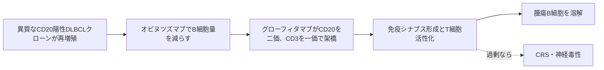

# グローフィタマブ（Columvi）

## まず3行で

- 再発・難治性のびまん性大細胞型B細胞リンパ腫（DLBCL）など、治療歴のある大細胞型B細胞リンパ腫に用いる抗体である。
- 腫瘍B細胞のCD20を2本の腕で、T細胞のCD3を1本の腕でつかみ、人工的な免疫シナプスを作ってT細胞殺傷を誘導する。
- 高活性な2+1構造を、Fcサイレンシング、オビヌツズマブ前処置、段階増量、期間固定投与と一体で実用化した点が重要である。

## 1. どんな病気か

DLBCLは成熟B細胞に由来し、急速に増大するリンパ節腫瘤や臓器病変、発熱・寝汗・体重減少を来し得る侵攻性リンパ腫である。一つの病名でも、胚中心B細胞様（GCB）型と活性化B細胞様（ABC）型などでは、B細胞受容体、NF-κB、アポトーシスを支える遺伝子異常が異なる。つまり「大きなB細胞」という形態は共通でも、増殖の駆動機構は均一でない。[Lenzら](https://pubmed.ncbi.nlm.nih.gov/18765795/)

抗CD20抗体を含む免疫化学療法で治癒する患者がいる一方、初回治療に抵抗する例や再発例では、腫瘍のクローン進化と免疫微小環境が治療選択を難しくする。多剤治療後でも残るCD20を目印に、化学療法とは別の原理で即時に使える既製品が開発課題だった。どの腫瘍内T細胞が十分に再活性化できるかは、なお完全には予測できない。

## 2. なぜこの分子を標的にするのか

CD20はpre-B細胞から成熟B細胞と多くのDLBCL細胞に発現し、造血幹細胞や形質細胞には乏しい。正常B細胞も減るが、造血からの再生余地を残しながら腫瘍B細胞を識別できる。一方のCD3はT細胞受容体複合体の信号部である。両者を架橋すれば、腫瘍抗原ペプチドの提示や既存の腫瘍特異的T細胞に依存せず、T細胞へ殺傷対象を指定できる。

弱点も標的に直結する。正常B細胞減少は低ガンマグロブリン血症と感染につながり、広いT細胞活性化はサイトカイン放出症候群（CRS）を生む。効果はCD20発現と機能するT細胞に依存し、治療後再発例の後方視的解析ではCD20消失が高頻度だった。ただし、その頻度を全患者へ一般化できるか、消失が一時的か固定的かは未解明である。[Griggら](https://pubmed.ncbi.nlm.nih.gov/38720530/)

## 3. どんな抗体として設計されたか

### 開発企業

Rocheの研究チームがCD20-TCB（後のグローフィタマブ）を創製し、前臨床で2+1構造とオビヌツズマブ前処置を設計した。世界初承認は2023年3月のカナダで、米国ではGenentechが申請・販売を担う。日本では中外製薬がRoche導入品RG6026として臨床開発中であり、2026年9月1日時点では未承認である。[Health Canada](https://www.canada.ca/en/health-canada/services/drugs-health-products/drug-products/notice-compliance/conditions.html) [中外製薬](https://www.chugai-pharm.co.jp/ir/product/pipeline.html)

### 基本設計と作用の仕組み

約197 kDaのヒト化IgG1型三価二重特異性抗体で、CD20結合部位を2つ、CD3ε結合部位を1つ持つ。CD20への二価結合でアビディティを高め、低いCD20発現でも腫瘍細胞とT細胞を密着させる。形成された免疫シナプスでT細胞が活性化・増殖し、サイトカインとパーフォリン／グランザイムを放出してCD20陽性細胞を溶解する。[Bacacら](https://pubmed.ncbi.nlm.nih.gov/29716920/)

### 設計上の工夫

CD3結合部を片側のCD20腕へ頭尾方向に追加し、重鎖のknobs-into-holes、ドメイン交換と電荷改変で異なる鎖を正しく組み立てる。FcにはLALA-PG型置換を入れてFcγ受容体・補体依存性エフェクター作用を抑え、T細胞がFc経由で無差別に架橋されるのを避けた。[厚生労働省](https://www.mhlw.go.jp/web/t_doc?dataId=00tc9588&dataType=1&pageNo=1)

強い初回活性を構造だけでは安全化できないため、投与7日前のオビヌツズマブで末梢・リンパ組織のB細胞量を減らし、2.5→10→30 mgと段階増量する。Fcを残した半減期は定常状態で約7.6日で、3週ごとの静注を最大12サイクルに固定した。分子設計と投与設計を同時に最適化した抗体である。[FDA](https://www.accessdata.fda.gov/drugsatfda_docs/label/2026/761309s006lbl.pdf)

## 4. 病態から作用まで

## 5. 何が画期的だったのか

革新は、T細胞誘導能を単に強めたことではなく、強い2+1分子を安全に使う運用まで製品設計へ組み込んだ点にある。承認根拠の単群試験では、多数の前治療歴を持つ患者でも完全奏効43%を示した。ただし比較対照のない結果であり、米国承認は2026年9月1日時点も迅速承認で、臨床的利益の確認が条件である。[Dickinsonら](https://pubmed.ncbi.nlm.nih.gov/36507690/)

> **一言で評価：** この抗体の革新性は、CD20二価結合で高めたT細胞リダイレクト活性を、Fc無力化と計画的なB細胞デバルキングで臨床管理可能にしたことにある。

## 6. 実際の医療での位置づけ

米国では2治療以上後の再発・難治性DLBCL NOSまたは濾胞性リンパ腫由来LBCLに単剤で用いる。欧州では同じ後期単剤に加え、自家移植非適応の再発・難治性DLBCL NOSにGemOx併用も通常承認されている。日本では未承認である。[EMA](https://www.ema.europa.eu/en/medicines/human/EPAR/columvi)

最重要毒性はCRSであり、初回投与期の入院、前投薬、トシリズマブを含む緊急対応体制が必要である。ICANSを含む神経毒性、重篤感染症、腫瘍フレア、血球減少にも注意する。既製品で待機期間が短く、12サイクルで終了できる強みがある反面、前処置と静注、初期監視の負担は大きい。

## 7. 類薬との違い

| 項目 | グローフィタマブ | エプコリタマブ |
|---|---|---|
| 標的・結合価 | CD20×CD3、2+1 | CD20×CD3、1+1 |
| 形式 | 約197 kDa、FcサイレントIgG1 | FcサイレントIgG1 |
| 投与 | オビヌツズマブ前処置後に静注 | 皮下注 |
| 期間 | 最大12サイクル | 原則、進行または不耐まで |
| 設計上の強み | CD20二価による高アビディティ | 皮下吸収と投与経路の利便性 |
| 主な制約 | 前処置、CRS、初期入院 | CRS、ICANS、長期継続 |

最重要の違いは、同じCD20×CD3架橋でも、グローフィタマブは結合価と事前デバルキング、エプコリタマブは皮下注と継続投与を選んだ点である。[PMDA](https://www.pmda.go.jp/PmdaSearch/rdDetail/iyaku/4291469A1028_1?user=1)

## 8. この抗体から学べること

- **疾患生物学：** DLBCLの増殖経路は多様でも、B細胞系統抗原を共通の攻撃目印にできる。
- **標的選択：** 実証済みのCD20も、T細胞への標的指定に使えば別の治療原理になる。
- **抗体設計：** 結合価、鎖の組立て、Fc機能、半減期、安全化投与は一つのシステムとして設計する。
- **残る課題：** CD20消失、T細胞疲弊、感染とCRSを予測する指標、米国迅速承認の検証が必要である。
- **次に読む抗体：** 1+1型を静注・皮下注で展開したモスネツズマブ、皮下注1+1型のエプコリタマブ。

## 参考文献

1. COLUMVI (glofitamab-gxbm) Prescribing Information, revised May 2026. U.S. Food and Drug Administration, 2026. [FDA](https://www.accessdata.fda.gov/drugsatfda_docs/label/2026/761309s006lbl.pdf)（2026年9月1日アクセス）
2. Columvi: European Public Assessment Report. European Medicines Agency, 2026. [EMA](https://www.ema.europa.eu/en/medicines/human/EPAR/columvi)（2026年9月1日アクセス）
3. Notice of Compliance with conditions: Columvi. Health Canada, 2023. [Health Canada](https://www.canada.ca/en/health-canada/services/drugs-health-products/drug-products/notice-compliance/conditions.html)（2026年9月1日アクセス）
4. 医薬品の一般的名称について（グローフィタマブ）. 厚生労働省, 2025. [厚生労働省](https://www.mhlw.go.jp/web/t_doc?dataId=00tc9588&dataType=1&pageNo=1)（2026年9月1日アクセス）
5. 開発パイプライン：グローフィタマブ／RG6026. 中外製薬, 2026. [中外製薬](https://www.chugai-pharm.co.jp/ir/product/pipeline.html)（2026年9月1日アクセス）
6. Lenz G, et al. Molecular subtypes of diffuse large B-cell lymphoma arise by distinct genetic pathways. *PNAS*. 2008;105:13520–13525. [PubMed](https://pubmed.ncbi.nlm.nih.gov/18765795/)
7. Bacac M, et al. CD20-TCB with Obinutuzumab Pretreatment as Next-Generation Treatment of Hematologic Malignancies. *Clinical Cancer Research*. 2018;24:4785–4797. [PubMed](https://pubmed.ncbi.nlm.nih.gov/29716920/)
8. Dickinson MJ, et al. Glofitamab for Relapsed or Refractory Diffuse Large B-Cell Lymphoma. *New England Journal of Medicine*. 2022;387:2220–2231. [PubMed](https://pubmed.ncbi.nlm.nih.gov/36507690/)
9. Grigg S, et al. Relapse after glofitamab has a poor prognosis and rates of CD20 loss are high. *British Journal of Haematology*. 2024;205:122–126. [PubMed](https://pubmed.ncbi.nlm.nih.gov/38720530/)
10. エプキンリ皮下注4 mg／48 mg 添付文書・審査報告書. 医薬品医療機器総合機構, 2025. [PMDA](https://www.pmda.go.jp/PmdaSearch/rdDetail/iyaku/4291469A1028_1?user=1)（2026年9月1日アクセス）
