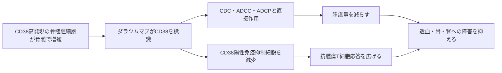

# ダラツムマブ（Darzalex）

## まず3行で

- 多発性骨髄腫を中心に、異常な形質細胞が増える疾患へ用いる抗体である。
- 骨髄腫細胞に多いCD38を標識し、補体、NK細胞、食細胞など複数の経路で細胞死を誘導する。
- CD38を腫瘍マーカーと免疫微小環境の調節点の両方として利用し、抗CD38抗体という新しい薬効クラスを実用化した。

## 1. どんな病気か

多発性骨髄腫は、抗体を作る形質細胞が骨髄でクローン性に増殖する血液がんである。腫瘍細胞が正常造血を圧迫して貧血や感染を招き、骨吸収を促して骨痛・骨折・高カルシウム血症を起こす。単一クローンが作るM蛋白や遊離軽鎖は腎障害にもつながる。[NCI](https://www.cancer.gov/types/myeloma/patient/myeloma-treatment-pdq)

疾患はMGUS、くすぶり型、多発性骨髄腫へ連続的に進み得るが、染色体異常、骨髄間質との接着、免疫抑制性微小環境が複雑に重なる。プロテアソーム阻害薬や免疫調節薬が効いても耐性クローンは残り得るため、既存薬と交差しにくく、併用できる表面抗原標的が求められた。誰が長期奏効し、どの高リスクくすぶり型患者へ早期介入すべきかは、現在も完全には決着していない。

## 2. なぜこの分子を標的にするのか

CD38はNADを代謝して細胞内カルシウム動員や細胞外アデノシン産生に関わる膜型酵素・受容体で、活性化リンパ球などにも発現する。一方、成熟形質細胞と多くの骨髄腫細胞では高密度かつ比較的均一に発現する。この「正常細胞にもあるが、腫瘍では多い」という発現差は、IgGのFc機能で腫瘍細胞を選別する目印になる。

弱点も同じ発現分布に由来する。CD38陽性の正常形質細胞、NK細胞、免疫調節細胞も影響を受け、低ガンマグロブリン血症や感染リスクに寄与し得る。赤血球上の微量CD38への結合は間接クームス試験を偽陽性にし、輸血適合検査へ最終投与後6カ月まで干渉し得る。また、治療後のCD38低下やCD55・CD59増加は感受性低下と関連するが、耐性を単一機序では説明できない。[Nijhofら](https://pubmed.ncbi.nlm.nih.gov/27307294/)

## 3. どんな抗体として設計されたか

### 開発企業

GenmabがHuMax-CD38として候補を選択し、2005～2012年に自社で前臨床・初期臨床開発を進めた。2012年、Janssen Biotechが世界独占ライセンスを取得し、その後の開発、製造、商業化を主導した。[Genmab](https://ir.genmab.com/node/38111/html) 2015年11月に米国で初承認され、日本では2017年に承認・上市された。[FDA](https://www.accessdata.fda.gov/drugsatfda_docs/nda/2015/761036Orig1s000ChemR.pdf)

### 基本設計と作用の仕組み

ダラツムマブは完全ヒトIgG1κ通常抗体で、CD38の細胞外領域に高親和性で結合する。FcがC1qを呼び込む補体依存性細胞傷害（CDC）、NK細胞などによる抗体依存性細胞傷害（ADCC）、マクロファージによる抗体依存性細胞貪食（ADCP）を並行して作動させる。Fc受容体による架橋下では直接的な細胞死も起こり得る。[de Weersら](https://pubmed.ncbi.nlm.nih.gov/21187443/)

さらに、CD38陽性の制御性T細胞・制御性B細胞・骨髄由来抑制細胞が減り、細胞傷害性T細胞の増加とレパトア拡大が観察された。これは腫瘍細胞を直接除く作用に免疫微小環境の再編が加わることを示すが、各機序が患者ごとの効果に占める割合は確定していない。[Krejcikら](https://pubmed.ncbi.nlm.nih.gov/27222480/)

### 設計上の工夫

Fcを弱めず、IgG1本来の複数のエフェクター機能を活かしたことが設計の核心である。静注は16 mg/kgを週1回から段階的に4週ごとへ移す。皮下注配合剤は固定量1,800 mgにヒアルロン酸分解酵素ボルヒアルロニダーゼ アルファを加え、皮下での分散・吸収を可能にした。標的や抗体配列を変えず、投与負担と投与時反応を軽減する製剤工学上の展開である。[PMDA（皮下注）](https://www.pmda.go.jp/PmdaSearch/iyakuDetail/ResultDataSetPDF/800155_4291500A1023_1_09)

## 4. 病態から作用まで

## 5. 何が画期的だったのか

最大の意義は、シグナル阻害ではなく「高密度な表面標識」を選び、通常型IgG1が備える殺傷経路を束ねた点にある。プロテアソーム阻害薬・免疫調節薬に抵抗する患者でも単剤で奏効を示し、抗CD38抗体が臨床的に成立することを実証した。[Lonialら](https://pubmed.ncbi.nlm.nih.gov/26778538/) その後は初回治療の併用構成にも組み込まれ、皮下注化と、発症前段階である高リスクくすぶり型への適応拡大へ発展した。

> **一言で評価：** この抗体の革新性は、CD38という形質細胞の高密度標識を利用し、一つの通常型IgG1で直接的細胞除去と免疫微小環境の再編を同時に実現したことにある。

## 6. 実際の医療での位置づけ

2026年9月4日時点、日本の静注製剤は多発性骨髄腫に他の抗悪性腫瘍薬と併用する。皮下注配合剤は多発性骨髄腫、全身性ALアミロイドーシス、高リスクくすぶり型多発性骨髄腫の進展遅延に承認され、後者のみ単剤で最長3年間用いる。[PMDA（静注）](https://www.pmda.go.jp/PmdaSearch/iyakuDetail/ResultDataSetPDF/800155_4291437A1028_1_12)

重要な有害事象は初回に多い投与時反応、骨髄抑制、肺炎などの重篤感染症であり、前投薬と感染監視が必要である。輸血前検査とM蛋白検査への薬剤干渉も、この抗体ならではの運用上の制約である。作用機序が異なる薬との併用性は強みだが、長期投与、免疫グロブリン低下、耐性後の治療選択は負担となる。

## 7. 類薬との違い

| 項目 | ダラツムマブ | イサツキシマブ |
|---|---|---|
| 標的 | CD38 | CD38（異なるエピトープ） |
| 抗体形式 | 完全ヒトIgG1κ | キメラIgG1κ |
| 主な作用 | CDC、ADCC、ADCP、免疫調節 | ADCC、ADCP、直接作用、CDC |
| 投与 | 静注またはヒアルロニダーゼ配合皮下注 | 静注またはヒアルロニダーゼ非配合皮下注 |
| 強み | 幅広い治療段階・疾患、固定量皮下注 | 異なる結合様式、酵素を加えない固定量皮下注 |
| 共通の弱点 | 感染、血球減少、輸血検査干渉、CD38低下 | 感染、血球減少、輸血検査干渉、CD38低下 |

最も重要なのは、同じCD38でもエピトープと直接細胞死・酵素阻害の性質が異なり得る一方、臨床では単純な分子間優劣ではなく、併用薬、治療歴、投与経路で選択される点である。[PMDA（イサツキシマブ静注）](https://www.pmda.go.jp/PmdaSearch/rdDetail/iyaku/4291454A1021_1?user=1) [厚生労働省（皮下注承認）](https://www.mhlw.go.jp/web/t_doc?dataId=00td0179&dataType=1&pageNo=1)

## 8. この抗体から学べること

- **疾患生物学：** 形質細胞系列に保たれる高密度抗原は、遺伝的に不均一な骨髄腫を横断する目印になる。
- **標的選択：** 正常細胞にもある標的は、発現量の差と回復可能性を利用すれば治療域を作れる。
- **抗体設計：** Fcを保った通常型IgG1でも、CDC、ADCC、ADCP、免疫調節を重ねて多面的な薬理を生み出せる。
- **残る課題：** CD38低下、補体制御分子、エフェクター細胞減少を含む耐性の予測と克服が必要である。
- **次に読む抗体：** 異なるCD38エピトープを認識するイサツキシマブ、形質細胞のSLAMF7を狙うエロツズマブ。

## 参考文献

1. ダラザレックス点滴静注100 mg／400 mg 添付文書（2025年6月改訂）. 医薬品医療機器総合機構, 2025. [PMDA](https://www.pmda.go.jp/PmdaSearch/iyakuDetail/ResultDataSetPDF/800155_4291437A1028_1_12)（2026年9月4日アクセス）
2. ダラキューロ配合皮下注 添付文書（2025年11月改訂）. 医薬品医療機器総合機構, 2025. [PMDA](https://www.pmda.go.jp/PmdaSearch/iyakuDetail/ResultDataSetPDF/800155_4291500A1023_1_09)（2026年9月4日アクセス）
3. Executive Summary, BLA 761036 DARZALEX (daratumumab). U.S. Food and Drug Administration, 2015. [FDA](https://www.accessdata.fda.gov/drugsatfda_docs/nda/2015/761036Orig1s000ChemR.pdf)（2026年9月4日アクセス）
4. Plasma Cell Neoplasms (Including Multiple Myeloma) Treatment (PDQ®). National Cancer Institute, updated 2023. [NCI](https://www.cancer.gov/types/myeloma/patient/myeloma-treatment-pdq)（2026年9月4日アクセス）
5. Annual Report 2018: Daratumumab development and Janssen agreement. Genmab A/S, 2019. [Genmab](https://ir.genmab.com/node/38111/html)（2026年9月4日アクセス）
6. de Weers M, et al. Daratumumab, a novel therapeutic human CD38 monoclonal antibody, induces killing of multiple myeloma and other hematological tumors. *Journal of Immunology*. 2011;186:1840–1848. [PubMed](https://pubmed.ncbi.nlm.nih.gov/21187443/)
7. Krejcik J, et al. Daratumumab depletes CD38+ immune regulatory cells, promotes T-cell expansion, and skews T-cell repertoire in multiple myeloma. *Blood*. 2016;128:384–394. [PubMed](https://pubmed.ncbi.nlm.nih.gov/27222480/)
8. Nijhof IS, et al. CD38 expression and complement inhibitors affect response and resistance to daratumumab therapy in myeloma. *Blood*. 2016;128:959–970. [PubMed](https://pubmed.ncbi.nlm.nih.gov/27307294/)
9. Lonial S, et al. Daratumumab monotherapy in patients with treatment-refractory multiple myeloma (SIRIUS). *Lancet*. 2016;387:1551–1560. [PubMed](https://pubmed.ncbi.nlm.nih.gov/26778538/)
10. サークリサ点滴静注100 mg／500 mg 添付文書・審査報告書、サークリサ皮下注1400 mg承認情報. 医薬品医療機器総合機構・厚生労働省, 2025–2026. [PMDA](https://www.pmda.go.jp/PmdaSearch/rdDetail/iyaku/4291454A1021_1?user=1)・[厚生労働省](https://www.mhlw.go.jp/web/t_doc?dataId=00td0179&dataType=1&pageNo=1)（2026年9月4日アクセス）
