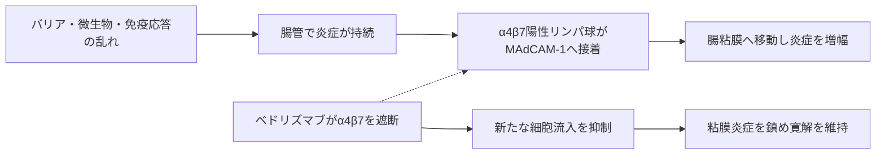

# ベドリズマブ（Entyvio／エンタイビオ）

## まず3行で

- 潰瘍性大腸炎とクローン病で、腸粘膜へ免疫細胞が集まり続ける流れを抑える抗体である。
- 腸管指向性リンパ球のα4β7インテグリンを塞ぎ、腸血管のMAdCAM-1との接着・組織移行を阻害する。
- 広範な免疫抑制ではなく「腸への交通整理」を狙い、臓器選択的な免疫調節を臨床で成立させた。

## 1. どんな病気か

潰瘍性大腸炎は大腸粘膜に連続した炎症と潰瘍を生じ、血便、下痢、腹痛、便意切迫を繰り返す炎症性腸疾患である。若年で発症することも多く、寛解と再燃を長期にわたり反復する。遺伝的素因、上皮・粘液バリア、腸内細菌、環境因子に対する免疫応答のずれが重なるが、単一の原因は確定していない。[NIDDK](https://www.niddk.nih.gov/health-information/digestive-diseases/ulcerative-colitis)

病変では、血中から腸粘膜へ呼び込まれたリンパ球が炎症性サイトカインを放出し、上皮障害と新たな免疫細胞動員を増幅する。ステロイド、免疫調節薬、抗TNF抗体が効かない、効かなくなる、または全身性免疫抑制が問題になる患者が残り、炎症部位への細胞流入そのものが別の介入点になった。ただし、どのリンパ球集団が患者ごとの病態を主導し、誰が交通遮断に反応するかを予測する確立したバイオマーカーはない。

## 2. なぜこの分子を標的にするのか

α4β7インテグリンはα4鎖とβ7鎖からなる接着受容体で、腸へ帰巣する一部のメモリーT細胞、B細胞などに発現する。その主要リガンドMAdCAM-1は主に腸管血管内皮に発現し、流血中のリンパ球が内皮へ接着して腸組織へ移る過程を支える。炎症腸管ではこの経路が免疫細胞の補充路となるため、α4β7を塞げば炎症の燃料供給を絞れる。[Solerら](https://pubmed.ncbi.nlm.nih.gov/19509315/)

長所は、α4β1–VCAM-1を介する中枢神経などへの免疫監視を温存しながら、腸管指向性の移動を選択的に弱められることにある。一方、腸粘膜の正常な感染防御も同じ交通網を使うため感染症には注意が必要である。また、α4β1などの代替的な遊走経路があり、末梢血でα4β7を十分占有しても全員が寛解するわけではない。実際の薬効がどの細胞集団の移動抑制に最も依存するかには未解明な部分が残る。

## 3. どんな抗体として設計されたか

### 開発企業

原型のマウス抗体Act-1はMassachusetts General Hospitalの研究から生まれ、LeukoSiteが炎症性腸疾患向けのヒト化抗体LDP-02として開発した。[MGH](https://csibd.mgh.harvard.edu/about.html) Genentechは1997年から共同研究に参加し、LeukoSiteを買収したMillennium PharmaceuticalsがMLN0002として臨床開発を継承した。[Genentech](https://www.gene.com/download/pdf/1997_annual-report.pdf) [Millennium](https://www.sec.gov/Archives/edgar/data/1002637/000091205702009058/a2072025z10-k.htm) Takedaは2008年のMillennium買収後に後期開発と承認・商業化を担った。[Takeda](https://assets-dam.takeda.com/raw/upload/v1662726197/legacy-dotcom/siteassets/system/investors/report/annual-reports/ar2014_en.pdf)

### 基本設計と作用の仕組み

ベドリズマブは約147 kDaのヒト化IgG1κ通常抗体で、α4鎖やβ7鎖単独ではなくα4β7ヘテロ二量体を選択的に認識する。MAdCAM-1との結合を遮断し、主にメモリーT細胞が腸管内皮を越えて炎症部位へ入るのを抑える。α4β1、αEβ7には結合せず、α4インテグリンとVCAM-1の相互作用も阻害しない。[FDA](https://www.accessdata.fda.gov/drugsatfda_docs/label/2026/125476s66lbl.pdf)

### 設計上の工夫

FcのL239A/G241A置換によりFcγ受容体結合を低減し、ADCCやCDCを起こさないよう設計された。目的はα4β7陽性リンパ球の除去ではなく、接着機能だけを一時的に止めることだからである。[FDA CMC審査](https://www.accessdata.fda.gov/drugsatfda_docs/nda/2024/761133Orig1s000ChemR.pdf) 静注は0、2、6週後に8週ごと、皮下注は静注で反応を確認してから108 mgを2週ごとに自己投与できる。皮下注化は標的選択性を保ったまま通院負担を下げる製剤上の拡張である。[PMDA（皮下注）](https://www.pmda.go.jp/PmdaSearch/iyakuDetail/ResultDataSetPDF/400256_2399405G1025_1_06)

## 4. 病態から作用まで

## 5. 何が画期的だったのか

α4インテグリンを広く止めるナタリズマブは有効でも、中枢神経の免疫監視低下とPML（進行性多巣性白質脳症）が大きな制約となる。ベドリズマブはα4β7という組合せだけを認識し、MAdCAM-1が偏在する腸へ作用範囲を絞った。動物の慢性大腸炎で得られた「臓器特異的な細胞移動を標的にする」という発想を、潰瘍性大腸炎とクローン病の寛解導入・維持へつなげた点が重要である。[Hesterbergら](https://pubmed.ncbi.nlm.nih.gov/8898653/)

> **一言で評価：** この抗体の革新性は、免疫細胞を全身で抑え込む代わりに、α4β7–MAdCAM-1という腸への入口を選択的に閉じる治療原理を実用化したことにある。

## 6. 実際の医療での位置づけ

2026年9月7日時点、日本では既存治療で効果不十分な成人の中等症～重症潰瘍性大腸炎と活動期クローン病に静注製剤を用い、反応例は皮下注製剤へ切り替えて維持できる。[PMDA（静注）](https://www.pmda.go.jp/PmdaSearch/iyakuDetail/ResultDataSetPDF/400256_2399405F1020_1_06) プラセボ対照試験で寛解導入と維持が示され、ステロイド離脱を目指せるが、作用は細胞流入の抑制なので特にクローン病では効果発現が緩やかなことがある。[Feaganら](https://pubmed.ncbi.nlm.nih.gov/23964932/)

重要なリスクは重篤感染症、結核、過敏症・点滴反応であり、PMLも稀ながら否定できないため神経症状を監視する。日本の添付文書は間質性肺疾患にも注意を求める。[Colombelら](https://pubmed.ncbi.nlm.nih.gov/26893500/) 全身への影響を抑える設計は強みだが、急性重症例の救援薬ではなく、反応しない患者では別機序へ切り替える必要がある。

## 7. 類薬との違い

| 項目 | ベドリズマブ | ナタリズマブ |
|---|---|---|
| 標的 | α4β7ヘテロ二量体 | α4鎖（α4β7とα4β1） |
| 抗体形式 | ヒト化IgG1κ、Fc機能低減 | ヒト化IgG4κ |
| 作用範囲 | 主に腸管へのリンパ球移動 | 腸管と中枢神経を含む広い移動経路 |
| 強み | 腸管選択性、静注・皮下注 | クローン病と多発性硬化症で有効性 |
| 弱点 | 効果発現の遅さ、非反応例 | PMLリスクと厳格な管理 |

最も重要な違いは「インテグリンを止めるか」ではなく「どの臓器への交通を残すか」である。ベドリズマブは標的の分子選択性を、臓器選択性と安全域へ翻訳した。[FDA（ナタリズマブ）](https://www.accessdata.fda.gov/drugsatfda_docs/label/2023/125104s976s979lbl.pdf)

## 8. この抗体から学べること

- **疾患生物学：** 炎症は局所のサイトカインだけでなく、血中からの免疫細胞補充で維持される。
- **標的選択：** 組織特異的リガンドと対になる接着分子は、臓器選択的治療の入口になる。
- **抗体設計：** 遮断が目的なら、Fcを弱めて標的細胞を温存する設計が合理的である。
- **残る課題：** 代替遊走経路と反応予測バイオマーカーを解明し、遅い効果発現を補う必要がある。
- **次に読む抗体：** α4鎖を広く遮断するナタリズマブ、炎症性サイトカインTNFを中和するインフリキシマブ。

## 参考文献

1. エンタイビオ点滴静注用300 mg 添付文書（2026年5月改訂）. 医薬品医療機器総合機構, 2026. [PMDA](https://www.pmda.go.jp/PmdaSearch/iyakuDetail/ResultDataSetPDF/400256_2399405F1020_1_06)（2026年9月7日アクセス）
2. エンタイビオ皮下注108 mg ペン／シリンジ 添付文書（2026年5月改訂）. 医薬品医療機器総合機構, 2026. [PMDA](https://www.pmda.go.jp/PmdaSearch/iyakuDetail/ResultDataSetPDF/400256_2399405G1025_1_06)（2026年9月7日アクセス）
3. ENTYVIO Prescribing Information（2026年2月改訂）. U.S. Food and Drug Administration, 2026. [FDA](https://www.accessdata.fda.gov/drugsatfda_docs/label/2026/125476s66lbl.pdf)（2026年9月7日アクセス）
4. Executive Summary, BLA 761133 ENTYVIO SC. U.S. Food and Drug Administration, 2024. [FDA](https://www.accessdata.fda.gov/drugsatfda_docs/nda/2024/761133Orig1s000ChemR.pdf)（2026年9月7日アクセス）
5. Ulcerative Colitis. National Institute of Diabetes and Digestive and Kidney Diseases, reviewed 2020. [NIDDK](https://www.niddk.nih.gov/health-information/digestive-diseases/ulcerative-colitis)（2026年9月7日アクセス）
6. Soler D, et al. The binding specificity and selective antagonism of vedolizumab. *J Pharmacol Exp Ther*. 2009;330:864–875. [PubMed](https://pubmed.ncbi.nlm.nih.gov/19509315/)
7. Hesterberg PE, et al. Rapid resolution of chronic colitis with an antibody to a gut-homing integrin α4β7. *Gastroenterology*. 1996;111:1373–1380. [PubMed](https://pubmed.ncbi.nlm.nih.gov/8898653/)
8. Feagan BG, et al. Vedolizumab as induction and maintenance therapy for ulcerative colitis. *N Engl J Med*. 2013;369:699–710. [PubMed](https://pubmed.ncbi.nlm.nih.gov/23964932/)
9. Colombel JF, et al. The safety of vedolizumab for ulcerative colitis and Crohn's disease. *Gut*. 2017;66:839–851. [PubMed](https://pubmed.ncbi.nlm.nih.gov/26893500/)
10. Vedolizumab development-history records. Massachusetts General Hospital・Genentech・Millennium Pharmaceuticals・Takeda. [MGH](https://csibd.mgh.harvard.edu/about.html)・[Genentech](https://www.gene.com/download/pdf/1997_annual-report.pdf)・[Millennium](https://www.sec.gov/Archives/edgar/data/1002637/000091205702009058/a2072025z10-k.htm)・[Takeda](https://assets-dam.takeda.com/raw/upload/v1662726197/legacy-dotcom/siteassets/system/investors/report/annual-reports/ar2014_en.pdf)（2026年9月7日アクセス）
