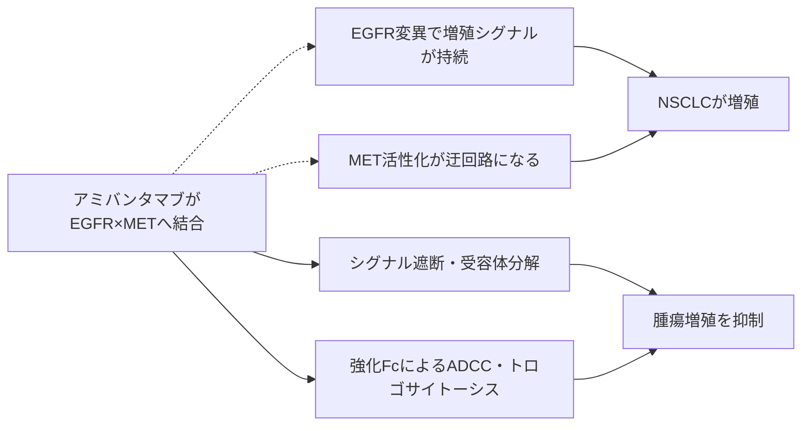

# アミバンタマブ（Rybrevant／ライブリバント）

## まず3行で

- EGFR遺伝子変異を持つ切除不能・進行再発非小細胞肺癌（NSCLC）に使う二重特異性抗体である。
- EGFRとMETの細胞外領域を同時に捉え、増殖シグナル阻害、受容体除去、免疫細胞による攻撃を重ねる。
- 低分子薬が入りにくい変異型キナーゼと迂回耐性を、二本のFabと強化Fcで外側から攻略した点が重要である。

## 1. どんな病気か

NSCLCは肺癌の大部分を占め、進行すると咳、息切れ、胸痛などを来す。肺腺癌の一部ではEGFRの活性化変異が増殖の主な駆動因子となり、非喫煙者、女性、東アジア人に比較的多い。通常、EGFRはリガンド結合で二量体化し、RAS–MAPKやPI3K–AKT経路を一時的に動かす。変異癌ではこのスイッチが持続的に入り、細胞がEGFRシグナルへ依存する。

代表的なエクソン20挿入変異は、キナーゼ領域のαCヘリックス周辺を変形させて活性型を安定化する一方、薬剤結合ポケットを狭める。このため古典的EGFRチロシンキナーゼ阻害薬（TKI）が結合しにくく、正常型EGFRを傷めず変異型だけを十分抑える治療域を作りにくかった。[Yasudaら](https://pubmed.ncbi.nlm.nih.gov/24353160/) また、感受性変異でも治療中に二次変異やMET増幅などの迂回路が選択される。変異ごとの感受性や、どの耐性経路が優勢になるかは患者間で一様ではない。

## 2. なぜこの分子を標的にするのか

EGFRは上皮の増殖・修復を、METはHGFを受けて細胞の生存、運動、組織修復を調節する受容体型チロシンキナーゼである。癌では変異EGFRが主エンジンとなり、METの増幅・過剰活性化が同じ下流経路を再点火してEGFR阻害を迂回できる。両者を一分子で塞げば、主経路と代表的な逃げ道を同時に抑えられる。

抗体はATP結合ポケットではなく細胞外領域を認識するので、エクソン20挿入によるポケット形状の問題を回避できる。二つの受容体が並ぶ腫瘍細胞では両腕で結合しやすいことも長所である。ただしEGFRは皮膚や消化管、METは正常組織の修復にも必要であり、発疹、爪囲炎、浮腫などはオンターゲット作用と切り離せない。受容体発現が低い腫瘍や別の駆動経路へ移った腫瘍には効きにくい。

## 3. どんな抗体として設計されたか

### 開発企業

Genmabが作製した抗EGFR抗体と抗MET抗体を、同社のDuoBody技術で組み合わせた。GenmabとJanssenの共同研究で候補が選ばれ、Janssenが最適化、臨床開発、承認・商業化を担った。[Genmab](https://ir.genmab.com/node/39351/html)

### 基本設計と作用の仕組み

アミバンタマブは約148 kDaの完全ヒトIgG1κ型二重特異性抗体で、EGFR結合腕とMET結合腕を一つずつ持つ。リガンド結合と受容体リン酸化を抑え、受容体の内在化・分解を促す。さらにFcがNK細胞や単球・マクロファージを呼び込み、ADCCに加え、腫瘍膜の一部と受容体を免疫細胞側へ剥ぎ取るトロゴサイトーシスを起こす。[FDA](https://www.accessdata.fda.gov/drugsatfda_docs/label/2025/761210s010lbl.pdf)

### 設計上の工夫

DuoBodyの制御Fabアーム交換では、親抗体のCH3領域に対応するF405LとK409R置換を入れ、正しい異種重鎖対を形成させる。各Fabは元の軽鎖と組になるため、IgGらしい構造を保ちながら二特異性化できる。[Neijssenら](https://pubmed.ncbi.nlm.nih.gov/33839159/) さらに低フコース糖鎖でFcγRIIIa結合を高め、Fc依存的な受容体除去と細胞傷害を強化した。METへの高親和性とEGFRへの比較的弱い親和性が二重陽性腫瘍への選択性を高めるという説明は、臨床的に確立した結論ではなく前臨床研究者の仮説である。[Vijayaraghavanら](https://pubmed.ncbi.nlm.nih.gov/32747419/)

製剤は体重別用量の点滴静注で、初回を2日に分割し、導入後は併用療法に応じて2週または3週ごとに投与する。これは初回に多いinfusion reactionを管理しつつ、通常IgGの持続性を利用する設計である。[PMDA](https://www.pmda.go.jp/PmdaSearch/iyakuDetail/ResultDataSetPDF/800155_4291473A1024_1_07)

## 4. 病態から作用まで

## 5. 何が画期的だったのか

2021年、米国でEGFRエクソン20挿入変異NSCLCに対する最初の標的治療として迅速承認された。[FDA](https://www.fda.gov/drugs/resources-information-approved-drugs/fda-grants-accelerated-approval-amivantamab-vmjw-metastatic-non-small-cell-lung-cancer) 革新性は標的を二つに増やしただけではない。細胞外から変異型EGFRを捉えてポケット依存性を避け、METという耐性経路も塞ぎ、低フコースFcで受容体そのものを免疫細胞に剥ぎ取らせた。二重特異性とFc工学を、固形癌のシグナル阻害と耐性対策に統合した実例である。

> **一言で評価：** この抗体の革新性は、EGFRとMETの二重遮断にFc依存的な受容体除去を重ね、変異と迂回耐性を細胞外から攻略したことにある。

## 6. 実際の医療での位置づけ

2026年9月10日時点、日本ではEGFRエクソン20挿入変異陽性NSCLCにカルボプラチン＋ペメトレキセドと併用し、その他のEGFR変異陽性進行NSCLCではラゼルチニブとの一次治療、またはEGFR-TKI後の化学療法併用に用いる。[PMDA](https://www.pmda.go.jp/PmdaSearch/iyakuDetail/ResultDataSetPDF/800155_4291473A1024_1_07) 初期試験ではプラチナ製剤後のエクソン20挿入変異例の40%に奏効が確認され、後の比較試験で一次治療としての上乗せ効果も示された。[Parkら](https://pubmed.ncbi.nlm.nih.gov/34339292/)

主な制約は初回に多いinfusion reaction、EGFR阻害に対応する発疹・爪囲炎、間質性肺疾患である。ラゼルチニブ併用時は静脈血栓塞栓症が増えるため、日本では開始後4か月の予防的抗凝固が定められた。遺伝子検査で患者を選ぶ必要があり、大分子抗体であるため投与時間と通院負担も残る。

## 7. 類薬との違い

| 項目 | アミバンタマブ | セツキシマブ | オシメルチニブ |
|---|---|---|---|
| 標的 | EGFR＋METの細胞外領域 | EGFRの細胞外領域 | 変異EGFRの細胞内キナーゼ |
| 形式 | 完全ヒト・低フコースIgG1二重特異性抗体 | キメラIgG1通常抗体 | 経口低分子TKI |
| 作用 | 二経路遮断、受容体分解、強化Fc | EGFR遮断、Fc作用 | ATP結合部位を不可逆阻害 |
| 強み | MET迂回路も一分子で狙う | 単純で確立した抗EGFR設計 | 経口、変異選択性、脳移行性 |
| 弱点 | 点滴反応、皮膚毒性、複雑な投与 | MET耐性を直接抑えない | 多くのエクソン20挿入、MET迂回耐性 |

最も重要な違いは作用する場所である。アミバンタマブはキナーゼポケットを使わず、受容体を足場に自然免疫まで動員するため、低分子TKIと補完し得る。一方、正常EGFRも認識するので「変異だけを狙う抗体」ではない。[PMDA審査報告書](https://www.pmda.go.jp/drugs/2024/P20241010001/800155000_30600AMX00257_A100_4.pdf)

## 8. この抗体から学べること

- **疾患生物学：** 癌の依存経路を一つ止めると、METなどの並列経路が耐性として選択される。
- **標的選択：** 細胞外ドメインなら、変異した酵素ポケットの形状に左右されず標的化できる。
- **抗体設計：** 二重特異性、非対称親和性、低フコースFcを組み合わせると、遮断と受容体除去を一分子に統合できる。
- **残る課題：** どのEGFR変異・耐性機序が各作用に依存するかを見分け、正常組織毒性と投与負担を減らす必要がある。
- **次に読む抗体：** EGFR単独を狙うセツキシマブ、MET標的ADCのテリソツズマブ ベドチン。

## 参考文献

1. ライブリバント点滴静注350 mg 電子添文（2026年3月改訂）. 医薬品医療機器総合機構, 2026. [PMDA](https://www.pmda.go.jp/PmdaSearch/iyakuDetail/ResultDataSetPDF/800155_4291473A1024_1_07)（2026年9月10日アクセス）
2. RYBREVANT Prescribing Information（2025年10月改訂）. U.S. Food and Drug Administration, 2025. [FDA](https://www.accessdata.fda.gov/drugsatfda_docs/label/2025/761210s010lbl.pdf)（2026年9月10日アクセス）
3. ライブリバント点滴静注350 mg 審査報告書. 医薬品医療機器総合機構, 2024. [PMDA](https://www.pmda.go.jp/drugs/2024/P20241010001/800155000_30600AMX00257_A100_4.pdf)（2026年9月10日アクセス）
4. FDA grants accelerated approval to amivantamab-vmjw for metastatic NSCLC. U.S. Food and Drug Administration, 2021. [FDA](https://www.fda.gov/drugs/resources-information-approved-drugs/fda-grants-accelerated-approval-amivantamab-vmjw-metastatic-non-small-cell-lung-cancer)（2026年9月10日アクセス）
5. Yasuda H, et al. Structural, biochemical, and clinical characterization of EGFR exon 20 insertion mutations in lung cancer. *Sci Transl Med*. 2013;5:216ra177. [PubMed](https://pubmed.ncbi.nlm.nih.gov/24353160/)
6. Moores SL, et al. A novel bispecific antibody targeting EGFR and cMet is effective against EGFR inhibitor-resistant lung tumors. *Cancer Res*. 2016;76:3942–3953. [PubMed](https://pubmed.ncbi.nlm.nih.gov/27216193/)
7. Neijssen J, et al. Discovery of amivantamab (JNJ-61186372), a bispecific antibody targeting EGFR and MET. *J Biol Chem*. 2021;296:100641. [PubMed](https://pubmed.ncbi.nlm.nih.gov/33839159/)
8. Vijayaraghavan S, et al. Amivantamab induces receptor downmodulation and antitumor activity by monocyte/macrophage trogocytosis. *Mol Cancer Ther*. 2020;19:2044–2056. [PubMed](https://pubmed.ncbi.nlm.nih.gov/32747419/)
9. Park K, et al. Amivantamab in EGFR exon 20 insertion-mutated NSCLC progressing on platinum chemotherapy. *J Clin Oncol*. 2021;39:3391–3402. [PubMed](https://pubmed.ncbi.nlm.nih.gov/34339292/)
10. Interim Report for the Nine Months Ended September 30, 2020. Genmab, 2020. [Genmab](https://ir.genmab.com/node/39351/html)（2026年9月10日アクセス）
