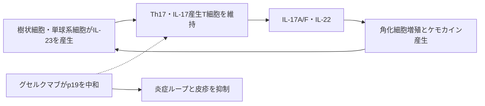

# グセルクマブ（Tremfya／トレムフィア）

## まず3行で

- 主に中等症から重症の尋常性乾癬に使い、乾癬性関節炎や炎症性腸疾患にも適応を広げた抗体である。
- IL-23に固有のp19サブユニットを中和し、病的な17型免疫と角化細胞の炎症性ループを上流から弱める。
- IL-12と共有されるp40を避け、IL-23だけを選択的に止める設計を初めて承認薬として実証した点が重要である。

## 1. どんな病気か

尋常性乾癬は、境界明瞭な赤い局面に銀白色の鱗屑が重なり、かゆみや痛みを伴う慢性免疫疾患である。皮膚だけでなく、関節炎や心血管・代謝疾患とも関連し、外見、睡眠、生活の質への負担も大きい。[NIAMS](https://www.niams.nih.gov/health-topics/psoriasis)

正常皮膚では角化細胞の増殖と分化が釣り合う。乾癬病変では樹状細胞や単球系細胞がIL-23を産生し、Th17細胞やIL-17産生CD8陽性T細胞を維持する。そこから出るIL-17A/FやIL-22が角化細胞を刺激し、増殖、抗菌ペプチド、好中球・T細胞を呼ぶケモカインを増やすため、炎症が自己増幅する。遺伝素因に感染、外傷、薬剤などが重なるが、最初の免疫異常が何か、治療後にどの細胞が再燃を決めるかは完全には分かっていない。2026年の単一細胞研究は、IL-23阻害後に病変部のIL-17産生組織常在性メモリーT細胞が持続的に減ることを示したが、全患者の長期寛解を説明する確立した機序ではない。[Jiangら](https://pubmed.ncbi.nlm.nih.gov/42208526/)

## 2. なぜこの分子を標的にするのか

IL-23はp19とp40からなる可溶性サイトカインで、活性化した抗原提示細胞から分泌される。p19はIL-23固有だが、p40はTh1・IFN-γ応答を促すIL-12にも使われる。[Oppmannら](https://pubmed.ncbi.nlm.nih.gov/11114383/) したがってp19を塞げば、乾癬を支えるIL-23―17型免疫の上流を抑えながら、IL-12経路を直接は阻害しない。これは「病的免疫を狭く切る」という標的選択である。

一方、IL-23/IL-17系は細菌・真菌への粘膜防御にも関わる。選択性は免疫抑制がないことを意味せず、感染症や結核の評価が必要である。また乾癬にはTNF、IL-36、組織常在性細胞など複数の回路があり、IL-23依存性や反応持続性には個人差が残る。

## 3. どんな抗体として設計されたか

### 開発企業

MorphoSysの完全ヒト抗体ライブラリーHuCALで創製され、Janssen Research & Developmentが臨床開発、Janssen Biotechが販売を担った。[MorphoSys](https://www.sec.gov/Archives/edgar/data/1340243/000119312520308866/d933676dex991.htm)

### 基本設計と作用の仕組み

グセルクマブは約147 kDaの完全ヒトIgG1λ通常抗体で、ペイロード、二重特異性、Fc配列改変を持たない。FabがIL-23のp19へ選択的に結合してIL-23受容体との相互作用を妨げ、下流のIL-17A/F、IL-22などを減らす。細胞除去やADCCが主作用ではなく、分泌されたサイトカインの中和が設計の中心である。[米国添付文書](https://dailymed.nlm.nih.gov/dailymed/drugInfo.cfm?setid=1e6dc9ae-1c4c-42d9-87aa-c315ecc51b56)

乾癬では100 mgを0週、4週、その後8週間隔で皮下注射する。通常のIgG骨格による約15～18日の半減期と高い標的親和性を、少ない維持投与回数につなげた製剤設計である。

### 設計上の未解明点

天然型Fcが高親和性Fcγ受容体CD64へ結合し、IL-23産生細胞の近傍でサイトカインを捕捉・内在化させるという結果が細胞系で報告された。[Sachenら](https://pubmed.ncbi.nlm.nih.gov/40145093/) しかし生理濃度の内因性IgGがある条件では優位性が再現されないとの反証もある。[Cohen-Solalら](https://pubmed.ncbi.nlm.nih.gov/41904387/) よって「二重作用」は興味深い仮説だが、患者での追加効果や他のp19抗体との差としては未確立である。

## 4. 病態から作用まで

## 5. 何が画期的だったのか

初期試験では単回投与後に皮疹だけでなく、表皮肥厚、病変部のT細胞・樹状細胞、乾癬関連遺伝子、血清IL-17Aが低下し、IL-23単独中和で病態回路を崩せることがヒトで示された。[Sofenら](https://pubmed.ncbi.nlm.nih.gov/24679469/) 2017年の米国承認により、グセルクマブは選択的IL-23 p19阻害を実用化した最初の抗体となった。共有p40を塞ぐ抗体から、疾患を駆動する固有サブユニットへ標的を絞る流れを作り、後続p19抗体と皮膚以外の適応開発を促した。

> **一言で評価：** この抗体の革新性は、IL-12を直接阻害せずIL-23固有のp19を狙い、乾癬の17型免疫を上流から選択的に制御できると臨床実証したことにある。

## 6. 実際の医療での位置づけ

2026年9月13日時点、日本では既存治療で効果不十分な尋常性乾癬、乾癬性関節炎、膿疱性乾癬、乾癬性紅皮症、掌蹠膿疱症に皮下注射で用いる。さらに中等症から重症の潰瘍性大腸炎と活動期クローン病にも、点滴または皮下導入後の皮下維持を含む選択肢がある。[PMDA](https://www.pmda.go.jp/PmdaSearch/iyakuDetail/ResultDataSetPDF/800155_3999446G1021_1_14)

代表的な乾癬試験では16週のPASI 90達成が73.3%で、プラセボ2.9%、アダリムマブ49.7%を上回った。[Blauveltら](https://pubmed.ncbi.nlm.nih.gov/28057360/) ただし疾患を治癒させる薬ではなく、反応不十分や中止後再燃もある。重要なリスクは重篤な感染症、結核再活性化、重篤な過敏症、肝機能障害であり、生ワクチンを避ける。投与前スクリーニング、注射継続、費用も制約となる。

## 7. 類薬との違い

| 項目 | グセルクマブ | ウステキヌマブ | セクキヌマブ |
|---|---|---|---|
| 標的 | IL-23固有p19 | IL-12/23共有p40 | IL-17A |
| 形式 | 完全ヒトIgG1λ | 完全ヒトIgG1κ | 完全ヒトIgG1κ |
| 作用点 | 17型免疫の維持を上流で抑制 | IL-12とIL-23を同時阻害 | 下流エフェクターを直接中和 |
| 強み | IL-12を直接阻害せず8週維持 | 共有サブユニットで二経路を遮断 | 複数の細胞由来のIL-17Aを直接遮断 |
| 弱点 | 反応発現が遅い例、感染・肝障害 | 免疫影響が広い | IL-23による病的T細胞の維持は直接止めない |

最重要点は選択性の置き方である。グセルクマブは上流だがIL-23に限定し、ウステキヌマブより狭く、セクキヌマブより早い段階で病的T細胞の維持を断つ。ただし、この整理だけで個々の患者の優劣は決められない。

## 8. この抗体から学べること

- **疾患生物学：** 乾癬はIL-23で維持される17型免疫と角化細胞の自己増幅回路として理解できる。
- **標的選択：** 共有サブユニットではなく疾患関連サイトカイン固有の鎖を狙うと、経路を選択的に切れる。
- **抗体設計：** 特殊なフォーマットがなくても、高親和性中和とIgGの持続性で投与間隔を延ばせる。
- **残る課題：** 反応・寛解持続を予測する指標と、天然型Fc―CD64結合の臨床的意味は未確立である。
- **次に読む抗体：** p40を共有阻害するウステキヌマブ、下流IL-17Aを中和するセクキヌマブ。

## 参考文献

1. トレムフィア皮下注 電子添文（2026年7月改訂）. 医薬品医療機器総合機構, 2026. [PMDA](https://www.pmda.go.jp/PmdaSearch/iyakuDetail/ResultDataSetPDF/800155_3999446G1021_1_14)（2026年9月13日アクセス）
2. TREMFYA Prescribing Information（2026年5月改訂）. U.S. Food and Drug Administration / DailyMed, 2026. [DailyMed](https://dailymed.nlm.nih.gov/dailymed/drugInfo.cfm?setid=1e6dc9ae-1c4c-42d9-87aa-c315ecc51b56)（2026年9月13日アクセス）
3. Psoriasis: Symptoms, Causes, & Risk Factors. National Institute of Arthritis and Musculoskeletal and Skin Diseases, 2023. [NIAMS](https://www.niams.nih.gov/health-topics/psoriasis)（2026年9月13日アクセス）
4. Oppmann B, et al. Novel p19 protein engages IL-12p40 to form a cytokine, IL-23, with biological activities similar as well as distinct from IL-12. *Immunity*. 2000;13:715–725. [PubMed](https://pubmed.ncbi.nlm.nih.gov/11114383/)
5. Jiang R, et al. A longitudinal atlas of human psoriatic skin reveals the mechanisms of anti-IL-23 therapy in disrupting the type 17 inflammatory circuit. *Immunity*. 2026;59:1758–1775.e6. [PubMed](https://pubmed.ncbi.nlm.nih.gov/42208526/)
6. Sofen H, et al. Guselkumab (an IL-23-specific mAb) demonstrates clinical and molecular response in patients with moderate-to-severe psoriasis. *J Allergy Clin Immunol*. 2014;133:1032–1040. [PubMed](https://pubmed.ncbi.nlm.nih.gov/24679469/)
7. Blauvelt A, et al. Efficacy and safety of guselkumab compared with adalimumab: VOYAGE 1. *J Am Acad Dermatol*. 2017;76:405–417. [PubMed](https://pubmed.ncbi.nlm.nih.gov/28057360/)
8. MorphoSys’ Licensee Announces Approval by the European Commission for Tremfya. MorphoSys, 2020. [SEC filing](https://www.sec.gov/Archives/edgar/data/1340243/000119312520308866/d933676dex991.htm)（2026年9月13日アクセス）
9. Sachen KL, et al. Guselkumab binding to CD64-positive IL-23-producing myeloid cells enhances potency for neutralizing IL-23 signaling. *Front Immunol*. 2025;16:1532852. [PubMed](https://pubmed.ncbi.nlm.nih.gov/40145093/)
10. Cohen-Solal JF, et al. CD64 binding potential does not translate into enhanced therapeutic efficacy for anti-IL-23 antibodies under physiologically relevant conditions. *Mol Med*. 2026;32:70. [PubMed](https://pubmed.ncbi.nlm.nih.gov/41904387/)
