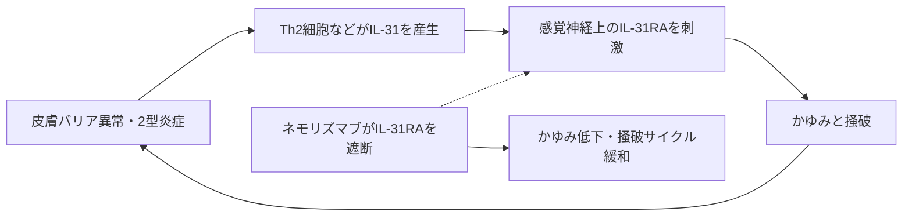

# ネモリズマブ（Mitchga／ミチーガ、Nemluvio）

## まず3行で

- 既存治療で抑えにくいアトピー性皮膚炎のかゆみと結節性痒疹に使う抗体である。
- IL-31受容体α（IL-31RA）を塞ぎ、免疫細胞から感覚神経へ届く「かゆみのサイトカイン」信号を遮断する。
- 炎症全体ではなく神経―免疫接点を標的にし、世界初のIL-31経路阻害抗体を実用化した点が重要である。

## 1. どんな病気か

アトピー性皮膚炎は、乾燥、紅斑、湿疹と強いかゆみが増悪と寛解を繰り返す慢性疾患で、乳幼児から成人まで発症する。皮膚バリアの脆弱性、2型免疫、環境因子が相互作用し、掻破による傷、炎症、感染、さらなるかゆみという「かゆみ―掻破サイクル」を作る。睡眠、集中力、生活の質への影響も大きい。[NIAMS](https://www.niams.nih.gov/health-topics/atopic-dermatitis)

正常皮膚では角層が水分と外来物質の境界となり、感覚神経は侵害刺激を伝える。病変ではTh2細胞などがIL-31を産生し、感覚神経、角化細胞、免疫細胞にあるIL-31RAを刺激する。神経興奮によるかゆみと、掻破によるバリア破壊が炎症を増幅する。IL-31は重要だが唯一の原因ではなく、IL-4/IL-13、TSLP、微生物叢、遺伝素因など患者ごとの寄与は未解明である。

## 2. なぜこの分子を標的にするのか

IL-31RAはオンコスタチンM受容体βと複合体を作り、IL-31結合後にJAK/STATなどを活性化する。原著研究では、IL-31が主にTh2細胞から産生され、IL-31RAを持つTRPV1/TRPA1陽性感覚神経を直接興奮させることが示された。[Cevikbasら](https://pubmed.ncbi.nlm.nih.gov/24373353/) 受容体側を抗体で塞げば、ヒスタミンとは別系統の慢性かゆみ信号に介入し、掻破から始まる二次的な皮膚障害も減らせる。

長所は、広い免疫抑制ではなく「かゆみを伝える神経―免疫接点」を狙えることにある。一方、IL-31RAは角化細胞や免疫細胞にもあり、遮断後の皮膚炎改善が神経作用、直接の抗炎症作用、掻破減少のどれにどれほど依存するかは確定していない。米国添付文書も患者での薬力学を未解明としている。[FDA](https://www.accessdata.fda.gov/drugsatfda_docs/label/2025/761391s001s002lbl.pdf)

## 3. どんな抗体として設計されたか

### 開発企業

中外製薬がIL-31RAの標的探索から抗体創製、初期臨床開発、製造までを担った。2016年に国内皮膚科領域をマルホへ、日本・台湾以外をGaldermaへ導出し、各社が後期開発と販売を進めた。[中外製薬](https://www.chugai-pharm.co.jp/english/ir/reports_downloads/annual_reports/files/eAR2016_12_00.pdf)

### 基本設計と作用の仕組み

ネモリズマブは約144 kDaのヒト化改変IgG2κ通常抗体で、IL-31RAへ競合的に結合し、IL-31の受容体結合と下流シグナルを阻害する。細胞を除去する薬ではない。Fcエフェクター機能を抑える目的で改変IgG2が選ばれ、試験系ではADCCや標的細胞死を示さなかった。[FDA審査資料](https://www.accessdata.fda.gov/drugsatfda_docs/nda/2024/761390Orig1s000IntegratedR.pdf)

### 設計上の工夫

マウス抗IL-31RA抗体NS22をCDR移植でヒト化し、製剤特性を最適化した。さらに中外製薬のACT-Ig技術で可変領域の等電点を下げ、陰性荷電した細胞表面への非特異的取り込みを減らして血中滞留を延ばす設計とした。カニクイザルでは単回皮下注後、IL-31誘発掻破の抑制が約2か月続いた。[Oyamaら](https://pubmed.ncbi.nlm.nih.gov/27714851/) こうして皮下投与と4週間隔投与を両立した。

## 4. 病態から作用まで

## 5. 何が画期的だったのか

従来のアトピー性皮膚炎治療はバリア補修や炎症抑制が中心だった。ネモリズマブは、かゆみを独立した治療標的として神経―免疫回路から切る発想を臨床実証した。国内第III相試験では外用治療併用下で、16週のかゆみVAS変化率がネモリズマブ群−42.8%、プラセボ群−21.4%だった。[Kabashimaら](https://pubmed.ncbi.nlm.nih.gov/32640132/) 2022年に日本で世界に先駆けて承認され、のちに結節性痒疹と海外のアトピー性皮膚炎へ展開した。[中外製薬](https://www.chugai-pharm.co.jp/english/news/detail/20220328160001_908.html)

> **一言で評価：** この抗体の革新性は、IL-31RAという神経―免疫接点を低エフェクター型抗体で遮断し、慢性そう痒そのものを疾患修飾の入口に変えたことにある。

## 6. 実際の医療での位置づけ

2026年9月16日時点、日本では既存治療で効果不十分なアトピー性皮膚炎に伴うそう痒に用い、6～12歳は30 mg、13歳以上は60 mgを4週間隔で皮下注射する。かゆみが改善しても保湿・抗炎症外用治療は継続する。結節性痒疹では13歳以上に初回60 mg、その後30 mgを4週間隔で投与する。[PMDA 30 mg](https://www.pmda.go.jp/PmdaSearch/iyakuDetail/ResultDataSetPDF/730155_4490408D1021_1_04)／[PMDA 60 mg](https://www.pmda.go.jp/PmdaSearch/iyakuDetail/ResultDataSetPDF/730155_4490408G1028_2_05)

効果はかゆみの比較的早い改善と、それに伴う睡眠・皮疹の改善に特徴があるが、全患者の炎症を制御するわけではない。重要なリスクは皮膚症状の悪化、重篤な感染症・過敏症、類天疱瘡である。注射継続、費用、年齢・地域で異なる適応も制約となる。

## 7. 類薬との違い

| 項目 | ネモリズマブ | デュピルマブ | トラロキヌマブ |
|---|---|---|---|
| 標的 | IL-31RA | IL-4Rα | IL-13 |
| 形式 | ヒト化改変IgG2κ | 完全ヒトIgG4 | 完全ヒトIgG4λ |
| 作用点 | 神経―免疫性のかゆみ信号 | IL-4/IL-13の2型炎症 | IL-13を選択的中和 |
| 強み | かゆみ回路へ直接介入、4週間隔 | 2型炎症を広く抑制、適応が広い | IL-4を直接止めずIL-13に限定 |
| 弱点 | 他の炎症・かゆみ経路は残る | 結膜炎など、作用範囲が広い | IL-4・IL-31経路は直接止めない |

最重要点は、どこで回路を切るかである。ネモリズマブは炎症の上流全体よりも、かゆみを増幅するIL-31信号へ焦点を絞るため、基礎的な皮膚治療との併用が設計思想に組み込まれている。

## 8. この抗体から学べること

- **疾患生物学：** かゆみは炎症の付随症状ではなく、掻破を通じて病態を増幅する駆動因子になりうる。
- **標的選択：** 免疫細胞から感覚神経へのサイトカイン信号は、病的免疫を狭く切る標的になる。
- **抗体設計：** 受容体保有細胞を殺さず遮断するには、低エフェクターIgG2と長時間作用化が合理的である。
- **残る課題：** 反応予測バイオマーカー、炎症改善の直接・間接機序、長期遮断の影響は未確立である。
- **次に読む抗体：** IL-4/IL-13を同時に抑えるデュピルマブ、IL-13選択的なトラロキヌマブ。

## 参考文献

1. ミチーガ皮下注用30 mgバイアル／60 mgシリンジ 電子添文. 医薬品医療機器総合機構, 2025. [30 mg](https://www.pmda.go.jp/PmdaSearch/iyakuDetail/ResultDataSetPDF/730155_4490408D1021_1_04)／[60 mg](https://www.pmda.go.jp/PmdaSearch/iyakuDetail/ResultDataSetPDF/730155_4490408G1028_2_05)（2026年9月16日アクセス）
2. NEMLUVIO Prescribing Information. U.S. Food and Drug Administration, 2025. [FDA](https://www.accessdata.fda.gov/drugsatfda_docs/label/2025/761391s001s002lbl.pdf)（2026年9月16日アクセス）
3. Atopic Dermatitis. National Institute of Arthritis and Musculoskeletal and Skin Diseases. [NIAMS](https://www.niams.nih.gov/health-topics/atopic-dermatitis)（2026年9月16日アクセス）
4. Dillon SR, et al. Interleukin 31, a cytokine produced by activated T cells, induces dermatitis in mice. *Nat Immunol*. 2004;5:752–760. [PubMed](https://pubmed.ncbi.nlm.nih.gov/15184896/)
5. Cevikbas F, et al. A sensory neuron-expressed IL-31 receptor mediates T helper cell-dependent itch. *J Allergy Clin Immunol*. 2014;133:448–460. [PubMed](https://pubmed.ncbi.nlm.nih.gov/24373353/)
6. Oyama S, et al. Cynomolgus monkey model of IL-31-induced scratching depicts blockade of IL-31RA by a humanized monoclonal antibody. *Exp Dermatol*. 2018;27:14–21. [PubMed](https://pubmed.ncbi.nlm.nih.gov/27714851/)
7. Kabashima K, et al. Trial of Nemolizumab and Topical Agents for Atopic Dermatitis with Pruritus. *N Engl J Med*. 2020;383:141–150. [PubMed](https://pubmed.ncbi.nlm.nih.gov/32640132/)
8. Kwatra SG, et al. Phase 3 Trial of Nemolizumab in Patients with Prurigo Nodularis. *N Engl J Med*. 2023;389:1579–1589. [PubMed](https://pubmed.ncbi.nlm.nih.gov/37888917/)
9. NEMLUVIO Multi-Discipline Review. U.S. Food and Drug Administration, 2024. [FDA](https://www.accessdata.fda.gov/drugsatfda_docs/nda/2024/761390Orig1s000IntegratedR.pdf)（2026年9月16日アクセス）
10. Annual Report 2016：ネモリズマブ創製、ACT-Ig、開発・導出. 中外製薬, 2017. [中外製薬](https://www.chugai-pharm.co.jp/english/ir/reports_downloads/annual_reports/files/eAR2016_12_00.pdf)（2026年9月16日アクセス）
