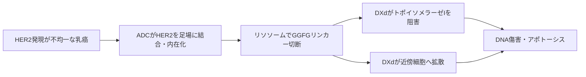

# トラスツズマブ デルクステカン（Enhertu／エンハーツ）

## まず3行で

- HER2を発現する乳癌を中心に、胃癌、非小細胞肺癌、複数の固形癌へ使われる抗体薬物複合体（ADC）である。
- 抗HER2抗体で細胞内へ入り、切断型リンカーからトポイソメラーゼI阻害薬DXdを放出し、DNA傷害で腫瘍細胞を死滅させる。
- 高い薬物抗体比と膜透過性ペイロードにより、HER2が少ない細胞や隣接細胞まで攻撃可能にし、HER2を「増殖ドライバー」から「薬物送達の住所」へ拡張した。

## 1. どんな病気か

代表疾患は手術不能・再発乳癌である。乳癌は乳房のしこりとして見つかるほか、進行すれば骨、肺、肝、脳などへ転移する。正常のHER2は上皮細胞表面にある受容体型チロシンキナーゼで、他のHERファミリー受容体と二量体を作り、必要な増殖・生存シグナルを伝える。ERBB2遺伝子増幅などでHER2が過剰になる乳癌では、この経路が持続して増殖を駆動する。[NCI](https://www.cancer.gov/types/breast/treatment/targeted-therapy)

トラスツズマブなどでHER2陽性乳癌の予後は改善したが、治療後の再発・耐性、腫瘍内での発現のばらつき、脳転移が課題として残った。一方、従来HER2陰性とされた中にもIHC 1+または2+/ISH陰性の「HER2-low」、ごく弱い膜染色を示す「HER2-ultralow」がある。これらは必ずしもHER2依存性という一つの生物学的亜型ではなく、ADCが届く量のHER2を示す治療予測上の区分である。低発現を再現よく判定する病理評価には今も難しさがある。

## 2. なぜこの分子を標的にするのか

HER2は細胞外に露出し、乳癌の一部では高密度に発現し、抗体結合後に複合体が細胞内へ取り込まれる。したがって、増殖シグナルを抑える標的であると同時に、細胞毒性薬を運ぶ入口になる。正常組織より腫瘍で発現が高いこと、検査で患者を選べること、既存のトラスツズマブで臨床的妥当性が確立していたことも長所である。

ただし、HER2-lowではHER2自体が主要な増殖ドライバーとは限らず、標的密度も不均一である。さらに心筋など正常組織にもHER2機能があり、抗体部分に由来する心機能低下を無視できない。抗原が極端に少ない細胞、内在化・リソソーム輸送の変化、薬物排出やDNA傷害応答の変化は耐性につながり得る。

## 3. どんな抗体として設計されたか

### 開発企業

第一三共が独自のDXd ADC技術を用いてDS-8201aを創製し、前臨床から初期臨床開発を進めた。2019年にAstraZenecaと日本を除く世界で共同開発・商業化する契約を結び、日本では第一三共が独占的権利を維持した。[第一三共](https://www.daiichisankyo.com/files/news/pressrelease/pdf/006988/190329_886_E.pdf)

### 基本設計と作用の仕組み

本剤はトラスツズマブと同じ配列のヒト化IgG1κ抗HER2抗体、酵素切断性のGGFGテトラペプチドリンカー、エキサテカン誘導体のトポイソメラーゼI阻害薬DXdからなる約157 kDaのADCである。HER2へ結合して内在化した後、リソソーム酵素でリンカーが切れ、DXdが遊離する。DXdはDNA複製時のトポイソメラーゼI-DNA複合体を捕捉してDNA切断を蓄積させ、アポトーシスを誘導する。抗体本来のHER2シグナル抑制とADCCも保つが、主作用はDXd送達である。[PMDA](https://www.pmda.go.jp/PmdaSearch/iyakuDetail/ResultDataSetPDF/430574_4291452D1029_1_13)

### 設計上の工夫

抗体1分子当たり平均約8個の薬物を結合する高DAR設計で、HER2が少ない細胞にも多くのDXdを運ぶ。親水性リンカーにより高DARでも凝集を抑え、血中安定性と腫瘍内切断を両立した。遊離DXdは膜を通過できるため、HER2陽性細胞から近傍の低発現・陰性細胞へ拡散するバイスタンダー効果を前臨床で示した。[Ogitaniら](https://pubmed.ncbi.nlm.nih.gov/27166974/) ただし患者ごとの効果に占める寄与は直接測定できず、確立した臨床量ではない。乳癌では通常5.4 mg/kgを3週ごとに点滴静注する。

## 4. 病態から作用まで

## 5. 何が画期的だったのか

従来のHER2治療は、HER2過剰発現・遺伝子増幅を伴う腫瘍を主対象としていた。本剤は高DAR、切断型リンカー、膜透過性DXdを一体化し、低いHER2発現を薬物送達の足場として利用した。HER2-low乳癌で通常の化学療法より無増悪生存と全生存を延長した比較試験は、HER2判定を陽性／陰性の二分法から連続量として捉え直す契機になった。[Modiら](https://pubmed.ncbi.nlm.nih.gov/35665782/) さらにHER2変異肺癌や癌種横断のHER2陽性固形癌へ広がり、同じDXd基盤を別標的へ展開するADC創薬にも影響した。

> **一言で評価：** この抗体の革新性は、HER2の高発現を阻害するだけでなく、わずかな発現を利用して高密度かつ近傍拡散性のDNA傷害薬を届け、治療可能な集団を拡張したことにある。

## 6. 実際の医療での位置づけ

2026年9月19日時点、日本ではHER2陽性乳癌のペルツズマブ併用一次治療と化学療法歴のある単剤治療、HR陽性HER2-low／ultralow乳癌、化学療法歴のあるHER2-low乳癌、HER2変異NSCLC、トラスツズマブ治療後のHER2陽性胃癌、標準治療が困難なHER2陽性進行・再発固形癌に承認されている。[PMDA](https://www.pmda.go.jp/PmdaSearch/rdDetail/iyaku/4291452D1029_1?user=1)

重要な制約は間質性肺疾患（ILD）で、死亡例もあるため、咳、呼吸困難、発熱と画像変化を早期に捉え、疑えば休薬・中止と治療を行う。悪心、骨髄抑制、左室機能低下にも注意する。バイスタンダー効果は不均一腫瘍への強みである一方、放出薬が正常組織へ届く可能性も含み、「標的化＝全身毒性なし」ではない。

## 7. 類薬との違い

| 項目 | トラスツズマブ デルクステカン | トラスツズマブ エムタンシン（T-DM1） | トラスツズマブ |
|---|---|---|---|
| 標的 | HER2 | HER2 | HER2 |
| 形式 | 切断型GGFG-DXd ADC、DAR約8 | 非切断型SMCC-DM1 ADC、DAR約3.5 | ヒト化IgG1通常抗体 |
| 主作用 | DNA傷害＋バイスタンダー効果 | 微小管阻害、標的細胞内で主に作用 | HER2シグナル抑制、ADCC |
| 強み | 低発現・不均一腫瘍にも届き得る | ペイロード保持性が高い | ADC固有の細胞毒性を持たない |
| 弱点 | ILD、悪心、骨髄抑制 | HER2量・内在化への依存が強い | 単独では低発現腫瘍に効きにくい |

最も重要な違いはリンカーとペイロードの行き先である。T-DM1は取り込んだ標的細胞内で主に働くのに対し、本剤は切断後のDXdが隣へ移れる。この性質と高DARが、同じ抗体を用いながら異なる発現域を治療対象にした。

## 8. この抗体から学べること

- **疾患生物学：** HER2は増殖ドライバーであるだけでなく、発現量に応じた薬物送達マーカーにもなる。
- **標的選択：** ADCでは標的の病因性に加え、表面密度、内在化、腫瘍内不均一性が重要である。
- **抗体設計：** 抗体、DAR、リンカー、ペイロードの膜透過性を一つのシステムとして最適化する必要がある。
- **残る課題：** ILDの機序と予測、低発現判定の再現性、耐性、脳転移への到達性をさらに改善する必要がある。
- **次に読む抗体：** HER2阻害の出発点である[トラスツズマブ](20260721_trastuzumab.md)、異なる切断型ADCのブレンツキシマブ ベドチン。

## 参考文献

1. エンハーツ点滴静注用100 mg 電子添文（2026年9月改訂）. 医薬品医療機器総合機構, 2026. [PMDA](https://www.pmda.go.jp/PmdaSearch/iyakuDetail/ResultDataSetPDF/430574_4291452D1029_1_13)（2026年9月19日アクセス）
2. エンハーツ点滴静注用100 mg 初回承認時審査報告書. 医薬品医療機器総合機構, 2020. [PMDA](https://www.pmda.go.jp/drugs/2020/P20200918001/430574000_30200AMX00425_A100_1.pdf)（2026年9月19日アクセス）
3. ENHERTU Prescribing Information（2026年5月改訂）. U.S. National Library of Medicine / FDA, 2026. [DailyMed](https://dailymed.nlm.nih.gov/dailymed/fda/fdaDrugXsl.cfm?setid=7e67e73e-ddf4-4e4d-8b50-09d7514910b6)（2026年9月19日アクセス）
4. Targeted Therapy for Breast Cancer. National Cancer Institute, 2025. [NCI](https://www.cancer.gov/types/breast/treatment/targeted-therapy)（2026年9月19日アクセス）
5. Ogitani Y, et al. DS-8201a, a novel HER2-targeting ADC with a novel DNA topoisomerase I inhibitor, demonstrates a promising antitumor efficacy with differentiation from T-DM1. *Clin Cancer Res*. 2016;22:5097–5108. [PubMed](https://pubmed.ncbi.nlm.nih.gov/27026201/)
6. Ogitani Y, et al. Bystander killing effect of DS-8201a in tumors with HER2 heterogeneity. *Cancer Sci*. 2016;107:1039–1046. [PubMed](https://pubmed.ncbi.nlm.nih.gov/27166974/)
7. Nakada T, et al. The latest research and development into trastuzumab deruxtecan (DS-8201a) for HER2 cancer therapy. *Chem Pharm Bull*. 2019;67:173–185. [J-STAGE](https://www.jstage.jst.go.jp/article/cpb/67/3/67_c18-00744/_html/-char/en)
8. Modi S, et al. Trastuzumab deruxtecan in previously treated HER2-low advanced breast cancer. *N Engl J Med*. 2022;387:9–20. [PubMed](https://pubmed.ncbi.nlm.nih.gov/35665782/)
9. Daiichi Sankyo and AstraZeneca announce global development and commercialization collaboration for trastuzumab deruxtecan. Daiichi Sankyo / AstraZeneca, 2019. [第一三共](https://www.daiichisankyo.com/files/news/pressrelease/pdf/006988/190329_886_E.pdf)（2026年9月19日アクセス）
10. KADCYLA Prescribing Information（2026年3月改訂）. U.S. National Library of Medicine / FDA, 2026. [DailyMed](https://dailymed.nlm.nih.gov/dailymed/fda/fdaDrugXsl.cfm?setid=23f3c1f4-0fc8-4804-a9e3-04cf25dd302e)（2026年9月19日アクセス）
