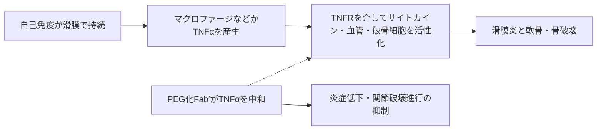

# セルトリズマブ ペゴル（Cimzia／シムジア）

## まず3行で

- 関節リウマチ（RA）や乾癬など、TNFαが炎症を増幅する免疫疾患に使う生物学的製剤である。
- 可溶型・膜結合型TNFαをヒト化Fab′で捕捉し、TNF受容体への結合を遮断するが、Fcを持たないため標的細胞をADCCやCDCで傷害しない。
- Fcを除いて「中和」に機能を絞り、失われる血中滞留を40 kDaのPEGで補った、約90 kDaの長時間作用型抗体断片である。

## 1. どんな病気か

代表疾患はRAである。免疫系が関節滑膜を持続的に攻撃し、手足の小関節を中心に痛み、腫れ、朝のこわばりを起こす。慢性化すると滑膜が肥厚して軟骨と骨へ侵入し、不可逆的な関節変形や機能障害に至る。[NIAMS](https://www.niams.nih.gov/health-topics/rheumatoid-arthritis)

病変ではマクロファージ、T細胞、B細胞、滑膜線維芽細胞などが相互に活性化する。TNFαは主に単球・マクロファージ系細胞から局所産生され、血管内皮の接着分子、IL-1・IL-6などのサイトカイン、破骨細胞形成を増幅する「上流のハブ」の一つである。[Chuら](https://pubmed.ncbi.nlm.nih.gov/1930331/) ただしRAの起点は遺伝、喫煙などの環境、自己抗体が絡む多因子性で、TNFαだけが原因ではない。メトトレキサートなどで不十分な患者が残り、抗TNF薬にも一次無効や二次的な効果減弱がある。

## 2. なぜこの分子を標的にするのか

TNFαは膜結合型三量体として作られ、切断された可溶型もTNFR1/TNFR2を介して炎症と組織防御を調節する。抗体で両者を中和すれば、一分子の遮断から複数の炎症回路を同時に弱められる。セルトリズマブのFabはTNFα三量体の一つのサブユニットに結合し、受容体結合面を部分的に占有して構造変化も誘導することが示されている。[Mukaiら](https://pubmed.ncbi.nlm.nih.gov/28124979/)

長所は、細胞外の可溶性・膜蛋白を高親和性で直接捕捉でき、患者選択用の単一バイオマーカーがなくても炎症ネットワークの上流へ介入できる点である。一方、TNFαは肉芽腫形成や感染防御にも必要であり、結核、肺炎、日和見感染症のリスクは標的そのものに由来する。TNF非依存性のRAには効かず、反応予測はなお不完全である。

## 3. どんな抗体として設計されたか

### 開発企業

英国CelltechがCDP870を創製し、1998年からRA臨床開発を開始した。UCBは2004年にCelltechを買収し、後期開発、承認、製造販売を引き継いだ。世界初承認は2008年の米国クローン病、日本ではUCBがRAを対象に開発して2012年に承認を得た。[PMDAインタビューフォーム](https://www.info.pmda.go.jp/go/interview/1/820110_3999437G1022_1_018_1F.pdf)

### 基本設計と作用の仕組み

ヒト化IgG1κ由来の単価Fab′に、約20 kDaのメトキシPEGを2本結合したFc欠損分子である。可溶型と膜結合型TNFαを中和する一方、Fcγ受容体やC1qを動員できず、in vitroでADCC、CDC、活性化リンパ球・単球のアポトーシスを誘導しなかった。[Nesbittら](https://pubmed.ncbi.nlm.nih.gov/17636564/) つまりTNF産生細胞の除去ではなく、サイトカイン信号の遮断へ作用を絞った設計である。

### 設計上の工夫

Fab′だけでは小さく腎排泄されやすく、FcRnによるIgG再利用も受けられない。そこで合計40 kDaの分岐PEGを付加し、蛋白分解・腎クリアランスを遅らせ、終末相半減期を約14日まで延ばした。[FDA](https://www.accessdata.fda.gov/drugsatfda_docs/label/2025/125160s315lbl.pdf) Fc欠損は同時に胎盤FcRnによる能動輸送を受けにくくする。妊娠後期16例の研究では新生児移行は「なし～ごくわずか」だったが、小規模研究であり完全なゼロとは断定できない。[Marietteら](https://pubmed.ncbi.nlm.nih.gov/29030361/)

## 4. 病態から作用まで

## 5. 何が画期的だったのか

抗TNFという標的の先駆性ではなく、完全長IgGからFcを意図的に外し、PEGで薬物動態を作り直した点が本剤の核心である。RAで症状と画像上の関節破壊進行を抑えたことは、抗炎症効果にADCC・CDCが必須ではないことを臨床的に支えた。[Keystoneら](https://pubmed.ncbi.nlm.nih.gov/18975346/) また、Fc欠損に伴う胎盤移行の少なさは、妊娠を希望・継続する患者で治療選択を考える際の固有の材料になった。ただし妊娠中も個別の利益・危険評価が必要である。

> **一言で評価：** この抗体の革新性は、中和に不要なFcを削り、PEG化で持続性を回復することで、作用と体内動態を別々に設計したことにある。

## 6. 実際の医療での位置づけ

2026年9月22日時点、日本ではRA（構造的損傷の防止を含む）と、既存治療で効果不十分な尋常性乾癬、乾癬性関節炎、膿疱性乾癬、乾癬性紅皮症に承認されている。RAでは初回、2週、4週に400 mg、その後200 mgを2週ごとに皮下注し、安定後は400 mgを4週ごとにもできる。自己注射も可能である。[PMDA](https://www.pmda.go.jp/PmdaSearch/iyakuDetail/ResultDataSetPDF/820110_3999437G1022_1_20)

メトトレキサート併用または単剤で用いるが、他の生物製剤とは併用しない。最大の制約は重篤な感染症で、開始前の結核・B型肝炎評価、投与中の感染監視が欠かせない。脱髄疾患と心不全は国内で禁忌である。Fc欠損でもTNF中和に由来する安全性問題は残り、PEG化は免疫抑制の選択性を高める仕組みではない。

## 7. 類薬との違い

| 項目 | セルトリズマブ ペゴル | アダリムマブ | エタネルセプト |
|---|---|---|---|
| 標的 | TNFα | TNFα | TNFα、リンホトキシンα |
| 形式 | ヒト化PEG-Fab′、Fcなし | 完全ヒトIgG1 | TNFR2-IgG1 Fc融合二量体 |
| 主作用 | 可溶型・膜結合型TNFαの中和 | TNFα中和＋Fc機能 | リガンドを受容体部分で捕捉 |
| 設計上の特徴 | PEGで半減期を補償 | 完全長IgG、FcRn再利用 | 二価の可溶性受容体デコイ |
| 強み | ADCC/CDCなし、能動的胎盤移行が少ない | 適応・使用経験が広い | TNFα以外にリンホトキシンαも捕捉 |
| 弱点 | TNF阻害の感染リスク、PEGを含む | FcRnによる胎盤移行 | Fcを持ち、Fab抗体とは結合様式が異なる |

最重要点は、同じTNF阻害でも「何を結合部位として残し、Fcをどう扱うか」が異なることである。本剤は標的範囲を広げるのでなく、不要な細胞傷害とFcRn輸送を構造的に切り離した。

## 8. この抗体から学べること

- **疾患生物学：** RAは多因子性でも、TNFαのような増幅ハブを切ると症状と組織破壊を同時に抑えられる。
- **標的選択：** 炎症サイトカインは有効な上流標的だが、正常な感染防御との治療域が問題になる。
- **抗体設計：** Fc除去で失う半減期をPEGで補えば、「結合」と「体内滞留」を別部品として最適化できる。
- **残る課題：** 反応予測、感染リスクの層別化、抗薬物抗体、長期PEG曝露の影響をさらに明らかにする必要がある。
- **次に読む抗体：** 完全長抗TNF抗体アダリムマブ、受容体Fc融合蛋白エタネルセプト。

## 参考文献

1. シムジア皮下注200 mg 電子添文（2025年7月改訂）. 医薬品医療機器総合機構, 2025. [PMDA](https://www.pmda.go.jp/PmdaSearch/iyakuDetail/ResultDataSetPDF/820110_3999437G1022_1_20)（2026年9月22日アクセス）
2. シムジア皮下注200 mg インタビューフォーム. UCB Japan, 2025. [PMDA](https://www.info.pmda.go.jp/go/interview/1/820110_3999437G1022_1_018_1F.pdf)（2026年9月22日アクセス）
3. CIMZIA Prescribing Information（2025年9月改訂）. U.S. Food and Drug Administration, 2025. [FDA](https://www.accessdata.fda.gov/drugsatfda_docs/label/2025/125160s315lbl.pdf)（2026年9月22日アクセス）
4. Cimzia EPAR Product Information（2026年5月改訂）. European Medicines Agency, 2026. [EMA](https://www.ema.europa.eu/en/documents/product-information/cimzia-epar-product-information_en.pdf)（2026年9月22日アクセス）
5. Rheumatoid Arthritis. National Institute of Arthritis and Musculoskeletal and Skin Diseases. [NIAMS](https://www.niams.nih.gov/health-topics/rheumatoid-arthritis)（2026年9月22日アクセス）
6. Chu CQ, et al. Localization of tumor necrosis factor alpha in synovial tissues and at the cartilage-pannus junction in patients with rheumatoid arthritis. *Arthritis Rheum*. 1991;34:1125–1132. [PubMed](https://pubmed.ncbi.nlm.nih.gov/1930331/)
7. Nesbitt A, et al. Mechanism of action of certolizumab pegol (CDP870): in vitro comparison with other anti-tumor necrosis factor alpha agents. *Inflamm Bowel Dis*. 2007;13:1323–1332. [PubMed](https://pubmed.ncbi.nlm.nih.gov/17636564/)
8. Mukai Y, et al. Molecular basis for the neutralization of tumor necrosis factor α by certolizumab pegol in the treatment of inflammatory autoimmune diseases. *J Mol Biol*. 2017;429:228–238. [PubMed](https://pubmed.ncbi.nlm.nih.gov/28124979/)
9. Keystone E, et al. Certolizumab pegol plus methotrexate is significantly more effective than placebo plus methotrexate in active rheumatoid arthritis: RAPID 1. *Arthritis Rheum*. 2008;58:3319–3329. [PubMed](https://pubmed.ncbi.nlm.nih.gov/18975346/)
10. Mariette X, et al. Lack of placental transfer of certolizumab pegol during pregnancy: results from CRIB. *Ann Rheum Dis*. 2018;77:228–233. [PubMed](https://pubmed.ncbi.nlm.nih.gov/29030361/)
