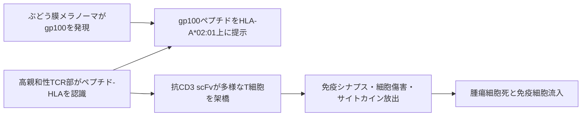

# テベンタフスプ（Kimmtrak）

## まず3行で

- HLA-A*02:01陽性の切除不能または転移性ぶどう膜悪性黒色腫に使う、可溶性T細胞受容体（TCR）由来の二重特異性薬である。
- 高親和性TCRで腫瘍細胞上の「gp100由来ペプチド–HLA複合体」を認識し、抗CD3 scFvで患者自身の多様なT細胞を呼び寄せて殺傷させる。
- 抗体では届かなかった細胞内蛋白由来のペプチドを創薬標的へ広げ、初めて承認されたTCR治療薬となった点が最大の革新である。

## 1. どんな病気か

ぶどう膜悪性黒色腫は、虹彩・毛様体・脈絡膜の色素細胞から生じる、成人で最も多い原発性眼内がんである。視野異常や飛蚊症を来すが無症状のこともあり、眼球内の原発巣には放射線や手術を用いる。[NCI](https://www.cancer.gov/types/eye/hp/intraocular-melanoma-treatment-pdq)

皮膚悪性黒色腫とは生物学が異なり、多くでGNAQまたはGNA11の活性化変異が初期ドライバーとなる。さらに3番染色体欠失やBAP1異常は転移リスクと結びつき、遠隔転移は肝臓に偏る。[Van Raamsdonkら](https://pubmed.ncbi.nlm.nih.gov/21083380/) 局所制御後も晩期転移が起こり得る理由や肝指向性の全容は未解明である。転移例は腫瘍変異量が低く、皮膚黒色腫で有効な免疫チェックポイント阻害薬への反応が乏しいため、腫瘍特異的T細胞が自然に成立するのを待たずに免疫を動員する必要があった。

## 2. なぜこの分子を標的にするのか

gp100（PMEL）はメラノソーム形成に関わる分化抗原で、正常メラノサイトとメラノーマに発現する。細胞内で分解されたgp100の280–288番ペプチドはHLA-A*02:01に載り、細胞表面へ提示される。標的はgp100蛋白そのものではなく、このペプチド–HLA複合体である。

通常の抗体は細胞表面蛋白しか認識できないが、TCRならHLAを「窓」として細胞内由来抗原を読める。gp100は腫瘍系譜に沿って発現し、少数の提示分子でも高親和性TCRが検出できる点が長所である。[Liddyら](https://doi.org/10.1038/nm.2764) 一方、正常メラノサイトも標的となるため皮疹・そう痒・色素変化が起こる。またHLA-A*02:01とgp100提示の両方が必要で、HLA陰性患者には原理上使えず、抗原提示低下による抵抗性も残る。

## 3. どんな抗体として設計されたか

### 開発企業

1990年代のOxford大学におけるTCR工学研究を基盤に、ImmunocoreがImmTAC（immune-mobilising monoclonal TCRs against cancer）技術として創製、臨床開発、承認、商業化まで担った。[Immunocore](https://www.immunocore.com/about-us)

### 基本設計と作用の仕組み

約77 kDaのFc非含有融合蛋白で、大腸菌により製造される。片側はgp100280–288–HLA-A*02:01をピコモル級で認識する親和性成熟型の可溶性αβ TCR、もう片側はヒト化抗CD3単鎖可変領域（scFv）である。[FDA](https://www.accessdata.fda.gov/drugsatfda_docs/label/2022/761228s000lbl.pdf) 腫瘍側へ結合した後にCD3陽性T細胞を架橋し、元来のTCR特異性にかかわらず免疫シナプス、細胞傷害蛋白、炎症性サイトカイン放出を誘導する。CD8だけでなくCD4 T細胞も動員できる。

### 設計上の工夫

自然の抗腫瘍TCRは自己抗原への親和性が低いため、標的選択性を保ちながら親和性を大幅に高め、低密度のペプチド–HLAを捉えられるようにした。抗CD3側はT細胞を無差別に先行刺激せず、標的細胞上で架橋した時に活性化させる役割を持つ。Fcを持たないためFc受容体による非特異的架橋はないが、終末相半減期は約7.5時間と短く週1回静注が必要である。初回20 µg、8日目30 µg、15日目以降68 µgという段階増量は、急なT細胞活性化とサイトカイン放出症候群（CRS）を和らげるための製剤・投与設計である。

## 4. 病態から作用まで

## 5. 何が画期的だったのか

従来の抗体が主に細胞表面プロテオームを探索していたのに対し、本剤は細胞内蛋白の断片をHLA越しに標的化した。しかも細胞製剤ではなく、保存・反復投与できる規格化された可溶性蛋白としてTCR機能を実用化した。第3相試験では1年全生存率が73%対59%となり、転移性ぶどう膜悪性黒色腫で全身療法として初めて生存期間延長を示した。[Nathanら](https://pubmed.ncbi.nlm.nih.gov/34551229/) 5年追跡でも生存率は16%対8%だった。[Piperno-Neumannら](https://pubmed.ncbi.nlm.nih.gov/42162665/) 画像上の奏効率は9%程度にとどまりながら生存利益が得られる理由は完全には解明されておらず、ctDNA低下や腫瘍微小環境変化が候補である。

> **一言で評価：** この薬の革新性は、親和性成熟TCRと抗CD3抗体断片を一分子にし、細胞内由来ペプチドを薬剤で狙える標的空間へ変えたことにある。

## 6. 実際の医療での位置づけ

2026年9月25日時点、米国とEUではHLA-A*02:01陽性成人の切除不能または転移性ぶどう膜悪性黒色腫に単剤承認され、Immunocoreは2025年末時点で39か国承認、30か国上市と報告している。[EMA](https://www.ema.europa.eu/en/medicines/human/EPAR/kimmtrak) 使用前のHLA遺伝子型確認が必須で、毎週静注する。最初の3回はCRSに備えた長時間監視を要する。

重要な有害事象はT細胞活性化に伴うCRSと、正常メラノサイトへのオンターゲット作用による皮疹・そう痒であり、多くは初期投与で強く、その後軽減する。肝転移が多い疾患背景も含め肝障害を監視する。HLA制限、週1回投与、初期監視、低い画像奏効率が大きな制約である。

## 7. 類薬との違い

| 項目 | テベンタフスプ | ブリナツモマブ | ペムブロリズマブ |
|---|---|---|---|
| 標的 | gp100ペプチド–HLA-A*02:01×CD3 | CD19×CD3 | PD-1 |
| 形式 | 可溶性TCR–抗CD3 scFv、Fcなし | タンデムscFv、Fcなし | ヒト化IgG4 |
| 主作用 | ペプチド提示細胞へT細胞を誘導 | CD19陽性細胞へT細胞を誘導 | T細胞の抑制解除 |
| 設計上の特徴 | 細胞内由来抗原を認識、HLA拘束 | 表面抗原を抗体で直接認識 | 内在する抗腫瘍免疫に依存 |
| 強み | 固形がんで生存利益、低密度標的を検出 | 血液がんで強力な細胞架橋 | HLA型に依存せず投与間隔が長い |
| 弱点 | HLA制限、CRS、週1回静注 | 持続投与、CRS・神経毒性 | ぶどう膜悪性黒色腫では反応が限定的 |

最重要点は「何を見える標的にするか」である。ブリナツモマブは表面CD19を、ペムブロリズマブは免疫ブレーキを狙うのに対し、本剤はHLA提示を利用して細胞内プロテオームへ標的範囲を広げた。

## 8. この抗体から学べること

- **疾患生物学：** 皮膚黒色腫と異なる低変異量腫瘍でも、外部からT細胞認識を作れば免疫療法が成立する。
- **標的選択：** 分化抗原は発現の一貫性が利点だが、正常系譜細胞へのオンターゲット毒性を伴う。
- **抗体設計：** TCRのペプチド–HLA識別と抗CD3 scFvの動員機能を分業させると、通常抗体の標的限界を越えられる。
- **残る課題：** HLA型ごとの製品開発、抗原提示低下、週1回投与、画像奏効と生存利益の乖離を解く指標が必要である。
- **次に読む抗体：** 表面抗原型T細胞エンゲージャーのブリナツモマブ、2+1型のグロフィタマブ。

## 参考文献

1. KIMMTRAK Prescribing Information. U.S. Food and Drug Administration, 2022. [FDA](https://www.accessdata.fda.gov/drugsatfda_docs/label/2022/761228s000lbl.pdf)（2026年9月25日アクセス）
2. Kimmtrak EPAR and Product Information（2025年12月更新）. European Medicines Agency, 2025. [EMA](https://www.ema.europa.eu/en/medicines/human/EPAR/kimmtrak)（2026年9月25日アクセス）
3. Intraocular (Eye) Melanoma Treatment (PDQ®)–Health Professional Version. National Cancer Institute. [NCI](https://www.cancer.gov/types/eye/hp/intraocular-melanoma-treatment-pdq)（2026年9月25日アクセス）
4. Piperno-Neumann S, et al. Five-year survival with tebentafusp in metastatic uveal melanoma. *Ann Oncol*. 2026;37:1266–1277. [PubMed](https://pubmed.ncbi.nlm.nih.gov/42162665/)
5. Van Raamsdonk CD, et al. Mutations in GNA11 in uveal melanoma. *N Engl J Med*. 2010;363:2191–2199. [PubMed](https://pubmed.ncbi.nlm.nih.gov/21083380/)
6. Liddy N, et al. Monoclonal TCR-redirected tumor cell killing. *Nat Med*. 2012;18:980–987. [DOI](https://doi.org/10.1038/nm.2764)
7. Middleton MR, et al. Tebentafusp, a TCR/anti-CD3 bispecific fusion protein targeting gp100, potently activated antitumor immune responses in patients with metastatic melanoma. *Clin Cancer Res*. 2020;26:5869–5878. [DOI](https://doi.org/10.1158/1078-0432.CCR-20-1247)
8. Nathan P, et al. Overall survival benefit with tebentafusp in metastatic uveal melanoma. *N Engl J Med*. 2021;385:1196–1206. [PubMed](https://pubmed.ncbi.nlm.nih.gov/34551229/)
9. Carvajal RD, et al. Clinical and molecular response to tebentafusp in previously treated patients with metastatic uveal melanoma: a phase 2 trial. *Nat Med*. 2022;28:2364–2373. [PubMed](https://pubmed.ncbi.nlm.nih.gov/36229663/)
10. Immunocore Holdings plc Annual Report 2025. Immunocore, 2026. [Annual Report](https://www.immunocore.com/investors/financials-filings/sec-filings/content/0001671927-26-000005/imcr-20251231.htm)（2026年9月25日アクセス）
