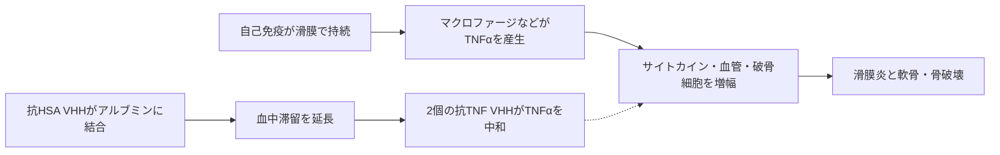

# オゾラリズマブ（ナノゾラ／Nanozora）

## まず3行で

- 既存治療で効果不十分な成人の関節リウマチ（RA）に用いる、日本で世界初承認されたTNFα阻害薬である。
- ラマ重鎖抗体由来の小さなVHHを3個つなぎ、両端の2個でTNFαを中和し、中央の1個でヒト血清アルブミン（HSA）に結合する。
- 約38 kDaのFc非含有一本鎖に「二価の標的結合」と「アルブミンを借りた長時間化」を同居させ、4週ごとの皮下注を実現した点が革新的である。

## 1. どんな病気か

RAは免疫系が関節滑膜を持続的に攻撃する慢性自己免疫疾患で、手指や手首などに左右対称の痛み、腫れ、朝のこわばりを起こす。炎症滑膜が肥厚して軟骨と骨へ侵入すると、不可逆的な関節破壊と機能障害に至り、肺や血管など関節外にも病変を生じ得る。[NIAMS](https://www.niams.nih.gov/health-topics/rheumatoid-arthritis)

病変ではマクロファージ、T・B細胞、滑膜線維芽細胞が相互に活性化する。TNFαは主に単球・マクロファージ系細胞から局所産生され、IL-1・IL-6、血管内皮活性化、破骨細胞形成を増幅する。[Chuら](https://pubmed.ncbi.nlm.nih.gov/1930331/) ただし発症には遺伝、喫煙、粘膜免疫、自己抗体などが絡み、患者ごとの主要経路は一様でない。メトトレキサート（MTX）や既存生物製剤でも無効・不耐容例が残り、TNF依存性を事前に確実に見分ける指標も未確立である。

## 2. なぜこの分子を標的にするのか

TNFαは膜結合型三量体として作られ、切断された可溶型もTNFR1／TNFR2を介して炎症を広げる。オゾラリズマブは両型へ結合し、受容体へのシグナルを遮断する。複数の炎症回路を支える増幅ハブを細胞外で直接捕捉できることが長所である。一方、TNFαは肉芽腫形成など感染防御にも必要なため、結核・肺炎・日和見感染症はオンターゲットの重要リスクとなる。TNF非依存性の滑膜炎には効かない。

HSAは病因標的ではなく薬物動態の標的である。小さなVHHは組織へ動きやすい反面、単独では腎排泄が速い。循環中のアルブミンに結合させれば、その長い滞留とFcRn再利用へ相乗りできる。この「治療標的」と「運搬体標的」の役割分担が設計の核である。

## 3. どんな抗体として設計されたか

### 開発企業

Ablynx（現Sanofi傘下）が創製・初期開発し、2015年に大正製薬へ日本の独占開発・販売権を許諾した。大正製薬が国内第II／III相・第III相試験、承認申請、製造販売を担った。[PMDA審査報告書](https://www.pmda.go.jp/drugs/2022/P20220824002/400059000_30400AMX00401000_A100_1.pdf)

### 基本設計と作用の仕組み

363アミノ酸、約38.4 kDaの一本鎖三価・二重特異性VHH薬で、CHO細胞により製造される。両端に同一のヒト化抗TNFα VHH、中央にヒト化抗HSA VHHを置き、各ドメインを9残基のGly-Serリンカーで連結する。二つのTNF結合部位で可溶型・膜結合型TNFαを高親和性に捕捉し、炎症シグナルを中和する。Fcを持たず、非臨床試験でADCCとCDCを示さなかったため、TNF産生細胞の除去ではなく中和へ機能を絞った薬である。

### 設計上の工夫

VHHは通常IgG約150 kDaの約4分の1で、モジュールを直列化しやすい。抗HSA部位はFcを付けずに血中半減期を約18日へ延ばし、30 mgを4週ごとに皮下注できる体内動態を与える。[Takeuchiら](https://pubmed.ncbi.nlm.nih.gov/37055803/) マウス関節炎モデルではアダリムマブより早い炎症関節への分布が観察されたが、小型・アルブミン結合がヒトで臨床的優位性を生むかは直接比較で確立していない。[Nakanishiら](https://pmc.ncbi.nlm.nih.gov/articles/PMC9613905/)

## 4. 病態から作用まで

## 5. 何が画期的だったのか

TNF阻害自体は成熟した戦略だが、本剤はFabとFcからなるIgGの骨格を使わず、独立して折り畳まれるVHHを必要な順に連結した。これにより、二価の中和、Fcエフェクター機能の除去、HSA結合による半減期延長を一つの小型鎖へ統合し、RAで初めてVHH薬を実用化した。MTX効果不十分例では16週のACR20改善率が30 mg群79.6%、プラセボ群37.3%で、構造的関節損傷の非進行割合も高かった。[Takeuchiら](https://pubmed.ncbi.nlm.nih.gov/35729713/) ただし既存TNF阻害薬に対する臨床的優越性を示した試験ではない。

> **一言で評価：** この抗体の革新性は、VHHを三つの交換可能な部品として連結し、小型化で失う滞留性をアルブミン結合で補ったことにある。

## 6. 実際の医療での位置づけ

2026年9月28日時点、日本では少なくとも1剤の抗リウマチ薬で効果不十分な成人RAに、30 mgを4週ごとに皮下注する。MTX併用・非併用の双方で国内試験が行われ、訓練後はシリンジまたはオートインジェクターで自己投与できる。[PMDA](https://www.pmda.go.jp/PmdaSearch/iyakuDetail/ResultDataSetPDF/400059_3999467G1023_1_05) 2026年4月の厚生労働省資料ではFDA・EMA承認はなく、日本のみの承認である。[厚生労働省](https://www.mhlw.go.jp/content/10601000/001711926.pdf)

効果は既存抗TNF薬と同じくTNF依存性の炎症を抑えるもので、治癒薬ではない。最重要リスクは重篤感染症と結核再活性化で、開始前の感染・結核・B型肝炎評価が必要である。脱髄疾患とうっ血性心不全は禁忌で、間質性肺炎にも注意する。抗薬物抗体・中和抗体による曝露や効果の低下も残る課題である。

## 7. 類薬との違い

| 項目 | オゾラリズマブ | アダリムマブ | セルトリズマブ ペゴル |
|---|---|---|---|
| 標的 | TNFα×2、HSA×1 | TNFα | TNFα |
| 形式 | 三価VHH一本鎖、Fcなし | 完全ヒトIgG1 | ヒト化PEG-Fab′、Fcなし |
| 長時間化 | HSA結合 | 自身のFcRn再利用 | 約40 kDaのPEG |
| 主作用 | 二価TNF中和 | TNF中和＋Fc機能 | 単価TNF中和 |
| 投与 | 30 mg、4週ごと皮下 | 通常2週ごと皮下 | 通常2週ごと、安定後4週ごとも可 |
| 主な弱点 | 日本のみの使用経験、免疫原性 | Fc機能、通常IgGサイズ | PEG付加、比較的大きい断片 |

最重要点は、小型断片の半減期を何で補うかである。本剤は外付け高分子や自身のFcではなく、内在性アルブミンを可逆的な運搬体として利用する。

## 8. この抗体から学べること

- **疾患生物学：** 多因子性のRAでも、TNFαという増幅ハブの遮断で症状と関節破壊を同時に抑えられる。
- **標的選択：** HSAのような非病因分子も、薬物動態を作る第二標的になり得る。
- **抗体設計：** 単一ドメイン抗体は、結合価・標的・滞留性をモジュールとして直列に組み替えられる。
- **残る課題：** 既存TNF阻害薬との直接比較、反応予測、免疫原性、小型化によるヒト関節移行の実益を明らかにする必要がある。
- **次に読む抗体：** PEGでFab′を長寿命化したセルトリズマブ ペゴル、VHH薬の先行例カプラシズマブ。

## 参考文献

1. ナノゾラ皮下注30 mg 電子添文（2025年4月改訂）. 医薬品医療機器総合機構, 2025. [PMDA](https://www.pmda.go.jp/PmdaSearch/iyakuDetail/ResultDataSetPDF/400059_3999467G1023_1_05)（2026年9月28日アクセス）
2. ナノゾラ皮下注30 mg シリンジ 審査報告書. 医薬品医療機器総合機構, 2022. [PMDA](https://www.pmda.go.jp/drugs/2022/P20220824002/400059000_30400AMX00401000_A100_1.pdf)（2026年9月28日アクセス）
3. 第24回医薬品等行政評価・監視委員会 資料6. 厚生労働省, 2026. [厚生労働省](https://www.mhlw.go.jp/content/10601000/001711926.pdf)（2026年9月28日アクセス）
4. Rheumatoid Arthritis. National Institute of Arthritis and Musculoskeletal and Skin Diseases, 2022. [NIAMS](https://www.niams.nih.gov/health-topics/rheumatoid-arthritis)（2026年9月28日アクセス）
5. Chu CQ, et al. Localization of tumor necrosis factor alpha in synovial tissues and at the cartilage-pannus junction in patients with rheumatoid arthritis. *Arthritis Rheum*. 1991;34:1125–1132. [PubMed](https://pubmed.ncbi.nlm.nih.gov/1930331/)
6. Nakanishi M, et al. A novel anti-TNF-alpha drug ozoralizumab rapidly distributes to inflamed joint tissues in a mouse model of collagen induced arthritis. *Front Immunol*. 2022;13:853008. [PMC](https://pmc.ncbi.nlm.nih.gov/articles/PMC9613905/)
7. Takeuchi T, et al. Phase II/III results of a trial of anti-TNF multivalent NANOBODY compound ozoralizumab in patients with rheumatoid arthritis. *Arthritis Rheumatol*. 2022;74:1776–1785. [PubMed](https://pubmed.ncbi.nlm.nih.gov/35729713/)
8. Tanaka Y, et al. Efficacy and safety of ozoralizumab without methotrexate co-administration in active rheumatoid arthritis: NATSUZORA trial. *Mod Rheumatol*. 2023;33:875–882. [PubMed](https://pubmed.ncbi.nlm.nih.gov/36201360/)
9. Takeuchi T, et al. Efficacy and pharmacokinetics of ozoralizumab in rheumatoid arthritis: 52-week results from OHZORA and NATSUZORA. *Arthritis Res Ther*. 2023;25:60. [PubMed](https://pubmed.ncbi.nlm.nih.gov/37055803/)
10. Approval of home self-injection guidance and dosing-period derestriction for Nanozora. Taisho Pharmaceutical, 2023. [Taisho](https://www.taisho.co.jp/en/company/news/20231201001464/)（2026年9月28日アクセス）
