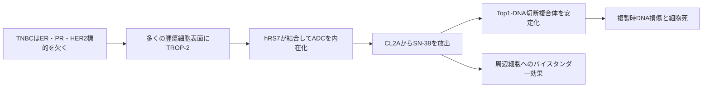

# サシツズマブ ゴビテカン（トロデルビ／Trodelvy）

## まず3行で

- 主に進行・再発したトリプルネガティブ乳がん（TNBC）と、治療抵抗性のホルモン受容体陽性・HER2陰性乳がんに用いる抗体薬物複合体（ADC）である。
- 多くの上皮がんに発現するTROP-2を目印に、ヒト化IgG1がトポイソメラーゼI阻害薬SN-38を腫瘍へ運び、DNA損傷を起こす。
- 超強力な毒素を安定に閉じ込めるのではなく、中等度の毒性をもつSN-38を高DAR・加水分解性リンカーで多量かつ周囲にも放出する、異なるADC設計を実用化した。

## 1. どんな病気か

TNBCは、乳がん治療の代表的な目印であるエストロゲン受容体、プロゲステロン受容体、HER2のいずれも治療標的として使えない病型で、乳がんの約15%を占める。増殖が速く再発しやすい一方、単一疾患ではなく、DNA修復異常、免疫活性、アンドロゲン受容体などが異なる不均一な集団である。[NCI](https://www.cancer.gov/types/breast/breast-cancer-types/triple-negative)

転移後は化学療法が中心で、PD-L1陽性なら免疫チェックポイント阻害薬、特定の生殖細胞系列BRCA変異ならPARP阻害薬を使えるが、反応しない患者や治療後に進行する患者が残る。そこで「腫瘍増殖を駆動する共通分子」を阻害するより、広く残る細胞表面分子を薬物の配送先にする発想が重要になった。

## 2. なぜこの分子を標的にするのか

TROP-2（TACSTD2）は細胞膜を1回貫通する糖タンパク質で、正常の上皮にも発現するが、多くのTNBCでは膜上に豊富に存在する。増殖・生存やカルシウムシグナルへの関与が提案され、高発現と不良予後の関連も報告される一方、生理機能や発がんへの必須性、治療効果を予測する発現閾値は確立していない。[Jeonら](https://pubmed.ncbi.nlm.nih.gov/36153494/)

したがって本剤でのTROP-2の第一の価値は、阻害すべきドライバーというより、抗体を内在化して薬物を運べる「住所」にある。発現が広いため患者を狭く選別せず使える反面、正常上皮にもあるため完全な腫瘍特異抗原ではない。さらに発現の不均一性・低下、薬物排出、DNA修復変化は耐性になり得る。

## 3. どんな抗体として設計されたか

### 開発企業

Immunomedicsが抗TROP-2抗体hRS7、CL2Aリンカー、SN-38を組み合わせて創製し、非臨床・臨床開発から2020年の米国初承認まで進めた。同年にGilead Sciencesが同社を買収し、世界での追加開発・製造販売を担っている。[Gilead](https://www.gilead.com/news/news-details/2020/gilead-sciences-completes-acquisition-of-immunomedics-inc)

### 基本設計と作用の仕組み

約159 kDaのADCで、マウス由来CDRをもつヒト化IgG1κ抗体hRS7に、イリノテカンの活性代謝物SN-38を平均約7～8個結合する。TROP-2結合後に内在化し、リンカーの加水分解と抗体分解でSN-38を放出する。SN-38はトポイソメラーゼIとDNA切断複合体を安定化し、複製時の致死的DNA損傷を増やす。[PMDA審査報告書](https://www.pmda.go.jp/drugs/2024/P20241107001/230867000_30600AMX00258_A100_1.pdf)

### 設計上の工夫

CL2Aは短いPEGで疎水性のSN-38を可溶化し、pH感受性の炭酸結合で比較的切れやすくしたリンカーである。超高力価毒素ではなくSN-38を選んだため、平均DAR約7.6まで搭載できる。細胞内だけでなく腫瘍微小環境でも放出され、膜透過性SN-38が隣接するTROP-2低発現細胞へ届くバイスタンダー効果が期待される。[Goldenbergら](https://pmc.ncbi.nlm.nih.gov/articles/PMC4673178/)

ただし「切れやすさ」は両刃で、循環中にもSN-38が生じる。高い送達量と不均一腫瘍への広がりを得る代わりに、好中球減少と下痢というイリノテカン様の全身毒性を受け入れた設計である。

## 4. 病態から作用まで

## 5. 何が画期的だったのか

従来のADCは、血中で安定なリンカーに極めて強力な毒素を少数結合し、標的陽性細胞内だけで放す設計が主流だった。本剤は、既知の化学療法活性体を高DARで積み、意図的に放出しやすくして腫瘍全体へ曝露させる別解を示した。ASCENT試験では、治療歴の多い転移TNBCで医師選択化学療法より無増悪・全生存期間を延長し、TROP-2 ADCというクラスを臨床的に成立させた。[Bardiaら](https://pubmed.ncbi.nlm.nih.gov/33882206/)

> **一言で評価：** この抗体の革新性は、標的精度だけを追わず、高DARと制御された薬物漏出を利用して不均一な固形がんへSN-38を面として届けたことにある。

## 6. 実際の医療での位置づけ

2026年10月1日時点、日本では化学療法歴のある手術不能・再発のHR陰性/HER2陰性またはHR陽性/HER2陰性乳がんに、10 mg/kgを21日サイクルの1日目と8日目に点滴する。[PMDA](https://www.pmda.go.jp/PmdaSearch/iyakuDetail/ResultDataSetPDF/230867_4291472D1026_1_03) 米国では2026年6月、進行TNBCの一次治療へ単剤（PD-1/PD-L1阻害薬が適さない患者）またはペムブロリズマブ併用（PD-L1 CPS 10以上）として拡大した。[FDA](https://www.fda.gov/drugs/resources-information-approved-drugs/fda-approves-sacituzumab-govitecan-hziy-monotherapy-and-combination-pembrolizumab-first-line)

最重要リスクは重篤な好中球減少と下痢で、血球監視、感染対応、G-CSF予防、早期の止瀉が必要である。SN-38を不活化するUGT1A1活性が低い患者では毒性が増え得る。脱毛、悪心、infusion reactionにも注意し、連続2週投与という負担もある。

## 7. 類薬との違い

| 項目 | サシツズマブ ゴビテカン | ダトポタマブ デルクステカン | トラスツズマブ デルクステカン |
|---|---|---|---|
| 標的 | TROP-2 | TROP-2 | HER2 |
| ペイロード | SN-38（Top1阻害） | DXd（Top1阻害） | DXd（Top1阻害） |
| リンカー・DAR | 加水分解性CL2A、約7.6 | 酵素切断性GGFG、約4 | 酵素切断性GGFG、約8 |
| 設計の重点 | 高搭載量と細胞外放出 | 血中安定性と治療域 | HER2選択と高搭載量 |
| 代表的な注意点 | 好中球減少、下痢 | 口内炎、眼障害、ILD | ILD、悪心、骨髄抑制 |

同じTROP-2・Top1阻害でも、リンカーの安定性とDARが異なれば曝露部位、投与間隔、毒性像が変わる。ADCは「標的」だけでなく、抗体・リンカー・薬物・結合数を一体で比較すべきである。[Okajimaら](https://pmc.ncbi.nlm.nih.gov/articles/PMC9398094/)

## 8. この抗体から学べること

- **疾患生物学：** 共通ドライバーを欠く不均一なTNBCでも、広く発現する表面抗原を配送口として利用できる。
- **標的選択：** 標的の病因上の必須性と、ADCの運搬先としての有用性は別に評価すべきである。
- **抗体設計：** 高DAR、切断性リンカー、膜透過性薬物は、発現不均一性をバイスタンダー効果で補える。
- **残る課題：** TROP-2発現の予測価値、Top1 ADC間の最適な順序、耐性、骨髄・消化管毒性の軽減が未解決である。
- **次に読む抗体：** 同じTROP-2を異なるDARとリンカーで狙うダトポタマブ デルクステカン。

## 参考文献

1. トロデルビ点滴静注用200 mg 電子添文（2026年3月改訂）. 医薬品医療機器総合機構, 2026. [PMDA](https://www.pmda.go.jp/PmdaSearch/iyakuDetail/ResultDataSetPDF/230867_4291472D1026_1_03)（2026年10月1日アクセス）
2. トロデルビ点滴静注用200 mg 審査報告書. 医薬品医療機器総合機構, 2024. [PMDA](https://www.pmda.go.jp/drugs/2024/P20241107001/230867000_30600AMX00258_A100_1.pdf)（2026年10月1日アクセス）
3. FDA approves sacituzumab govitecan-hziy as monotherapy and in combination with pembrolizumab for first-line treatment of triple-negative breast cancer. U.S. Food and Drug Administration, 2026. [FDA](https://www.fda.gov/drugs/resources-information-approved-drugs/fda-approves-sacituzumab-govitecan-hziy-monotherapy-and-combination-pembrolizumab-first-line)（2026年10月1日アクセス）
4. Triple-Negative Breast Cancer. National Cancer Institute, 2025. [NCI](https://www.cancer.gov/types/breast/breast-cancer-types/triple-negative)（2026年10月1日アクセス）
5. Goldenberg DM, et al. Trop-2 is a novel target for solid cancer therapy with sacituzumab govitecan. *Oncotarget*. 2015;6:22496–22512. [PMC](https://pmc.ncbi.nlm.nih.gov/articles/PMC4673178/)
6. Cardillo TM, et al. Sacituzumab Govitecan (IMMU-132), an Anti-Trop-2/SN-38 Antibody-Drug Conjugate: Characterization and Efficacy. *Bioconjug Chem*. 2015;26:919–931. [PubMed](https://pubmed.ncbi.nlm.nih.gov/25915780/)
7. Jeon YK, et al. Trophoblast cell-surface antigen 2 (TROP2) expression in triple-negative breast cancer. *BMC Cancer*. 2022;22:1014. [PubMed](https://pubmed.ncbi.nlm.nih.gov/36153494/)
8. Bardia A, et al. Sacituzumab Govitecan in Metastatic Triple-Negative Breast Cancer. *N Engl J Med*. 2021;384:1529–1541. [PubMed](https://pubmed.ncbi.nlm.nih.gov/33882206/)
9. Rugo HS, et al. Overall survival with sacituzumab govitecan in HR-positive and HER2-negative metastatic breast cancer (TROPiCS-02). *Lancet*. 2023;402:1423–1433. [PubMed](https://pubmed.ncbi.nlm.nih.gov/37633306/)
10. Okajima D, et al. Datopotamab deruxtecan demonstrates potent antitumor activity by efficient drug delivery to tumor cells. *Mol Cancer Ther*. 2022;21:635–646. [PMC](https://pmc.ncbi.nlm.nih.gov/articles/PMC9398094/)
