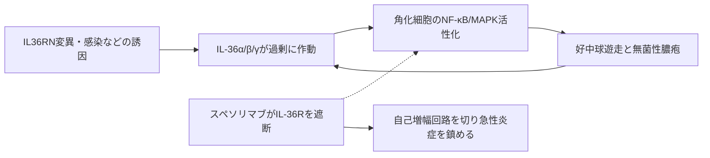

# スペソリマブ（スペビゴ／Spevigo）

## まず3行で

- 全身に無菌性膿疱が急速に広がり、発熱や臓器障害を伴い得る膿疱性乾癬の急性症状に用いる抗体である。
- IL-36受容体をふさぎ、3種類の炎症性リガンドによる角化細胞―好中球の自己増幅回路をまとめて遮断する。
- 病態遺伝学から見いだされた希少疾患の中核経路を治療標的へ変換し、Fcによる細胞傷害を避けた初のIL-36R抗体を実用化した。

## 1. どんな病気か

全身性膿疱性乾癬（GPP）は、紅斑上に感染によらない膿疱が広範に出現する希少な自己炎症性疾患である。発作は発熱、疼痛、白血球増多を伴い、敗血症様の全身状態、呼吸・循環不全へ進むこともある。尋常性乾癬を合併する例はあるが、後者の適応免疫・IL-23/IL-17軸優位の病態と同一ではない。

正常では、角化細胞などが作るIL-36α、β、γをIL-36受容体（IL-36R）と共受容体IL-1RAcPが受け、感染・組織損傷への局所防御を増幅する。内因性拮抗因子IL-36Raはこの反応にブレーキをかける。GPPでは`IL36RN`機能喪失変異がこのブレーキを弱める例があり、変異がない例でも病変部のIL-1/IL-36活性化が目立つ。角化細胞のケモカイン産生、好中球流入、好中球プロテアーゼによるIL-36活性化が正の循環を作る。[Marrakchiら](https://pubmed.ncbi.nlm.nih.gov/21848462/) [Johnstonら](https://pubmed.ncbi.nlm.nih.gov/28043870/)

ただし全患者を`IL36RN`変異だけでは説明できず、`CARD14`、`AP1S3`などや感染、薬剤中止、妊娠といった誘因の寄与も一様ではない。従来はレチノイド、シクロスポリンや尋常性乾癬向け生物製剤を用いたが、急性発作をGPP固有の機序から迅速に止める治療が不足していた。

## 2. なぜこの分子を標的にするのか

IL-36Rは主に角化細胞、線維芽細胞や一部の免疫細胞に発現する。受容体を狙えば、相互に代替し得るIL-36α、β、γを個別に中和せず、下流のMyD88―NF-κB/MAPK活性化と炎症性サイトカイン・好中球遊走因子の産生を一括して抑えられる。遺伝学と病変組織の双方が上流標的としての妥当性を支えるうえ、実際の反応は`IL36RN`変異の有無に限定されない。

一方、IL-36系は上皮防御にも関わるため、遮断は感染リスクを伴う。GPPにはIL-17、TNFなども関与し、IL-36R阻害だけで全例が反応するわけではない。発現細胞を除去する必要はなく、シグナルだけを止めることが設計上の要点となる。

## 3. どんな抗体として設計されたか

### 開発企業

Boehringer IngelheimがBI 655130として創製・臨床開発し、2022年に米国で世界初承認、同年に日本でも承認を得た。2025年、LEO Pharmaが中国を除く世界で商業化と開発を引き継ぐ独占的契約を結び、日本ではBoehringer Ingelheimが製造販売元、LEO Pharmaが販売提携先である。[Boehringer Ingelheim](https://www.boehringer-ingelheim.com/us/human-health/boehringer-ingelheim-and-leo-pharma-announce-partnership)

### 基本設計と作用の仕組み

マウス由来CDRをヒトIgG1κ骨格へ移した約149 kDaの通常型抗体で、IL-36Rへ高親和性で結合する。IL-36α、β、γと受容体の会合を妨げ、角化細胞・線維芽細胞でのNF-κB活性化とサイトカイン産生を抑える。リガンドそのものではなく共通受容体を占有するため、3本の入力を1本の抗体で遮断できる。[PMDA](https://www.pmda.go.jp/PmdaSearch/iyakuDetail/ResultDataSetPDF/650168_3999466A1026_1_03)

### 設計上の工夫

IgG1のFcにはL234A/L235A（LALA）置換が入り、Fcγ受容体とC1qを介するADCC、ADCP、CDCを低減している。[FDA品質審査](https://www.accessdata.fda.gov/drugsatfda_docs/nda/2022/761244Orig1s000ChemR.pdf) これはIL-36R陽性細胞を殺すのではなく、可逆的に炎症信号を止めるための設計である。日本では900 mgを90分で単回静注し、症状が続けば1週後に追加できる。米国では発作時の静注に加え、非発作時に皮下注を4週ごとに投与して再発を予防できる。

## 4. 病態から作用まで

## 5. 何が画期的だったのか

スペソリマブは、希少疾患の家系解析で発見された「受容体拮抗因子の欠損」を、共通受容体の阻害という創薬仮説へ直結させた。2022年、FDAはGPP発作に対する初の承認治療と位置づけた。[FDA](https://www.fda.gov/drugs/novel-drug-approvals-fda/new-drug-therapy-approvals-2022) 小規模ながら無作為化試験では、単回投与1週後の膿疱消失が54%対6%と、経路遮断による速い臨床効果を示した。[Bachelezら](https://pubmed.ncbi.nlm.nih.gov/34936739/)

> **一言で評価：** この抗体の革新性は、GPPを「尋常性乾癬の重症型」として広く抑えるのではなく、IL-36駆動の自己炎症疾患として治療可能だと実証したことにある。

## 6. 実際の医療での位置づけ

2026年10月4日時点、日本では成人の「膿疱性乾癬における急性症状の改善」に用いる発作治療であり、維持療法の承認はない。米国では12歳以上かつ40 kg以上を対象に、発作時の900 mg静注と、非発作時の600 mg皮下負荷後300 mgを4週ごとに投与する予防療法が承認されている。[FDA添付文書](https://www.accessdata.fda.gov/drugsatfda_docs/label/2025/761244s007lbl.pdf)

急性発作で膿疱を速く消す点が強みだが、主要試験は53例と小さく、長期・反復投与の知見はなお蓄積中である。重篤な感染症、結核再活性化、アナフィラキシーを含む過敏症に注意し、生ワクチンを避ける。抗薬物抗体は高頻度に生じたものの、有効性・安全性への影響は確定していない。

## 7. 類薬との違い

| 項目 | スペソリマブ | グセルクマブ | インフリキシマブ |
|---|---|---|---|
| 標的 | IL-36R | IL-23 p19 | TNF |
| 抗体形式 | ヒト化IgG1、LALA | ヒトIgG1 | キメラIgG1 |
| 作用の焦点 | GPPの自然免疫増幅回路 | IL-23/Th17軸 | 広い炎症ネットワーク |
| 日本での使い方 | 急性症状へ単回静注 | 既存治療不十分例へ反復皮下注 | 既存治療不十分例へ反復静注 |
| 主な強み | 発作に速く機序特異的 | 維持治療に適する | 作用発現が比較的速い |
| 主な弱点 | 長期データ、予防適応の地域差 | 発作時の即効性データが限定的 | 免疫原性、感染、輸注反応 |

最も重要な違いは、単なる投与間隔ではなく病態モデルである。スペソリマブはIL-36を発作の上流ドライバーとみなし、他剤は尋常性乾癬とも重なるIL-23/Th17またはTNF網を抑える。

## 8. この抗体から学べること

- **疾患生物学：** 見た目が似た乾癬でも、GPPは角化細胞と好中球の自然免疫回路が前景に立つ。
- **標的選択：** 複数リガンドが冗長なら、共通受容体を狙うと経路全体を遮断できる。
- **抗体設計：** 受容体遮断が目的なら、LALA-Fcで標的細胞傷害を弱める設計が合理的である。
- **残る課題：** 反応予測バイオマーカー、長期感染リスク、抗薬物抗体、各国で異なる予防療法へのアクセスが未解決である。
- **次に読む抗体：** 同じ膿疱性乾癬をIL-23側から制御するグセルクマブ。

## 参考文献

1. スペビゴ点滴静注450 mg 電子添文（2026年5月改訂）. 医薬品医療機器総合機構, 2026. [PMDA](https://www.pmda.go.jp/PmdaSearch/iyakuDetail/ResultDataSetPDF/650168_3999466A1026_1_03)（2026年10月4日アクセス）
2. スペビゴ点滴静注450 mg 承認審査情報. 医薬品医療機器総合機構, 2022. [PMDA](https://www.pmda.go.jp/drugs/2022/P20220922001/navi.html)（2026年10月4日アクセス）
3. Multi-disciplinary Review and Evaluation: Spevigo (spesolimab-sbzo), Chemistry Review. U.S. Food and Drug Administration, 2022. [FDA](https://www.accessdata.fda.gov/drugsatfda_docs/nda/2022/761244Orig1s000ChemR.pdf)（2026年10月4日アクセス）
4. SPEVIGO Prescribing Information（2025年10月改訂）. U.S. Food and Drug Administration, 2025. [FDA](https://www.accessdata.fda.gov/drugsatfda_docs/label/2025/761244s007lbl.pdf)（2026年10月4日アクセス）
5. New Drug Therapy Approvals 2022. U.S. Food and Drug Administration, 2022. [FDA](https://www.fda.gov/drugs/novel-drug-approvals-fda/new-drug-therapy-approvals-2022)（2026年10月4日アクセス）
6. Marrakchi S, et al. Interleukin-36-Receptor Antagonist Deficiency and Generalized Pustular Psoriasis. *N Engl J Med*. 2011;365:620–628. [PubMed](https://pubmed.ncbi.nlm.nih.gov/21848462/)
7. Johnston A, et al. IL-1 and IL-36 are dominant cytokines in generalized pustular psoriasis. *J Allergy Clin Immunol*. 2017;140:109–120. [PubMed](https://pubmed.ncbi.nlm.nih.gov/28043870/)
8. Bachelez H, et al. Trial of Spesolimab for Generalized Pustular Psoriasis. *N Engl J Med*. 2021;385:2431–2440. [PubMed](https://pubmed.ncbi.nlm.nih.gov/34936739/)
9. Morita A, et al. Efficacy and safety of subcutaneous spesolimab for the prevention of generalised pustular psoriasis flares (Effisayil 2). *Lancet*. 2023;402:1541–1551. [PubMed](https://pubmed.ncbi.nlm.nih.gov/37738999/)
10. Boehringer Ingelheim and LEO Pharma announce partnership to advance care for people living with generalized pustular psoriasis. Boehringer Ingelheim / LEO Pharma, 2025. [Boehringer Ingelheim](https://www.boehringer-ingelheim.com/us/human-health/boehringer-ingelheim-and-leo-pharma-announce-partnership)（2026年10月4日アクセス）
