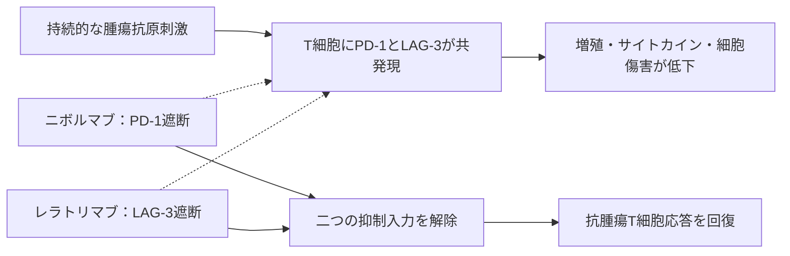

# レラトリマブ（Opdualagの抗LAG-3成分）

## まず3行で

- 切除不能または転移性悪性黒色腫に、抗PD-1抗体ニボルマブとの固定用量配合剤として用いる免疫チェックポイント阻害抗体である。
- 活性化・疲弊T細胞上のLAG-3を遮断し、PD-1とは別のブレーキを同時に外して抗腫瘍T細胞応答を立て直す。
- 細胞を除去しにくい安定化IgG4として設計され、LAG-3を臨床的に検証された第3のチェックポイント軸へ進めた。

## 1. どんな病気か

悪性黒色腫はメラノサイト由来のがんで、進行すると皮膚だけでなくリンパ節、肺、肝、脳などへ転移する。約半数の進行例では`BRAF`変異がMAPK経路を恒常的に動かし、BRAF/MEK阻害薬が効くが耐性が生じやすい。一方、変異型を問わず使えるPD-1阻害薬はT細胞の免疫監視を再起動するものの、全員が反応するわけではなく、初期抵抗性や獲得耐性が残る。[NCI](https://www.cancer.gov/types/skin/hp/melanoma-treatment-pdq)

腫瘍内では、抗原刺激が続くT細胞にPD-1とLAG-3など複数の抑制受容体が共発現し、増殖、サイトカイン産生、細胞傷害が低下する「疲弊」状態が形成される。ただし疲弊は一様な終末状態ではなく、どの細胞集団が治療で回復するか、LAG-3の発現量が反応を予測できるかは未解明である。

## 2. なぜこの分子を標的にするのか

LAG-3（CD223）は活性化CD4/CD8 T細胞や制御性T細胞などに誘導され、免疫反応の過剰を抑える。細胞外領域はCD4に似ており、代表的リガンドのMHCクラスIIと結合する。腫瘍ではPD-1との共発現が多く、マウスで両者を同時に欠損・遮断すると、単独より強い抗腫瘍応答が得られた。[Wooら](https://pubmed.ncbi.nlm.nih.gov/22186141/)

したがってLAG-3は、PD-1阻害で残る非重複の抑制を解く追加標的になる。反面、正常では自己寛容を守るため、二重遮断は臓器の免疫炎症を増やし得る。MHCクラスII以外にFGL1なども候補リガンドだが、生体内での寄与や細胞内抑制シグナルの全容は確定していない。LAG-3発現検査なしでも米国承認されており、現時点で確立した選択バイオマーカーではない。

## 3. どんな抗体として設計されたか

### 開発企業

Medarexのヒト免疫グロブリン遺伝子導入マウスから抗LAG-3クローン25F7を得て、その可変領域をヒトκ鎖・IgG4定常領域へ組み込んだ。Bristol Myers Squibb（BMS）が抗体を最適化し、ニボルマブとの併用・固定用量製剤を臨床開発した。[Thudiumら](https://pmc.ncbi.nlm.nih.gov/articles/PMC9530649/)

### 基本設計と作用の仕組み

レラトリマブは約148 kDaの完全ヒトIgG4κ抗体で、LAG-3のD1ドメインにある挿入ループを認識する。MHCクラスIIなどとの結合を妨げ、T細胞増殖とサイトカイン分泌への抑制を弱める。ニボルマブはPD-1―PD-L1/PD-L2軸を並行して遮断するため、二つの抗体は同じ細胞を殺すのではなく、異なる抑制入力を同時に解除する。

### 設計上の工夫

標的は回復させたいT細胞上にあるため、強いADCC/CDCは望ましくない。そこでFc受容体結合とエフェクター細胞傷害が弱いIgG4を選び、さらにS228P置換でIgG4に起こり得るFab-arm exchange（半抗体交換）を防いだ。[FDA品質審査](https://www.accessdata.fda.gov/drugsatfda_docs/nda/2022/761234Orig1s000ChemR.pdf) Opdualagはニボルマブ480 mg／レラトリマブ160 mgを同一バイアルに収め、4週ごとに30分かけて静注する。二重特異性抗体ではなく、独立した2抗体の固定用量配合剤である。

## 4. 病態から作用まで

## 5. 何が画期的だったのか

免疫チェックポイント治療はCTLA-4、PD-1の成功後も、新しい標的の多数が臨床的利益を示せずにいた。Opdualagは、LAG-3とPD-1の協調を示す前臨床仮説を、未治療進行黒色腫でニボルマブ単剤より長い無増悪生存期間（初回解析中央値10.1対4.6か月）へつなげ、2022年に承認された。[FDA](https://www.fda.gov/drugs/drug-trials-snapshots/drug-trials-snapshot-opdualag) 重要なのは単剤LAG-3阻害の確立ではなく、相補的なブレーキを合理的に組み合わせた点である。

> **一言で評価：** この抗体の革新性は、PD-1阻害後の次のチェックポイント候補だったLAG-3を、固定用量の二重遮断として実用化したことにある。

## 6. 実際の医療での位置づけ

2026年10月7日時点、米国では12歳以上の切除不能・転移性黒色腫に、PD-L1やLAG-3検査を要せず用いる（40 kg未満の小児用量は未確立）。EUでは12歳以上の未治療例のうち、腫瘍細胞PD-L1発現1%未満に適応が限定される。[DailyMed](https://dailymed.nlm.nih.gov/dailymed/drugInfo.cfm?setid=b22c9d83-3256-4e17-85f7-f331a504adc6) [EMA](https://www.ema.europa.eu/en/medicines/human/EPAR/opdualag)

単剤ニボルマブより病勢制御を延ばす一方、免疫関連有害事象は増える。肺臓炎、大腸炎、肝炎、内分泌障害、腎炎、皮膚障害に加え、頻度は低くても心筋炎などに注意し、重症度に応じて休薬・中止と副腎皮質ステロイドを用いる。二重遮断でも無効・耐性例はあり、最適な患者選択と治療順序は残る課題である。

## 7. 類薬との違い

| 項目 | Opdualag | ニボルマブ単剤 | ニボルマブ＋イピリムマブ |
|---|---|---|---|
| 標的 | LAG-3＋PD-1 | PD-1 | PD-1＋CTLA-4 |
| 抗体形式 | 2種のIgG4固定用量配合 | IgG4 | IgG4＋IgG1 |
| 作用の焦点 | 疲弊T細胞の二重抑制解除 | PD-1軸の解除 | 末梢＋T細胞初期活性化の解除 |
| 強み | 4週ごとの1回投与、単剤PD-1超えを直接実証 | 経験が多く比較的単純 | 強い抗腫瘍活性が期待できる |
| 弱点 | 単剤より免疫毒性、選択指標なし | 抵抗性が残る | 一般に免疫毒性が強い |

最も重要な違いは、LAG-3追加が「PD-1と同じブレーキを重ねる」のではなく、疲弊T細胞上の別経路を狙うことにある。ただしニボルマブ＋イピリムマブとの優劣を直接比較した試験ではないため、患者背景と毒性許容度を含めて選ぶ。

## 8. この抗体から学べること

- **疾患生物学：** 黒色腫の免疫逃避は一つの受容体でなく、複数チェックポイントの協調で成立する。
- **標的選択：** 単剤活性だけでなく、標準薬が残す非重複の抑制を補えるかが組合せ標的の価値を決める。
- **抗体設計：** T細胞を救う阻害抗体ではIgG4で除去を避け、S228Pで分子の同一性を保つ設計が合理的である。
- **残る課題：** LAG-3の細胞内機序、真に重要なリガンド、反応予測指標、PD-1/CTLA-4併用との使い分けが未解決である。
- **次に読む抗体：** 同じIgG4でPD-1を遮断し、配合相手となるニボルマブ。

## 参考文献

1. OPDUALAG Prescribing Information（2026年6月改訂）. DailyMed / U.S. National Library of Medicine, 2026. [DailyMed](https://dailymed.nlm.nih.gov/dailymed/drugInfo.cfm?setid=b22c9d83-3256-4e17-85f7-f331a504adc6)（2026年10月7日アクセス）
2. Multi-disciplinary Review and Evaluation: Opdualag (BLA 761234). U.S. Food and Drug Administration, 2022. [FDA](https://www.accessdata.fda.gov/drugsatfda_docs/nda/2022/761234Orig1s000MultidisciplineR.pdf)（2026年10月7日アクセス）
3. Chemistry Review: Opdualag (BLA 761234). U.S. Food and Drug Administration, 2022. [FDA](https://www.accessdata.fda.gov/drugsatfda_docs/nda/2022/761234Orig1s000ChemR.pdf)（2026年10月7日アクセス）
4. Opdualag EPAR and Product Information（2026年7月更新）. European Medicines Agency, 2026. [EMA](https://www.ema.europa.eu/en/medicines/human/EPAR/opdualag)（2026年10月7日アクセス）
5. Melanoma Treatment (PDQ®)–Health Professional Version. National Cancer Institute. [NCI](https://www.cancer.gov/types/skin/hp/melanoma-treatment-pdq)（2026年10月7日アクセス）
6. Woo SR, et al. Immune inhibitory molecules LAG-3 and PD-1 synergistically regulate T-cell function to promote tumoral immune escape. *Cancer Res*. 2012;72:917–927. [PubMed](https://pubmed.ncbi.nlm.nih.gov/22186141/)
7. Thudium K, et al. Preclinical Characterization of Relatlimab, a Human LAG-3–Blocking Antibody, Alone or in Combination with Nivolumab. *Cancer Immunol Res*. 2022;10:1175–1189. [PMC](https://pmc.ncbi.nlm.nih.gov/articles/PMC9530649/)
8. Tawbi HA, et al. Relatlimab and Nivolumab versus Nivolumab in Untreated Advanced Melanoma. *N Engl J Med*. 2022;386:24–34. [DOI](https://doi.org/10.1056/NEJMoa2109970)
9. Drug Trials Snapshot: OPDUALAG. U.S. Food and Drug Administration, 2022. [FDA](https://www.fda.gov/drugs/drug-trials-snapshots/drug-trials-snapshot-opdualag)（2026年10月7日アクセス）
