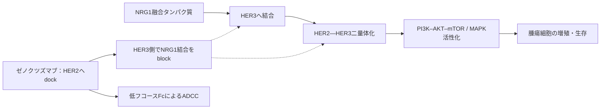

# ゼノクツズマブ（Bizengri）

## まず3行で

- `NRG1`遺伝子融合を持つ進行非小細胞肺がん、膵腺がん、胆管がんに用いる分子標的抗体である。
- HER2に係留しながらHER3へのNRG1結合とHER2―HER3二量体化を妨げ、腫瘍の増殖・生存シグナルを遮断する。
- 受容体の空間配置を利用するHER2×HER3二重特異性IgGにより、希少な「融合リガンド」を治療可能なドライバーへ変えた。

## 1. どんな病気か

膵管腺がんを中心に考える。膵管上皮由来のこのがんは、腹痛、体重減少、黄疸などを来すが、早期症状に乏しく、診断時には切除不能または転移性であることが多い。多くは`KRAS`変異でMAPK系を恒常的に作動させ、標準治療は多剤併用化学療法が中心である。[NCI](https://www.cancer.gov/types/pancreatic/treatment)

一方、`KRAS`野生型の一部では、`NRG1`のEGF様領域を保った融合タンパク質が細胞膜に提示される。これが同じ細胞または隣接細胞のHER3に結合し、キナーゼ活性の弱いHER3をHER2と組ませ、PI3K–AKT–mTORやMAPK経路を駆動する。小規模なゲノム解析では`KRAS`野生型膵がんへの集積が示されたが、融合は膵がん全体ではまれで、自然歴、融合相手ごとの差、耐性経路には未解明な点が多い。[Jonesら](https://pubmed.ncbi.nlm.nih.gov/31068372/) [FDA審査報告](https://www.accessdata.fda.gov/drugsatfda_docs/nda/2025/761352Orig1s000MultidisciplineR.pdf)

## 2. なぜこの分子を標的にするのか

NRG1は正常には神経、心臓、乳腺などの発生・恒常性に関わるHER3/HER4リガンドである。HER3は触媒活性が弱い代わりにPI3K結合部位を多く持ち、HER2は既知の可溶性リガンドを持たないが強い二量体相手になる。したがって融合NRG1が作るHER2―HER3回路は、二つの受容体を同時に押さえる合理性が高い。

標的の長所は、しばしば他の主要ドライバーと排他的で、腫瘍がこの回路へ依存することである。弱点は、HER2/HER3が正常組織にも必要なため、心機能低下、胎児毒性、下痢などのオンターゲット影響があり得ること、融合検出にNGS、とくに多様な融合相手を拾いやすいRNA解析が重要なことである。

## 3. どんな抗体として設計されたか

### 開発企業

MerusがBiclonics基盤からMCLA-128（ゼノクツズマブ）を創製し、前臨床・国際臨床開発と最初の米国承認を担った。2024年にPartner Therapeuticsへ米国の`NRG1`融合がんに関する開発・製造・販売権を許諾し、同社が現在の米国販売承認保持者である。[MerusのSEC提出資料](https://www.sec.gov/Archives/edgar/data/1651311/000095017025102966/mrus-20250630.htm)

### 基本設計と作用の仕組み

約146 kDaのヒト化・低フコース完全長IgG1で、片方のFabがHER2ドメインI、もう片方がHER3ドメインIIIを認識する1＋1型二重特異性抗体である。HER2側で細胞表面へ「dock」して局所濃度と向きを整え、HER3側でNRG1結合と二量体化を「block」する。低フコースFcはFcγRIIIa結合とADCCを高め、シグナル遮断に腫瘍細胞傷害を加える。[Schramら](https://pmc.ncbi.nlm.nih.gov/articles/PMC9394398/)

### 設計上の工夫

通常の二重特異性IgGでは重鎖・軽鎖の誤対合が問題になる。Biclonicsは共通軽鎖を用い、二種類の重鎖CH3に相補的な電荷変異を入れてヘテロ二量体形成を優先させる。これにより通常IgGに近い構造・半減期と、非対称な二つのFabを両立した。[Antibody Therapeutics](https://academic.oup.com/abt/article/8/3/197/8176596) 用量は750 mgを2週ごとに4時間かけて静注する。

## 4. 病態から作用まで

## 5. 何が画期的だったのか

ゼノクツズマブは2024年、`NRG1`融合陽性の非小細胞肺がんと膵腺がんに対する初のFDA承認全身療法となった。[FDA](https://www.fda.gov/drugs/resources-information-approved-drugs/fda-grants-accelerated-approval-zenocutuzumab-zbco-non-small-cell-lung-cancer-and-pancreatic) 画期性は単なる二標的化ではなく、豊富なHER2を足場にHER3遮断腕を最適位置へ置き、高濃度の融合リガンドに対抗した点にある。また、臓器ではなく希少ドライバーから患者を選ぶ考えを前進させた。ただし承認は腫瘍横断ではなく、臨床根拠のある三がん種に限られる。

> **一言で評価：** この抗体の革新性は、受容体の配置を利用した「係留＋遮断」で、融合リガンドという珍しいがんドライバーを薬物標的へ変えたことにある。

## 6. 実際の医療での位置づけ

2026年10月10日時点、米国では既治療の進行・切除不能または転移性`NRG1`融合陽性非小細胞肺がん、膵腺がん、胆管がんに単剤で用いる。肺がん・膵がんは奏効率と奏効期間に基づく迅速承認で、検証試験が必要である。膵腺がん30例では独立判定奏効率40%だったが、単群・少数例であり、生存利益を確立した数字ではない。[現行米国添付文書](https://dailymed.nlm.nih.gov/dailymed/lookup.cfm?setid=203daea4-fc87-40a4-a92f-ba2351b16de1)

重要な有害事象は輸注反応、間質性肺疾患／肺臓炎、左室機能低下、胎児毒性である。初回を中心とする輸注反応に備え前投薬と監視を行い、治療前および治療中に心機能を評価する。希少融合の検査機会、隔週4時間静注、一次治療での位置づけ、獲得耐性が実装上の制約として残る。

## 7. 類薬との違い

| 項目 | ゼノクツズマブ | トラスツズマブ | アミバンタマブ |
|---|---|---|---|
| 標的 | HER2＋HER3 | HER2 | EGFR＋MET |
| 抗体形式 | 1＋1低フコースIgG1二重特異性 | 通常型IgG1 | 1＋1低フコースIgG1二重特異性 |
| 患者選択 | `NRG1`融合 | HER2増幅・過剰発現など | EGFR変異など |
| 作用の焦点 | HER2へ係留しNRG1―HER3を遮断 | HER2シグナル抑制とADCC | 二受容体阻害・分解とFc作用 |
| 主な弱点 | 希少融合、検証試験中 | HER2低発現・耐性 | 輸注反応、皮膚・爪毒性など |

最重要の違いは、HER2自体の増幅を狙うのではなく、HER2を「足場」として融合NRG1―HER3回路を断つ点である。

## 8. この抗体から学べること

- **疾患生物学：** がんドライバーは変異した受容体だけでなく、異常な融合リガンドでも成立する。
- **標的選択：** 希少でも他のドライバーと排他的な異常は、強い依存性と明確な患者選択を与え得る。
- **抗体設計：** 二つのFabの幾何学、共通軽鎖、重鎖ヘテロ二量体化、Fc糖鎖を一つの目的へ統合できる。
- **残る課題：** 確証試験、RNAベース検査の普及、融合相手別の感受性、耐性機序の解明が必要である。
- **次に読む抗体：** HER2を単独標的とするトラスツズマブ、EGFR×METを狙うアミバンタマブ。

## 参考文献

1. BIZENGRI Prescribing Information（2026年5月改訂）. DailyMed / U.S. National Library of Medicine, 2026. [DailyMed](https://dailymed.nlm.nih.gov/dailymed/lookup.cfm?setid=203daea4-fc87-40a4-a92f-ba2351b16de1)（2026年10月10日アクセス）
2. Multi-disciplinary Review and Evaluation: BIZENGRI (BLA 761352). U.S. Food and Drug Administration, 2024. [FDA](https://www.accessdata.fda.gov/drugsatfda_docs/nda/2025/761352Orig1s000MultidisciplineR.pdf)（2026年10月10日アクセス）
3. FDA grants accelerated approval to zenocutuzumab-zbco for non-small cell lung cancer and pancreatic adenocarcinoma. U.S. Food and Drug Administration, 2024. [FDA](https://www.fda.gov/drugs/resources-information-approved-drugs/fda-grants-accelerated-approval-zenocutuzumab-zbco-non-small-cell-lung-cancer-and-pancreatic)（2026年10月10日アクセス）
4. FDA approves zenocutuzumab-zbco for advanced, unresectable or metastatic cholangiocarcinoma. U.S. Food and Drug Administration, 2026. [FDA](https://www.fda.gov/drugs/resources-information-approved-drugs/fda-approves-zenocutuzumab-zbco-advanced-unresectable-or-metastatic-cholangiocarcinoma)（2026年10月10日アクセス）
5. Pancreatic Cancer Treatment. National Cancer Institute, 2026. [NCI](https://www.cancer.gov/types/pancreatic/treatment)（2026年10月10日アクセス）
6. Jones MR, et al. NRG1 Gene Fusions Are Recurrent, Clinically Actionable Gene Rearrangements in KRAS Wild-Type Pancreatic Ductal Adenocarcinoma. *Clin Cancer Res*. 2019;25:4674–4681. [PubMed](https://pubmed.ncbi.nlm.nih.gov/31068372/)
7. Schram AM, et al. Zenocutuzumab, a HER2×HER3 Bispecific Antibody, Is Effective Therapy for Tumors Driven by NRG1 Gene Rearrangements. *Cancer Discov*. 2022;12:1233–1247. [PMC](https://pmc.ncbi.nlm.nih.gov/articles/PMC9394398/)
8. Schram AM, et al. Efficacy of Zenocutuzumab in NRG1 Fusion–Positive Cancer. *N Engl J Med*. 2025;392:566–576. [NEJM](https://www.nejm.org/doi/10.1056/NEJMoa2405008)
9. Suurs FV, et al. Structure and function of therapeutic antibodies approved by the US FDA in 2024. *Antib Ther*. 2025;8:197–262. [Oxford Academic](https://academic.oup.com/abt/article/8/3/197/8176596)
10. Merus Quarterly Report（Partner Therapeutics license agreement）. Merus N.V., 2025. [SEC](https://www.sec.gov/Archives/edgar/data/1651311/000095017025102966/mrus-20250630.htm)（2026年10月10日アクセス）
