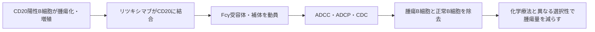

# リツキシマブ（リツキサン／MabThera）

## まず3行で

- CD20陽性B細胞非ホジキンリンパ腫を中心に、B細胞性腫瘍と複数の自己免疫疾患に使われる抗体である。
- B細胞表面のCD20に結合し、IgG1のFcを介した免疫反応などによって、腫瘍細胞と正常B細胞をまとめて除去する。
- 病因分子そのものではなく、安定した「細胞系譜マーカー」を標的に、抗体のエフェクター機能で治療できることを臨床で示した点が重要である。

## 1. どんな病気か

代表疾患として、びまん性大細胞型B細胞リンパ腫（DLBCL）を取り上げる。DLBCLは成熟B細胞が腫瘍化する、進行の速い非ホジキンリンパ腫である。急速に大きくなるリンパ節腫脹のほか、発熱、寝汗、体重減少を伴い、骨髄や節外臓器にも広がり得る。高齢者に多いが、どの年齢でも発症する。[NCI](https://www.cancer.gov/publications/dictionaries/cancer-terms/def/diffuse-large-b-cell-lymphoma)

正常B細胞は抗原を認識し、抗体産生細胞への分化や他の免疫細胞への情報提示を担う。DLBCLでは、B細胞の分化・増殖・生存を制御する複数の遺伝子経路が崩れた細胞が増殖する。単一疾患に見えても分子背景は不均一であり、再発・抵抗性の仕組みも一様ではない。従来の多剤化学療法は分裂細胞を広く傷害するため、腫瘍B細胞をより選択的に狙う手段が求められていた。

## 2. なぜこの分子を標的にするのか

CD20はB細胞の発生途中から成熟B細胞まで発現する膜タンパク質で、多くのB細胞リンパ腫にも保たれる。一方、造血幹細胞と抗体を産生する形質細胞ではほぼ発現しない。この発現分布により、CD20陽性細胞を除去しても幹細胞からB細胞を再構築でき、長寿命形質細胞を直接は標的にしないため既存の液性免疫をある程度保てる。

重要なのは、CD20がDLBCLの普遍的な増殖ドライバーではない点である。酵素活性を止める低分子薬ではなく、腫瘍細胞に付ける「目印」として利用し、抗体のFcに免疫細胞や補体を呼び込む。細胞表面で比較的安定し、細胞外に大量放出されにくいことも標的として好都合だった。

弱点は正常B細胞も除去することによる感染防御の低下である。また、CD20発現低下、腫瘍細胞上のFcγRIIbによる抗体の内在化、補体制御分子などは抵抗性に関与し得る。ただし、患者ごとの抵抗性をどの機序が支配するかは完全には確定していない。[Limら](https://doi.org/10.1182/blood-2011-01-330357)

## 3. どんな抗体として設計されたか

### 基本設計

リツキシマブは、マウス抗CD20抗体2B8の可変領域と、ヒトIgG1κの定常領域を組み合わせたキメラ抗体である。マウス抗体の結合特異性を残しつつ、ヒト定常領域で免疫原性を抑え、Fcエフェクター機能を使う設計だった。[Reffら](https://doi.org/10.1182/blood.V83.2.435.435)

投与は点滴静注で、日本のCD20陽性B細胞性非ホジキンリンパ腫では通常375 mg/m²を週1回、または併用化学療法の各サイクルに合わせて行う。投与間隔と回数は疾患・併用療法・維持療法で異なる。[PMDA添付文書](https://www.pmda.go.jp/PmdaSearch/iyakuDetail/ResultDataSetPDF/380101_4291407A1035_2_22)

### 作用の仕組みと設計意図

CD20に結合したIgG1のFcは、NK細胞やマクロファージのFcγ受容体を介するADCC・ADCPを誘導する。またC1qを結合して補体依存性細胞傷害（CDC）を起こし、直接的な細胞死シグナルも実験系で報告されている。どの経路が患者体内で最も重要かは病型や腫瘍環境で変わり、なお議論がある。したがって「CD20を遮断する薬」というより、「CD20陽性細胞を免疫系に処理させる薬」と理解する方が正確である。

## 4. 病態から作用まで

## 5. 何が画期的だったのか

FDAは1997年にリツキシマブを初承認した。[FDA Purple Book](https://purplebooksearch.fda.gov/index.cfm?blaNo=103705&event=productdetails) DLBCLでは、CHOP化学療法への追加が奏効と生存を改善し、抗体と化学療法を組み合わせる「R-CHOP」を治療の基盤にした。[Coiffierら](https://doi.org/10.1056/NEJMoa011795) さらに、同じB細胞除去という考え方が関節リウマチや血管炎などへ展開され、腫瘍抗原標的が免疫疾患の病態介入にも使えることを示した。

> **一言で評価：** この抗体の革新性は、疾患ドライバーではない細胞系譜マーカーCD20を、IgG1の免疫動員機能によるB細胞除去へ結びつけたことにある。

## 6. 実際の医療での位置づけ

2026年7月20日時点で、日本ではCD20陽性B細胞性非ホジキンリンパ腫や慢性リンパ性白血病に加え、血管炎、ループス腎炎など多数の免疫疾患に承認されている。腫瘍領域では単剤、化学療法との併用、維持療法などに使い分けられ、CD20陽性の確認が前提となる。

重要な有害事象は、初回に多いinfusion reaction、急速な腫瘍細胞死による腫瘍崩壊症候群、B細胞除去に伴う感染症である。B型肝炎ウイルス再活性化や進行性多巣性白質脳症にも注意を要する。投与前スクリーニング、前投薬、緩徐な点滴と監視が必要であり、「標的細胞をよく除去できる」こと自体が効果と毒性の両方を生む。

## 7. 類薬との違い

| 項目 | リツキシマブ | オビヌツズマブ |
|---|---|---|
| 標的 | CD20（I型） | CD20（II型） |
| 抗体形式 | キメラIgG1κ | ヒト化・糖鎖改変IgG1 |
| 作用の特徴 | ADCC・ADCP・CDC | ADCC・ADCPと直接細胞死を強化、CDCは相対的に弱い |
| 設計上の特徴 | ヒトFcで免疫動員 | 低フコース化FcでFcγRIII結合を強化 |
| 強み | 長い使用経験、広い適応 | エフェクター細胞動員を工学的に増強 |
| 弱点 | キメラ性、内在化や抵抗性 | infusion reaction、正常B細胞除去は残る |

最も重要な違いは、リツキシマブが確立した「標的＋天然IgG1 Fc」という設計を、オビヌツズマブが結合様式とFc糖鎖の両面から再設計したことである。[Mössnerら](https://doi.org/10.1182/blood-2009-06-225979)

## 8. この抗体から学べること

- **疾患生物学：** 腫瘍の原因分子でなくても、系譜を選別できる表面抗原は治療標的になる。
- **標的選択：** 正常細胞にもある標的では、除去後の再生可能性と残したい細胞集団が治療域を決める。
- **抗体設計：** Fabの結合だけでなく、IgG1 Fcが呼び込む細胞・補体までが薬理作用である。
- **残る課題：** CD20発現、内在化、腫瘍微小環境の差から生じる抵抗性を一つの指標では説明できない。
- **次に読む抗体：** オビヌツズマブ。Fc糖鎖改変とII型抗CD20設計による改良を比較できる。

## 参考文献

1. [リツキサン点滴静注 添付文書（第15版）](https://www.pmda.go.jp/PmdaSearch/iyakuDetail/ResultDataSetPDF/380101_4291407A1035_2_22), 医薬品医療機器総合機構（PMDA）, 2026（アクセス日：2026-07-20）
2. [Purple Book: Product Details for Rituxan](https://purplebooksearch.fda.gov/index.cfm?blaNo=103705&event=productdetails), U.S. Food and Drug Administration, 2026（アクセス日：2026-07-20）
3. [MabThera EPAR](https://www.ema.europa.eu/en/medicines/human/EPAR/mabthera), European Medicines Agency, 2025（アクセス日：2026-07-20）
4. [Definition of diffuse large B-cell lymphoma](https://www.cancer.gov/publications/dictionaries/cancer-terms/def/diffuse-large-b-cell-lymphoma), National Cancer Institute（アクセス日：2026-07-20）
5. [Depletion of B cells in vivo by a chimeric mouse human monoclonal antibody to CD20](https://doi.org/10.1182/blood.V83.2.435.435), Reff ME et al., 1994
6. [Phase I clinical trial using escalating single-dose infusion of chimeric anti-CD20 monoclonal antibody](https://doi.org/10.1182/blood.V84.8.2457.2457), Maloney DG et al., 1994
7. [CHOP chemotherapy plus rituximab compared with CHOP alone in elderly patients with diffuse large-B-cell lymphoma](https://doi.org/10.1056/NEJMoa011795), Coiffier B et al., 2002
8. [Fc gamma receptor IIb on target B cells promotes rituximab internalization and reduces clinical efficacy](https://doi.org/10.1182/blood-2011-01-330357), Lim SH et al., 2011
9. [Gazyvaro EPAR](https://www.ema.europa.eu/en/medicines/human/EPAR/gazyvaro), European Medicines Agency, 2026（アクセス日：2026-07-20）
10. [Increasing the efficacy of CD20 antibody therapy through the engineering of a new type II anti-CD20 antibody](https://doi.org/10.1182/blood-2009-06-225979), Mössner E et al., 2010
